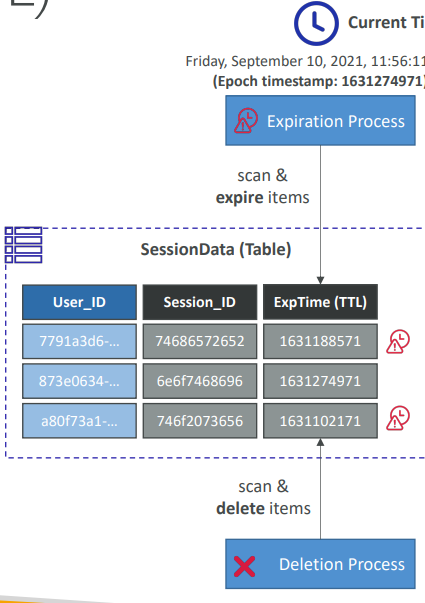

## **What is DynamoDB Time To Live (TTL)?**

* **TTL** is a feature that allows you to **automatically and permanently delete expired items** from a DynamoDB table.
* You set a specific attribute (typically named `ttl` or similar) on each item, and assign it a *UNIX timestamp* (in seconds).
* When the current time exceeds this timestamp, DynamoDB automatically marks the item as expired and removes it.

---

## **How Does TTL Work?**

1. **Choose an attribute** (e.g., `ttl`) to act as the TTL marker.
2. **Set the attribute’s value** as a UNIX epoch time (seconds since Jan 1, 1970) representing when the item should expire.
3. **Enable TTL** on your table via the AWS Console, CLI, or SDK, specifying the TTL attribute name.
4. DynamoDB **monitors items in the background** and deletes those where the TTL attribute’s value has passed.
5. **Deletion is eventually consistent**—expired items are typically deleted within a few minutes to several hours (not instantly at the expiry second).


---

## **Key Points**

* **Automatic Deletion:**
  Items are permanently deleted by DynamoDB; no backup or recovery.
* **No Cost for TTL Deletes:**
  You are not charged for the deletion operation itself (though you pay normal storage cost up to the time the item is deleted).
* **Non-blocking:**
  TTL processing happens in the background and doesn’t affect your table’s read/write operations.
* **Works with Streams:**
  If DynamoDB Streams are enabled, TTL-deleted items generate a `REMOVE` event in the stream (can be used for further processing, e.g., audit logs or data pipelines).

---

## **Practical Use Cases**

* **Session data:**
  Automatically expire user session records after inactivity (e.g., logout tokens, shopping cart sessions).
* **Temporary data:**
  Delete password reset tokens, single-use links, or verification codes after a time window.
* **Log data:**
  Automatically purge old logs or analytics data beyond the retention period (e.g., keep only last 30 days).

---

## **How to Enable TTL (Step-by-step)**

1. Add a `ttl` attribute to your table items (UNIX epoch seconds).
2. In the AWS Console, open your table → “Time to Live” → Enable TTL → Set the attribute name (e.g., `ttl`).
3. DynamoDB will start scanning and removing expired items.

---

## **Example**

Suppose you have an item:

```json
{
  "UserID": "A1B2C3",
  "sessionToken": "xyz123",
  "ttl": 1725758400
}
```

* If `ttl` equals the UNIX timestamp for July 9, 2024, at 12:00:00 UTC, then after that moment, DynamoDB will eventually (within minutes to hours) delete this item.

---

## **Slide Reference**

> “Time To Live (TTL)
>
> * Specify attribute containing UNIX epoch time for expiry
> * Expired items are automatically deleted
> * Used for session expiry, log/data retention, auto-cleanup
> * TTL deletions appear as REMOVE events in Streams (if enabled)”

---

## **Summary Table**

| Feature     | Description                                   |
| ----------- | --------------------------------------------- |
| Attribute   | Stores expiry timestamp (seconds since epoch) |
| Deletion    | Automatic, background, permanent              |
| Consistency | Eventually consistent (not instant)           |
| Streams     | REMOVE event on deletion (if enabled)         |
| Common Uses | Sessions, tokens, logs, temp data             |

---

## **Best Practices**

* Always store the TTL value as a **number** (UNIX epoch seconds).
* Items with no TTL attribute (or value = 0/null) are **not** deleted by TTL.
* Use TTL to keep tables lean, minimize manual cleanup scripts, and lower costs.
