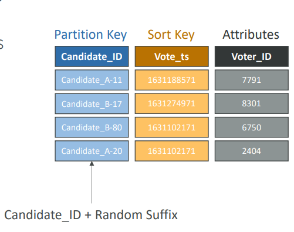
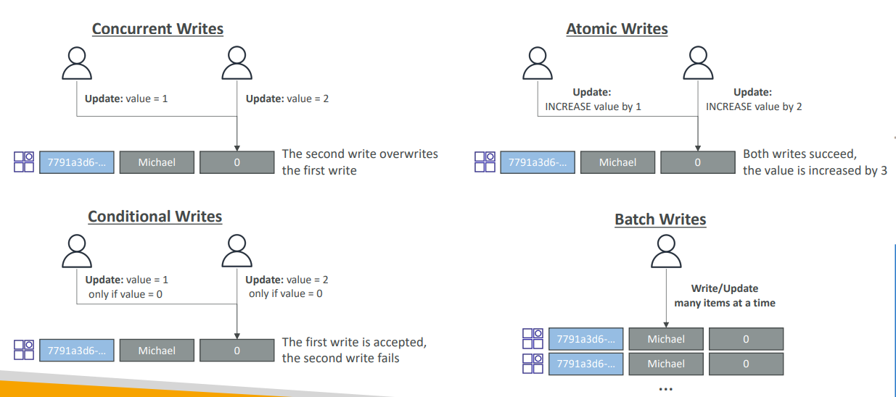
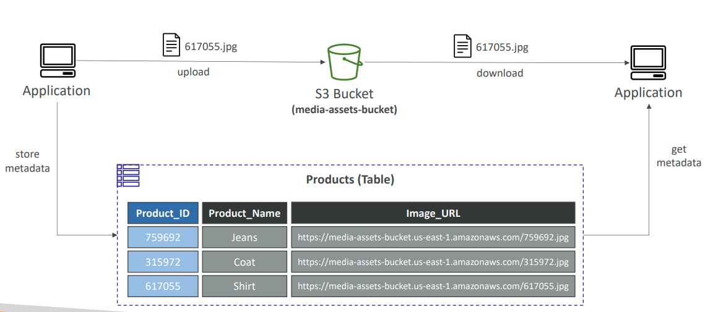
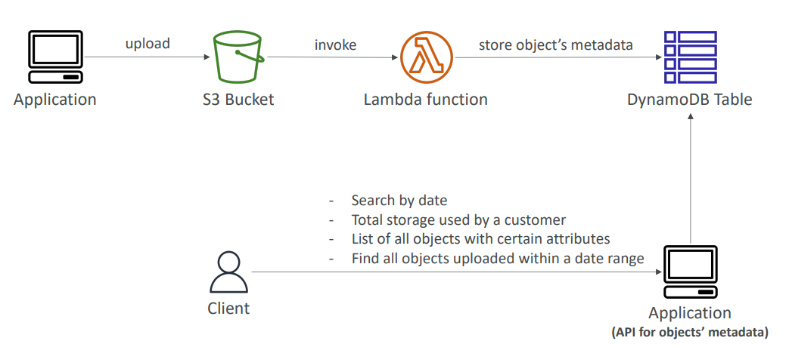
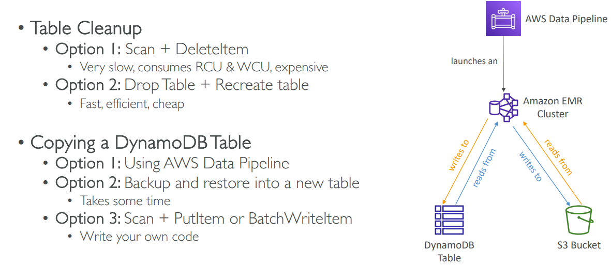
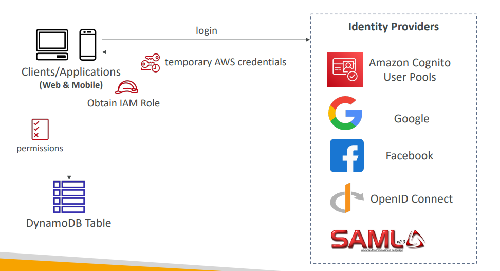

## **1. DynamoDB Write Sharding**

**Write sharding** is a pattern to avoid “hot partitions” (where too many writes go to the same partition key), which can cause throttling and reduced throughput.

### **How it works:**

* Instead of using a single partition key (e.g., `user#123`), **distribute writes across multiple “shards”** by adding a random suffix or prefix.
* For example, instead of `user#123`, use `user#123#shard1`, `user#123#shard2`, etc.
* When reading, **aggregate results from all shards**.

### **Why use it?**

* Prevents one partition from being a bottleneck.
* Ensures more even utilization of your table’s capacity.

**Example:** Logging millions of events per second—distribute them across 10 shards to prevent any single partition from being overwhelmed.

---

## **2. DynamoDB – Write Types**

DynamoDB supports several types of write operations:

* **PutItem:** Inserts or fully replaces an item.
* **UpdateItem:** Updates attributes of an existing item or adds new attributes if they don’t exist.
* **DeleteItem:** Removes a single item.
* **BatchWriteItem:** Executes multiple PutItem or DeleteItem requests in a single batch (up to 25 per batch).

**Use case example:**

* Use `UpdateItem` for atomic counters (incrementing views/likes).
* Use `BatchWriteItem` for ingesting data in bulk, such as importing data from a CSV.

---

## **3. DynamoDB – Large Objects Pattern**

DynamoDB items have a maximum size limit of **400 KB**. To store large objects (e.g., images, documents), use the **Large Objects Pattern**:

### **How it works:**

* Store the large object in **Amazon S3**.
* Store the **metadata and S3 object key (URL)** in DynamoDB.
* Access the large object by first fetching metadata from DynamoDB, then retrieving the file from S3.

**Benefits:**

* Efficient and scalable storage for large, unstructured data.
* DynamoDB stores only searchable metadata and object references.

---

## **4. DynamoDB – Indexing S3 Objects Metadata**

**Indexing S3 objects metadata** means using DynamoDB to index and search S3 objects based on their attributes.

### **How it works:**

* When you upload files to S3, create a DynamoDB item with metadata (e.g., filename, upload date, user, tags, S3 key).
* Use DynamoDB’s fast queries and scans to **search or filter objects** by metadata.
* Retrieve the object from S3 using the S3 key stored in DynamoDB.

**Example:**
Building a document management system that quickly searches documents by author, type, or upload date using DynamoDB.

---

## **5. DynamoDB Operations**

Main operations available in DynamoDB:

| Operation          | Description                                                 |
| ------------------ | ----------------------------------------------------------- |
| PutItem            | Insert or replace a single item                             |
| UpdateItem         | Modify or add attributes for an item                        |
| GetItem            | Retrieve a single item by key                               |
| Query              | Find items by partition key and (optionally) sort key       |
| Scan               | Read every item in the table (inefficient for large tables) |
| DeleteItem         | Delete a single item                                        |
| BatchWriteItem     | Bulk insert or delete                                       |
| BatchGetItem       | Bulk read                                                   |
| TransactWriteItems | Multiple writes in a single atomic action                   |
| TransactGetItems   | Multiple gets in a single atomic action                     |

---

## **6. DynamoDB – Security & Other Features**

**Security features:**

* **Encryption at rest:** All data is encrypted using AWS KMS by default.
* **Encryption in transit:** Data transmitted to/from DynamoDB is encrypted with TLS.
* **VPC Endpoints:** Access DynamoDB privately from your VPC without public internet.
* **Backup and Restore:** On-demand and point-in-time recovery.
* **Global Tables:** Multi-region, fully-replicated tables for DR and low latency.
* **Streams:** Change data capture for event-driven workflows.

---

## **7. DynamoDB – Users Interact with DynamoDB Directly**

* Applications/users can access DynamoDB **directly via the AWS SDK, CLI, or Console**.

* Common integrations:

  * Mobile/web apps using the AWS SDK
  * Lambda functions, EC2 instances, or containers in AWS
  * Third-party tools/scripts

* No need to build an intermediate API if security is well configured.

---

## **8. DynamoDB – Fine-Grained Access Control**

**Fine-grained access control** lets you restrict who can access or modify specific items or attributes in a table.

### **How it works:**

* Use **IAM policies** with conditions to limit access by partition key, sort key, or attributes.
* Can restrict by user identity, request source, or even attribute value.
* Supports **attribute-based access control (ABAC)** and **resource-based policies**.

**Examples:**

* Users can only read or write their own items (e.g., `user_id = ${aws:username}`).
* Only allow updating a specific attribute (e.g., status) but not others.

**Benefits:**

* Increased security and compliance.
* Least-privilege access—users/applications only get the permissions they truly need.

---

## **Slide References & Real-World Context**

* **Write Sharding:** Solves “hot partition” problem in high-volume use cases.
* **Large Objects Pattern & S3 Indexing:** Very common for storing documents, media, logs, and IoT data.
* **Fine-Grained Access Control:** Essential for multi-tenant and user-centric applications.

