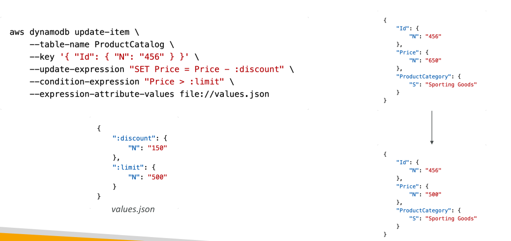
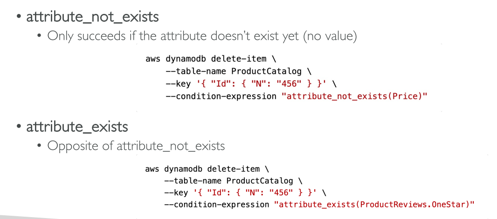
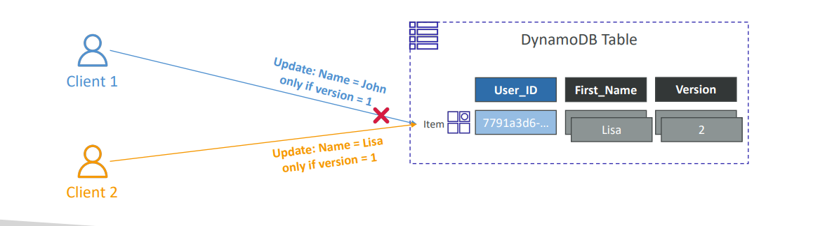

Here’s a full explanation of **DynamoDB Conditional Writes**, with practical context and reference to your slides:

---

## **What are Conditional Writes?**

Conditional Writes in DynamoDB allow you to **control whether a write, update, or delete operation is actually executed**—based on the current state of the item.

* If the *condition expression* is **true**, the operation is performed.
* If the *condition* is **false**, DynamoDB rejects the operation and returns an error—no write is made.

This is crucial for **preventing race conditions** and ensuring **data integrity** in concurrent systems.

---

## **Where Can You Use Conditional Writes?**

You can add a condition expression in:

* **PutItem**
* **UpdateItem**

* **DeleteItem**

* **BatchWriteItem**

---

## **Condition Expression Examples**

Common functions and operators for condition expressions:

* `attribute_exists(attribute_name)` — checks if an attribute exists.
* `attribute_not_exists(attribute_name)` — checks if an attribute does **not** exist.
* `attribute_type(attribute_name, type)` — checks attribute type.
* `contains(attribute_name, value)` — checks if string/array contains a value.
* `begins_with(attribute_name, prefix)` — checks if a string starts with a prefix.
* `IN`, `BETWEEN`, `size(attribute_name)` — advanced checks.

Example:

```sql
ProductCategory IN (:cat1, :cat2) AND Price BETWEEN :low AND :high
```

*Note: These conditions apply to **write operations only**, not reads (for reads, use FilterExpression).*

---

## **Typical Use Cases**

* **Prevent Overwriting an Existing Item**:
  Only insert an item if it doesn't already exist.
  *Condition*: `attribute_not_exists(partition_key)`

* **Optimistic Locking** (Concurrency Control):
  Only update/delete if a “version” attribute matches your expected value.
  *Condition*: `version = :expected_version`
  Prevents two clients from updating the same item simultaneously without knowing about each other's change.

* **Safe Delete**:
  Only delete if a specific attribute or value exists.

* **String checks**:
  E.g., only update an item if `begins_with(username, "A")` or `contains(roles, "admin")`.

---

## **Real-World Example**

### **Example: Do Not Overwrite Existing User**

Let’s say you want to insert a user profile, but only if that user ID does **not** already exist:

* Use `PutItem` with condition: `attribute_not_exists(UserID)`
* If another process already inserted the same user, your insert fails and no data is lost.

### **Example: Optimistic Locking**

Suppose you read a blog post item and it has a `version=2`.
You update the post, but someone else might update it at the same time.

* Use `UpdateItem` with condition: `version = 2`
* If the version in DB is still 2, your update succeeds (and you might increment the version to 3).
* If not (someone else updated), your update fails. You can handle this in your code.


---

## **Slide Reference**

> “Conditional Writes
>
> * For PutItem, UpdateItem, DeleteItem, and BatchWriteItem
> * You can specify a Condition expression to determine which items should be modified:
>
>   * attribute\_exists
>   * attribute\_not\_exists
>   * attribute\_type
>   * contains (for string)
>   * begins\_with (for string)
>   * ProductCategory IN (\:cat1, \:cat2) and Price between \:low and \:high
>   * size (string length)
> * *Filter Expression filters the results of read queries, while Condition Expressions are for write operations*”.

---

## **Visual Example from Slides**

* `attribute_not_exists(partition_key)`
  → Prevents overwrite of an existing item.
* `attribute_not_exists(partition_key) and attribute_not_exists(sort_key)`
  → Ensures that the combination of partition and sort key isn’t already used.
* Use in Delete:
  `attribute_exists` or `attribute_not_exists` to control delete logic.

---

## **Summary Table**

| Use Case                       | Condition Example                                           |
| ------------------------------ | ----------------------------------------------------------- |
| Insert only if item not exists | attribute\_not\_exists(partition\_key)                      |
| Update only if version matches | version = \:expected\_version                               |
| Delete only if exists          | attribute\_exists(partition\_key)                           |
| String prefix check            | begins\_with(name, "A")                                     |
| Membership check               | contains(roles, "admin")                                    |
| Multiple conditions            | category IN (\:c1, \:c2) AND price BETWEEN \:low AND \:high |

---

Conditional Writes are **best practice** for preventing accidental overwrites, ensuring safe concurrent updates, and enforcing business logic at the database level!
