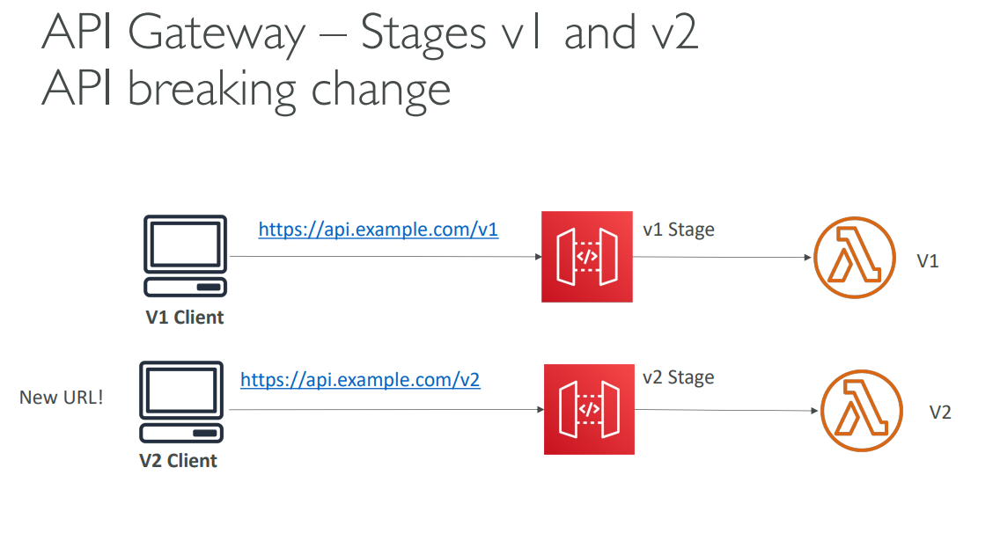

In AWS API Gateway, after you've made changes to your API, those changes aren't immediately live or effective. You need to "deploy" them to a "stage" for them to become active and accessible to your clients[cite: 690].

Here's a breakdown of API Gateway deployment stages:

* **Deployment Necessity:** Any modification to your API (e.g., adding a new endpoint, changing an integration, updating security settings) requires a deployment to a stage to take effect[cite: 690]. This is a common point of confusion for developers who are new to API Gateway.
* **Stages:** A stage is a logical reference to a specific deployment of your API[cite: 690]. You can create multiple stages for a single API, which is extremely useful for managing different environments of your application, such as:
    * `dev` (development) [cite: 690]
    * `test` (testing) [cite: 690]
    * `prod` (production) [cite: 690]
    * You can name your stages whatever you like[cite: 690].
* **Stage-Specific Configuration:** Each stage can have its own configuration parameters[cite: 690]. This allows you to:
    * Set different logging levels for development versus production.
    * Configure different throttling limits.
    * Enable or disable caching.
    * Link to different backend Lambda function aliases or HTTP endpoints using **Stage Variables**[cite: 692, 693].
* **Rollback Capability:** API Gateway keeps a history of your deployments[cite: 690]. This means if a new deployment introduces issues, you can easily roll back to a previous, stable version of your API without experiencing extended downtime[cite: 690].
* **Canary Deployments:** API Gateway allows you to enable canary deployments for any stage (typically your production stage)[cite: 694]. This enables a blue/green deployment strategy for your API, where you can:
    * Shift a small percentage of traffic (e.g., 5%) to a new version of your API while the majority of traffic still goes to the old version[cite: 694].
    * Monitor the metrics and logs for the canary deployment separately to ensure stability[cite: 694].
    * Gradually increase the traffic to the new version or roll back if issues are detected[cite: 694].

