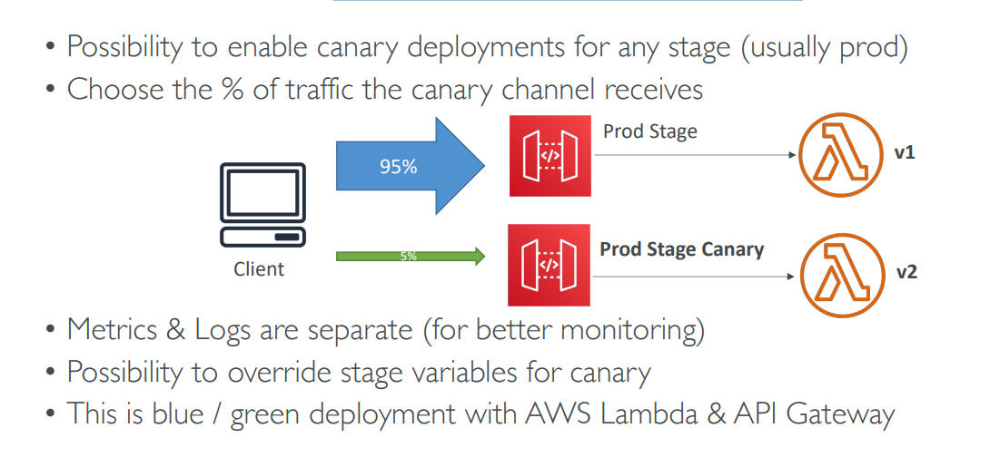

API Gateway Canary Deployment is a traffic-splitting deployment strategy that allows you to release new API versions with reduced risk. It's a form of blue/green deployment specifically adapted for API Gateway.

Here's how it works and its benefits:

**What is a Canary Deployment?**
A canary deployment involves rolling out a new version of an API (the "canary" version) to a small, controlled subset of users or traffic, while the majority of users continue to interact with the current, stable version. By monitoring the canary version for errors or performance issues, you can detect problems early and minimize the impact on your entire user base.

**How it Works in API Gateway:**
1.  **Existing Production Stage:** You have a stable API deployed to a `prod` stage, serving 100% of your user traffic[cite: 694].
2.  **New API Version:** You create or update your API definition with new features or bug fixes.
3.  **Canary Channel:** You enable "canary deployment" for your `prod` stage in API Gateway[cite: 694].
4.  **Traffic Split:** You choose a percentage of traffic (e.g., 5%, 10%) to route to the new, "canary" version[cite: 694]. The remaining traffic (e.g., 95%, 90%) continues to go to the original, stable production version[cite: 694].
5.  **Separate Monitoring:** API Gateway provides separate metrics and logs for the canary channel, allowing you to monitor its performance and error rates in isolation[cite: 694]. This is crucial for quickly identifying any issues with the new version.
6.  **Stage Variable Override (Optional):** You have the possibility to override stage variables specifically for the canary deployment. This allows the canary version to point to different backend resources if needed (e.g., a new Lambda alias or a different database schema for testing purposes)[cite: 694].
7.  **Gradual Rollout or Rollback:**
    * **Successful Canary:** If the canary version performs well with no errors, you can gradually increase the percentage of traffic routed to it until it serves 100% of the traffic, becoming the new production version.
    * **Failed Canary:** If issues are detected in the canary, you can immediately roll back by directing 100% of the traffic back to the old, stable version. This minimizes customer impact.

**Key Benefits of API Gateway Canary Deployment:**

* **Reduced Risk:** By exposing the new version to only a small portion of users, you limit the blast radius of any potential issues[cite: 694].
* **Early Error Detection:** Separate monitoring for the canary allows you to quickly identify bugs or performance regressions before they affect all users[cite: 694].
* **Zero Downtime:** Users continuously experience a working API, as traffic is incrementally shifted, ensuring no service interruption[cite: 694].
* **Real-world Testing:** The new version is tested with actual user traffic and real-world conditions, providing more accurate feedback than isolated testing environments.
* **Control and Automation:** The process can be managed through the AWS Console, CLI, or SDK, and can be integrated into CI/CD pipelines for automated rollouts and rollbacks based on alarm thresholds.

**Example Use Case: E-commerce API Update**
FashionFlow, the online clothing retailer, wants to release a new recommendation engine that suggests products based on user Browse history.

1.  Their current `/recommendations` API is stable in the `prod` stage.
2.  They deploy the new recommendation engine as a Lambda function and create a new Lambda alias `recommendation-v2`.
3.  In API Gateway, they enable canary deployment for the `prod` stage and set the traffic split to 5% for the new API version (which points to `recommendation-v2` Lambda alias).
4.  They monitor CloudWatch metrics for the canary. If error rates or latency for the 5% traffic spike, they immediately roll back to 0% traffic to the new version.
5.  If performance is stable, they gradually increase traffic to 25%, then 50%, and finally 100% over a few hours or days, making the new engine fully live.