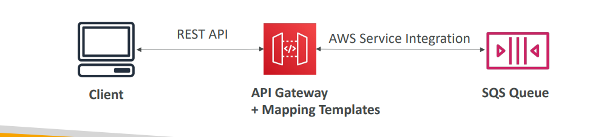
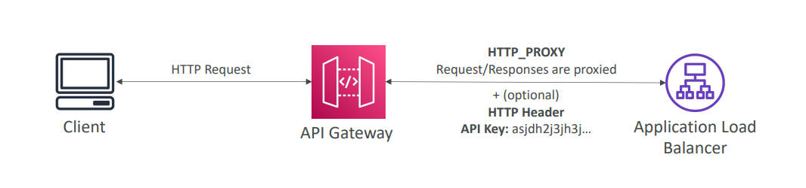

API Gateway offers different integration types to connect your API methods to various backend services. The choice of integration type depends on the specific backend you're using and how much control you need over the request and response transformation.

Here's an explanation of the main integration types:

1.  **Integration Type: MOCK**
    * **Purpose:** API Gateway returns a response directly without sending the request to any backend service[cite: 695].
    * **Use Cases:**
        * **Early Development/Prototyping:** Allows frontend and mobile developers to start building against the API without waiting for the backend to be fully developed.
        * **Testing API Gateway Features:** Useful for testing API Gateway's request validation, caching, or throttling independently of a backend.
        * **Fixed Responses:** For simple, unchanging responses, like health checks or static data.
    * **Configuration:** You define the response directly within API Gateway, including status codes, headers, and body.

2.  **Integration Type: HTTP / AWS**
    
    * **HTTP Integration:** This type is used to connect your API Gateway method to any publicly accessible HTTP endpoint[cite: 686, 695].
        * **Use Cases:** Exposing an existing internal HTTP API (on-premises or on an Application Load Balancer), or integrating with third-party web services.
        * **Why use API Gateway?** To add features like rate limiting, caching, user authentication, and API keys on top of an existing HTTP endpoint[cite: 686].
    * **AWS Integration:** This type allows you to expose any AWS API through API Gateway[cite: 686].
        * **Use Cases:** Directly invoking services like Step Functions (to start a workflow), SQS (to post a message), Kinesis (to send records), or DynamoDB (to perform database operations) directly from the API Gateway.
        * **Why use API Gateway?** To add authentication, deploy publicly, or rate control access to AWS service actions[cite: 686].
    * **Configuration (for both HTTP and AWS Integrations):**
        * You **must configure both the integration request and integration response**[cite: 695].
        * You set up **data mapping using mapping templates** for both the request (transforming the client request before sending to the backend) and the response (transforming the backend response before sending to the client)[cite: 695]. These templates use Velocity Template Language (VTL)[cite: 698].

3.  **Integration Type: AWS_PROXY (Lambda Proxy Integration)**
    * **Purpose:** This is a specialized integration for AWS Lambda functions that simplifies development by removing the need for complex mapping templates[cite: 696].
    
    * **How it Works:**
        * The entire incoming request from the client (including headers, query string parameters, path, HTTP method, and body) is passed as the input payload directly to the Lambda function[cite: 696].
        * The Lambda function is then **responsible for all the logic of parsing the request and formatting the response** in a specific JSON structure that API Gateway expects[cite: 696].
    * **Use Cases:** Most common and recommended integration for Lambda functions due to its simplicity and flexibility within the Lambda code.
    * **Configuration:** No mapping templates are required in API Gateway itself for the request or response[cite: 696].

4.  **Integration Type: HTTP_PROXY**
    * **Purpose:** This is a generic proxy integration for HTTP endpoints that minimizes configuration within API Gateway[cite: 697].
    * **How it Works:**
        * There are **no mapping templates**[cite: 697].
        * The HTTP request received by API Gateway is **passed directly to the backend HTTP endpoint as-is**[cite: 697].
        * The HTTP response from the backend is **forwarded directly by API Gateway to the client as-is**[cite: 697].
    * **Use Cases:** When you want API Gateway to act purely as a pass-through proxy to an existing HTTP service, perhaps to add a custom domain, SSL, or API keys without any data transformation.
    * **Configuration:** You can optionally add HTTP Headers if needed (e.g., an API key for the backend)[cite: 697].

**Summary of Key Differences:**

| Feature                | MOCK       | HTTP / AWS (Non-Proxy) | AWS_PROXY (Lambda Proxy) | HTTP_PROXY    |
| :--------------------- | :--------- | :--------------------- | :----------------------- | :------------ |
| **Backend Invoked** | None       | HTTP Endpoint / AWS Service | Lambda Function          | HTTP Endpoint |
| **Mapping Templates** | Yes (for mock response) | Yes (for request & response) | No                       | No            |
| **Transformation Logic** | Within API GW | Within API GW (VTL)   | Within Lambda Function   | None          |
| **Control Level** | High       | High                   | High (in Lambda)         | Low (pass-through) |
| **Use Cases** | Prototyping, testing, fixed responses | Complex transformations, direct AWS service invocation | Most Lambda APIs | Simple pass-through to HTTP |