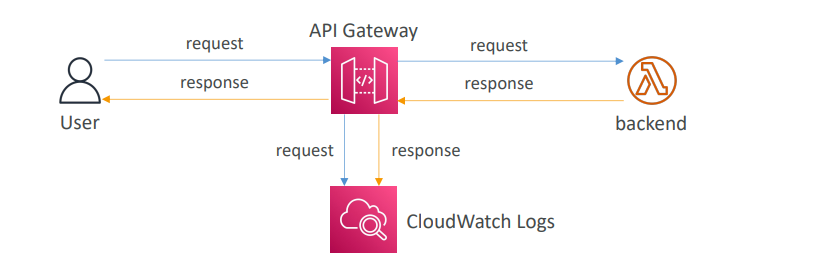

Let's add API Gateway Throttling and Error handling to the detailed explanation.

### API Gateway – Logging & Tracing

API Gateway provides robust capabilities for logging and tracing, which are crucial for monitoring, troubleshooting, and auditing your API's performance and usage.

1.  **CloudWatch Logs:**

    * **Purpose:** API Gateway can send logs of API calls to Amazon CloudWatch Logs[cite: 501]. These logs contain detailed information about the requests and responses that pass through your API Gateway.
    * **Content:** The logs can include information about the request and response body.
    * **Configuration:**
        * Logging is enabled at the **Stage level**[cite: 708]. This means you can configure different logging settings for your `dev`, `test`, and `prod` stages.
        * You can set the **Log Level** to `ERROR`, `DEBUG`, or `INFO`[cite: 708].
        * Settings can also be overridden on a **per-API basis** for more granular control[cite: 708].
    * **Use Cases:**
        * **Troubleshooting:** Identify and diagnose issues by examining detailed request and response payloads, errors, and latency information.
        * **Monitoring API Usage:** Analyze access patterns and identify popular endpoints.
        * **Auditing:** Keep records of API calls for compliance and security purposes.

2.  **AWS X-Ray:**
    * **Purpose:** X-Ray helps you trace requests as they travel through your API Gateway and into your backend services (like Lambda functions, EC2 instances, or other AWS services)[cite: 528, 529].
    * **How it Works:** When X-Ray tracing is enabled, API Gateway injects tracing headers into requests. As the request propagates through your architecture, each integrated service that supports X-Ray (and has the X-Ray SDK/daemon enabled) adds its own segment data to the trace.
    * **Benefits:**
        * **End-to-end Visibility:** Provides a visual map of your distributed application, showing how requests flow between different components[cite: 532, 533].
        * **Performance Bottleneck Identification:** Helps pinpoint where latency is introduced in your API call chain[cite: 528].
        * **Error and Fault Analysis:** Easily identify errors, exceptions, and throttling events across your microservices[cite: 528].
        * **Service Map Visualization:** X-Ray generates a service map that visually represents the connections and performance of your API and its downstream dependencies[cite: 532].
    * **Configuration:** You enable tracing in API Gateway at the **Stage level**[cite: 708].
    * **Integration with Lambda:** Enabling X-Ray on API Gateway and also on your backend Lambda functions provides a full picture of the request lifecycle, from the client through API Gateway to Lambda and any services Lambda calls[cite: 708].

### API Gateway – Throttling

Throttling in API Gateway helps protect your backend services from being overwhelmed by too many requests, ensuring stability and availability.

* **Account Limit:** API Gateway throttles requests at a default account limit of 10,000 requests per second (rps) across all APIs within an AWS account and region[cite: 710]. This is a soft limit that can be increased upon request through AWS Support.
* **Throttling Response:** If the account limit or any other configured limit is exceeded, API Gateway returns a `429 Too Many Requests` error to the client[cite: 710]. This is a retriable error, meaning clients can implement exponential backoff to retry the request.
* **Stage and Method Limits:** You can set more granular throttling limits at:
    * **Stage Level:** Apply limits to all methods within a specific stage.
    * **Method Level:** Apply limits to individual API methods (e.g., a `POST` method might have stricter limits than a `GET` method).
    * These granular limits help improve performance and isolate overloaded APIs so that one API doesn't cause others to be throttled[cite: 710].
* **Usage Plans Integration:** Throttling limits are a key component of **Usage Plans**, allowing you to enforce specific request rates and burst capacities on individual API keys (i.e., per customer or application)[cite: 706].

### API Gateway – Errors

API Gateway categorizes errors into client-side (4xx) and server-side (5xx) errors, providing insights into the source of the problem.

* **4xx Client Errors:** These errors indicate that the client made a bad request or is not authorized.
    * `400 Bad Request`: The request was malformed or invalid[cite: 711].
    * `403 Access Denied`: The client is not authorized to access the resource, possibly due to WAF filtering or incorrect permissions[cite: 711].
    * `429 Quota Exceeded / Too Many Requests`: The client has exceeded the configured throttling or quota limits[cite: 710, 711].
* **5xx Server Errors:** These errors indicate a problem with API Gateway or the backend integration.
    * `502 Bad Gateway Exception`: Usually returned for an incompatible output from a Lambda proxy integration backend, or occasionally for out-of-order invocations due to heavy loads[cite: 711].
    * `503 Service Unavailable Exception`: Indicates a temporary server issue[cite: 711].
    * `504 Integration Failure – Endpoint Request Timed-out Exception`: Occurs when API Gateway's request to the backend times out. API Gateway requests time out after a maximum of 29 seconds[cite: 711]. This is a common error to watch for if your backend processing takes too long.