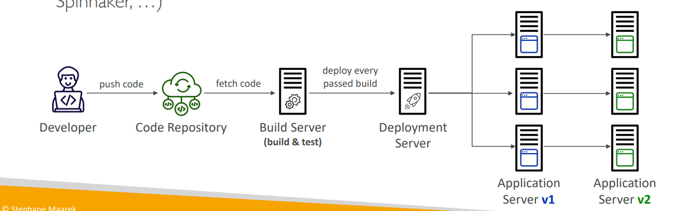
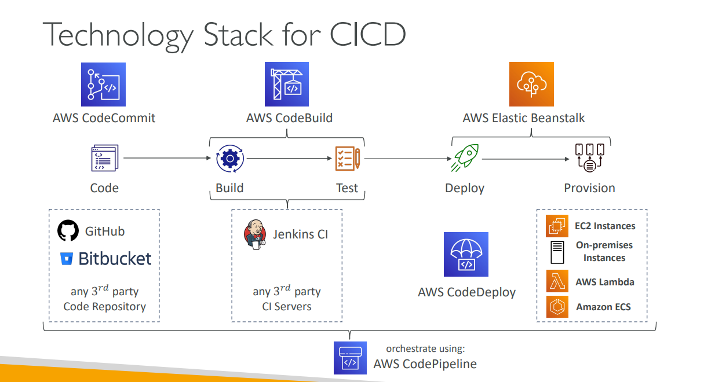

Based on the lessons, here's a detailed explanation of these three key CI/CD concepts:

## Continuous Integration (CI)

### **Core Concept**
CI is about **frequent code integration** with automated testing and building to catch issues early.

### **Key Principles**
- **Frequent Code Pushes**: Developers push code to repositories often (multiple times per day)
- **Automated Testing**: Build server automatically checks code as soon as it's pushed
- **Fast Feedback**: Developers get immediate feedback about test results
- **Early Bug Detection**: Find bugs early and fix them quickly

### **Benefits**
- **Faster Development**: Code is continuously tested and validated
- **Deploy Often**: Enables frequent deployments
- **Happier Developers**: Developers are unblocked and can work more efficiently
- **Quality Assurance**: Ensures code quality through automated testing

### **AWS CI Services**
- **CodeCommit**: Store code in Git repositories
- **CodeBuild**: Build and test code automatically
- **Third-party integrations**: GitHub, GitLab, Bitbucket

### **Real-world Example**
A development team working on an e-commerce platform:
- Developer A pushes authentication feature at 10 AM
- CodeBuild automatically runs unit tests, integration tests
- If tests pass, code is marked as ready for deployment
- If tests fail, developer gets immediate notification to fix issues
- Developer B can safely pull the latest code knowing it's tested

## Continuous Delivery (CD)

### **Core Concept**
CD ensures **reliable and frequent releases** by automating the deployment process.

### **Key Principles**
- **Reliable Releases**: Software can be released whenever needed
- **Frequent Deployments**: Shift from "one release every 3 months" to "5 releases a day"
- **Automated Deployment**: Every passed build can be automatically deployed
- **Quick Deployments**: Deployment process is fast and consistent

### **Benefits**
- **Faster Time to Market**: Features reach users quickly
- **Reduced Risk**: Smaller, frequent releases are less risky
- **Better User Experience**: Continuous improvements and bug fixes
- **Business Agility**: Can respond to market changes quickly

### **AWS CD Services**
- **CodeDeploy**: Automated deployment to various targets
- **CodePipeline**: Orchestrates the entire deployment workflow
- **Elastic Beanstalk**: Platform-as-a-Service for web applications

### **Real-world Example**
An online banking application:
- Morning: Developer fixes login bug
- Afternoon: Fix is automatically tested and deployed to staging
- Evening: After validation, deployed to production
- Users get the fix within hours instead of waiting months

## Technology Stack for CI/CD

### **Complete AWS Technology Stack**

**Code Storage:**
- **AWS CodeCommit**: Private Git repositories
- **GitHub/GitLab**: Third-party alternatives
- **Integration**: All can work with AWS services

**Build & Test:**
- **AWS CodeBuild**: Fully managed build service
- **Jenkins/TeamCity**: Third-party CI servers
- **Docker Support**: Containerized build environments

**Deployment:**
- **AWS CodeDeploy**: Deploy to EC2, Lambda, ECS
- **AWS Elastic Beanstalk**: Platform-as-a-Service
- **Third-party Tools**: Various deployment options

**Orchestration:**
- **AWS CodePipeline**: Visual workflow orchestration
- **Coordinates**: All stages from code to production

**Compute Targets:**
- **EC2 Instances**: Virtual servers
- **AWS Lambda**: Serverless functions
- **Amazon ECS**: Container orchestration
- **On-premises**: Hybrid deployments

### **Architecture Flow**

**1. Source Stage:**
- Developer pushes code to repository
- CodePipeline detects changes
- Fetches source code artifacts

**2. Build Stage:**
- CodeBuild compiles and tests code
- Creates deployment artifacts
- Stores artifacts in S3

**3. Test Stage:**
- Automated testing in staging environment
- Integration tests, security scans
- Performance testing

**4. Deploy Stage:**
- CodeDeploy deploys to target environment
- Blue/Green or Rolling deployments
- Health checks and monitoring

**5. Provision Stage:**
- CloudFormation for infrastructure
- Automated resource provisioning
- Infrastructure as Code

### **Real-world Technology Stack Example**

**E-commerce Platform:**
- **Source**: GitHub repository with React frontend and Node.js backend
- **Build**: CodeBuild compiles JavaScript, runs tests, creates Docker images
- **Test**: Automated API tests and UI tests in staging environment
- **Deploy**: CodeDeploy uses blue/green deployment to EC2 instances
- **Monitoring**: CloudWatch monitors application health
- **Orchestration**: CodePipeline coordinates entire workflow

**Benefits of This Stack:**
- **Flexibility**: Mix AWS and third-party services
- **Scalability**: Services scale automatically
- **Integration**: Deep integration between AWS services
- **Cost-effective**: Pay only for what you use
- **Security**: Built-in security features and compliance

**Key Takeaway:**
The technology stack shows how different tools work together to create a complete CI/CD pipeline. You can choose AWS-native services for tight integration, or mix with third-party tools based on your team's expertise and requirements.