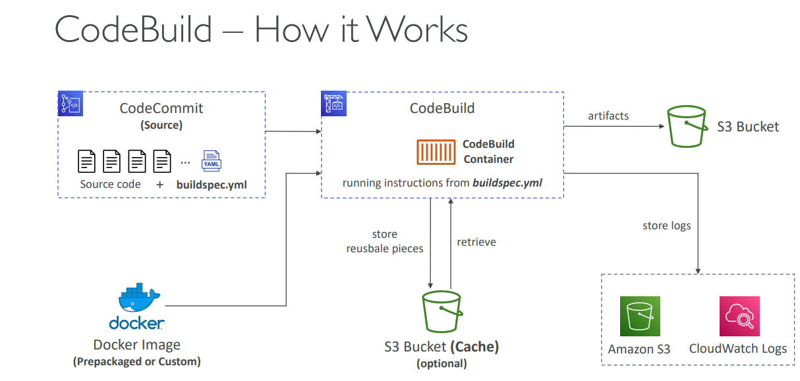

Based on the lessons, here's a comprehensive explanation of **AWS CodeBuild**:

## What is AWS CodeBuild?

### **Core Concept**
AWS CodeBuild is a **fully managed continuous integration (CI) service** that compiles source code, runs tests, and produces software packages ready for deployment.

### **Key Characteristics**
- **Fully Managed**: No servers to manage or provision
- **Continuous Scaling**: Automatically scales to handle build workloads
- **No Build Queues**: Eliminates waiting time for build resources
- **Pay-per-Use**: Charged per minute of compute resources used
- **Docker-based**: Uses Docker containers for reproducible builds

### **Primary Functions**
- **Compile Source Code**: Build applications from source
- **Run Tests**: Execute unit tests, integration tests, and other validation
- **Package Software**: Create deployment artifacts
- **Jenkins Alternative**: Modern replacement for self-managed build servers

## CodeBuild Architecture

### **How CodeBuild Works**


**Build Process Flow:**
1. **Source Retrieval**: CodeBuild fetches source code from repository
2. **Container Creation**: Spins up Docker container with specified environment
3. **Build Execution**: Runs commands defined in `buildspec.yml`
4. **Artifact Generation**: Produces build outputs and stores in S3
5. **Cleanup**: Destroys container after build completion

### **Container-Based Architecture**
- **Docker Foundation**: Every build runs in a Docker container
- **Isolated Environment**: Each build gets a fresh, clean environment
- **Reproducible Builds**: Same environment every time
- **Custom Images**: Use prepackaged or custom Docker images

## Supported Build Environments

### **Programming Languages**
- **Java**: Maven, Gradle projects
- **Node.js**: npm, yarn builds
- **Python**: pip, virtualenv environments
- **Ruby**: gem, bundler projects
- **Go**: go build, go test
- **PHP**: composer, PHPUnit
- **.NET Core**: dotnet build, restore
- **Android**: Android SDK, Gradle
- **Docker**: Any containerized application

### **Runtime Images**
- **AWS Managed**: Prepackaged images for common languages
- **Custom Images**: Build your own Docker images
- **ECR Integration**: Use images from Amazon ECR
- **Docker Hub**: Public images from Docker Hub

## buildspec.yml Configuration

### **File Structure**
The `buildspec.yml` file **must be at the root** of your source code and defines the build process:

```yaml
version: 0.2
env:
  variables:
    NODE_ENV: production
  parameter-store:
    DB_PASSWORD: /myapp/db/password
  secrets-manager:
    API_KEY: /myapp/api/key
phases:
  install:
    runtime-versions:
      nodejs: 18
    commands:
      - npm install -g typescript
  pre_build:
    commands:
      - npm install
      - npm run test
  build:
    commands:
      - npm run build
      - docker build -t myapp .
  post_build:
    commands:
      - docker tag myapp:latest myapp:$CODEBUILD_BUILD_NUMBER
      - docker push myapp:latest
artifacts:
  files:
    - '**/*'
  base-directory: dist
cache:
  paths:
    - node_modules/**/*
```

### **Phase Breakdown**

**1. Install Phase**
- **Purpose**: Install dependencies needed for the build
- **Examples**: Install specific runtime versions, global packages
- **Real-world**: Install Node.js 18, Python packages, Java SDK

**2. Pre-build Phase**
- **Purpose**: Commands to execute before build
- **Examples**: Install project dependencies, run tests
- **Real-world**: `npm install`, `pip install -r requirements.txt`

**3. Build Phase**
- **Purpose**: Main build commands
- **Examples**: Compile code, create Docker images
- **Real-world**: `npm run build`, `docker build`, `mvn package`

**4. Post-build Phase**
- **Purpose**: Finishing touches after build
- **Examples**: Tag Docker images, upload artifacts
- **Real-world**: Push to ECR, generate deployment packages

## Environment Variables

### **Variable Types**

**1. Plaintext Variables**
```yaml
env:
  variables:
    NODE_ENV: production
    API_URL: https://api.example.com
```

**2. Parameter Store Integration**
```yaml
env:
  parameter-store:
    DB_HOST: /myapp/database/host
    DB_PORT: /myapp/database/port
```

**3. Secrets Manager Integration**
```yaml
env:
  secrets-manager:
    DB_PASSWORD: /myapp/secrets/db-password
    API_KEY: /myapp/secrets/api-key
```

## Build Artifacts

### **Artifact Management**
- **S3 Storage**: All artifacts stored in S3 buckets
- **KMS Encryption**: Artifacts encrypted at rest
- **Versioning**: Each build creates versioned artifacts
- **Pipeline Integration**: Artifacts passed to subsequent pipeline stages

### **Artifact Configuration**
```yaml
artifacts:
  files:
    - '**/*'                    # All files
    - 'dist/**/*'              # Specific directory
    - 'target/*.jar'           # Specific file patterns
  base-directory: 'build'       # Base directory for artifacts
  name: myapp-$CODEBUILD_BUILD_NUMBER  # Artifact name
```

## Caching for Performance

### **Cache Configuration**
```yaml
cache:
  paths:
    - node_modules/**/*        # Node.js dependencies
    - ~/.m2/repository/**/*    # Maven dependencies
    - vendor/**/*              # PHP dependencies
```

### **Cache Benefits**
- **Faster Builds**: Reuse downloaded dependencies
- **Cost Reduction**: Less compute time for dependency installation
- **Consistency**: Same dependencies across builds
- **S3 Storage**: Cache stored in S3 for persistence

## Integration with AWS Services

### **Source Integration**
- **CodeCommit**: Native AWS Git repositories
- **GitHub**: Public and private repositories
- **Bitbucket**: Atlassian Git repositories
- **S3**: Source code packages

### **Pipeline Integration**
- **CodePipeline**: Orchestrated CI/CD workflows
- **CloudWatch Events**: Trigger builds on repository changes
- **Lambda**: Custom build triggers and notifications

### **Monitoring and Logging**
- **CloudWatch Logs**: Build logs and output
- **CloudWatch Metrics**: Build statistics and performance
- **EventBridge**: Build status notifications
- **CloudWatch Alarms**: Failure threshold alerts

## Security Features

### **IAM Integration**
- **Service Roles**: CodeBuild assumes IAM roles for permissions
- **Fine-grained Permissions**: Access to specific AWS services
- **Cross-account Access**: Build projects across AWS accounts

### **VPC Integration**
- **Network Security**: Run builds inside VPC
- **Private Resources**: Access private databases and services
- **Security Groups**: Control network access

### **Encryption**
- **KMS Integration**: Encrypt build artifacts
- **Secrets Management**: Secure handling of sensitive data
- **CloudTrail**: Audit all API calls

## Real-World Implementation Examples

### **Example 1: Node.js Web Application**
```yaml
version: 0.2
phases:
  install:
    runtime-versions:
      nodejs: 18
  pre_build:
    commands:
      - npm install
      - npm run test
  build:
    commands:
      - npm run build
  post_build:
    commands:
      - aws s3 cp dist/ s3://my-website-bucket/ --recursive
artifacts:
  files:
    - '**/*'
  base-directory: dist
```

### **Example 2: Docker Application**
```yaml
version: 0.2
phases:
  pre_build:
    commands:
      - aws ecr get-login-password | docker login --username AWS --password-stdin $AWS_ACCOUNT_ID.dkr.ecr.$AWS_DEFAULT_REGION.amazonaws.com
  build:
    commands:
      - docker build -t $IMAGE_REPO_NAME:$IMAGE_TAG .
      - docker tag $IMAGE_REPO_NAME:$IMAGE_TAG $AWS_ACCOUNT_ID.dkr.ecr.$AWS_DEFAULT_REGION.amazonaws.com/$IMAGE_REPO_NAME:$IMAGE_TAG
  post_build:
    commands:
      - docker push $AWS_ACCOUNT_ID.dkr.ecr.$AWS_DEFAULT_REGION.amazonaws.com/$IMAGE_REPO_NAME:$IMAGE_TAG
```

### **Example 3: Java Spring Boot Application**
```yaml
version: 0.2
phases:
  install:
    runtime-versions:
      java: openjdk11
  pre_build:
    commands:
      - mvn clean compile test
  build:
    commands:
      - mvn package
  post_build:
    commands:
      - mv target/*.jar app.jar
artifacts:
  files:
    - app.jar
    - appspec.yml
cache:
  paths:
    - ~/.m2/repository/**/*
```

## Cost Optimization

### **Pricing Model**
- **Pay-per-minute**: Only charged for actual build time
- **No Idle Costs**: No charges when not building
- **Compute Types**: Different instance sizes for different needs

### **Cost Optimization Strategies**
- **Caching**: Reduce build time with dependency caching
- **Parallel Builds**: Split large builds into parallel jobs
- **Right-sizing**: Choose appropriate compute types
- **Build Optimization**: Optimize build scripts for speed

## Best Practices

### **Build Configuration**
- **Fast Feedback**: Run tests early in the build process
- **Fail Fast**: Stop builds on first failure
- **Parallel Execution**: Run independent tasks in parallel
- **Artifact Management**: Clean up old artifacts regularly

### **Security**
- **Least Privilege**: Grant minimum required permissions
- **Secrets Management**: Use Parameter Store or Secrets Manager
- **Network Security**: Use VPC for sensitive builds
- **Audit Logging**: Enable CloudTrail for compliance

### **Performance**
- **Caching Strategy**: Cache dependencies and build outputs
- **Build Optimization**: Optimize Docker images and build scripts
- **Monitoring**: Set up CloudWatch alarms for build failures
- **Resource Sizing**: Choose appropriate compute types