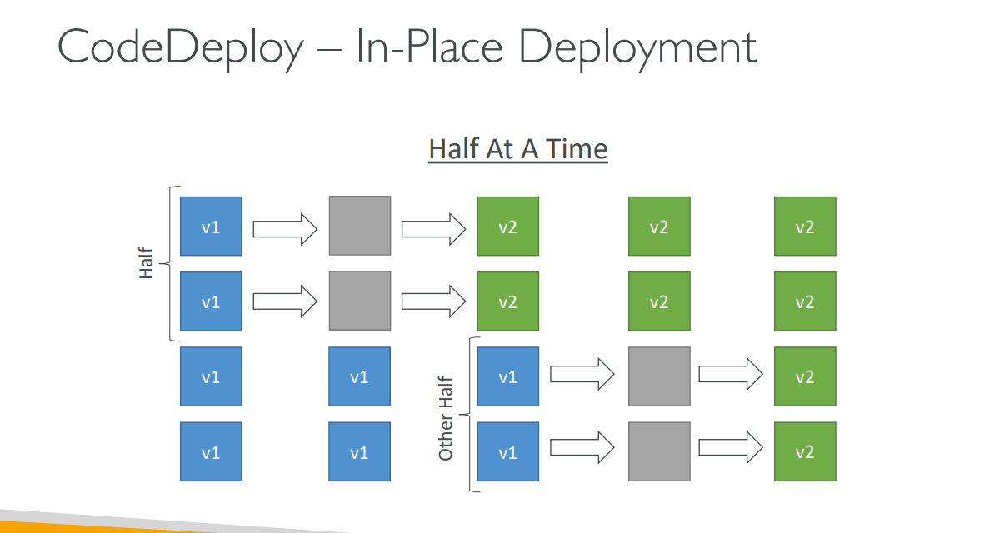
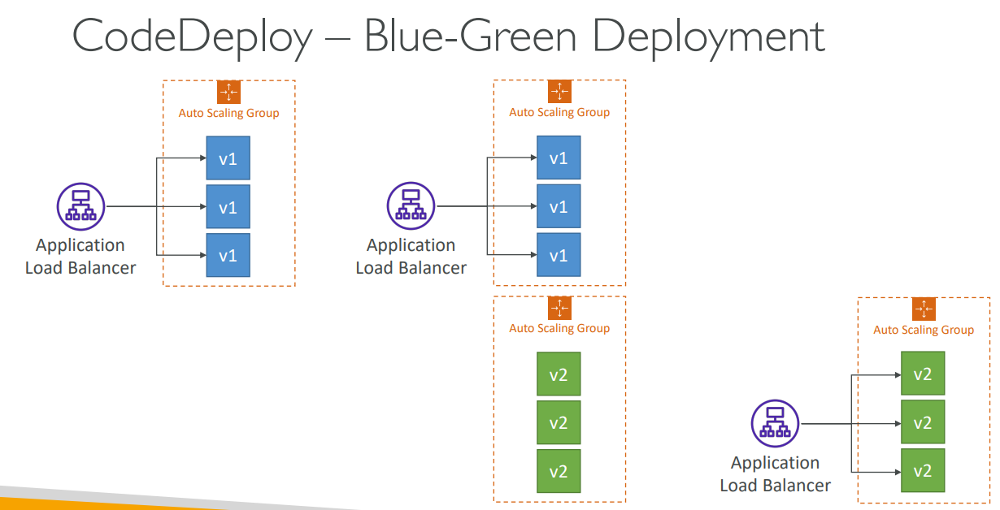

Based on the lessons, here's a comprehensive explanation of **AWS CodeDeploy**:

## What is AWS CodeDeploy?

### **Core Concept**
AWS CodeDeploy is a **deployment service that automates application deployments** to various compute services with sophisticated deployment strategies and rollback capabilities.

### **Key Features**
- **Automated Deployment**: Deploy applications to multiple platforms
- **Gradual Deployment Control**: Control deployment speed and strategy
- **Automated Rollback**: Automatic rollback on failure or CloudWatch alarms
- **Zero Downtime**: Support for blue/green and rolling deployments
- **Multi-Platform**: Deploy to EC2, Lambda, ECS, and on-premises servers

### **Deployment Targets**
- **EC2 Instances**: Virtual machines in AWS
- **On-premises Servers**: Your own data center servers
- **AWS Lambda Functions**: Serverless function deployments
- **Amazon ECS Services**: Container service deployments

## CodeDeploy Architecture

### **How CodeDeploy Works**

```
Source (S3/GitHub) → CodeDeploy → Target Infrastructure
        ↓               ↓              ↓
   Application      Deployment    EC2/Lambda/ECS
     Bundle        Orchestration    Applications
```

**Core Components:**
1. **Application**: Logical grouping of deployment components
2. **Deployment Group**: Set of target instances/services
3. **Deployment Configuration**: Strategy for rolling out changes
4. **appspec.yml**: Defines deployment behavior and lifecycle hooks

## Deployment Platforms

### **1. EC2/On-Premises Platform**

**Requirements:**
- **CodeDeploy Agent**: Must be running on target instances
- **IAM Permissions**: Instances need S3 access for deployment bundles
- **Systems Manager**: Can auto-install and update agents

**Deployment Types:**
- **In-Place Deployment**: Update existing instances
- **Blue/Green Deployment**: Create new instances, then switch traffic

**Deployment Speeds:**
- **AllAtOnce**: Fastest, but causes downtime
- **HalfAtATime**: 50% capacity reduction during deployment
- **OneAtATime**: Slowest, minimal availability impact
- **Custom**: Define your own percentage

### **Real-World Example: E-commerce Website**
```
Current: 4 EC2 instances running v1.0
Deployment: Update to v1.1 using HalfAtATime strategy

Timeline:
Step 1: Stop 2 instances, deploy v1.1, restart → 2 v1.0 + 2 v1.1
Step 2: Stop remaining 2 v1.0 instances, deploy v1.1 → 4 v1.1
```

### **2. Lambda Platform**

**Traffic Shifting Strategies:**

**Linear Deployment:**
- **LambdaLinear10PercentEvery3Minutes**: Gradually shift 10% every 3 minutes
- **LambdaLinear10PercentEvery10Minutes**: Slower, more conservative approach

**Canary Deployment:**
- **LambdaCanary10Percent5Minutes**: 10% for 5 minutes, then 100%
- **LambdaCanary10Percent30Minutes**: Extended validation period

**AllAtOnce:**
- **Immediate**: Switch all traffic instantly

### **Real-World Example: API Gateway + Lambda**
```
Production: Lambda function v1 handling 100% traffic
New Version: Deploy v2 using Canary strategy

Timeline:
0 min: 90% traffic → v1, 10% traffic → v2
5 min: Monitor metrics, error rates
5 min: If healthy, 100% traffic → v2
```

### **3. ECS Platform**

**Blue/Green Deployments Only:**
- **Requirement**: Application Load Balancer must be used
- **Process**: Create new task definition, switch target groups

**Traffic Shifting Options:**
- **ECSLinear10PercentEvery3Minutes**: Gradual traffic shift
- **ECSCanary10Percent5Minutes**: Test with small percentage first
- **AllAtOnce**: Immediate switch

### **Real-World Example: Microservices Architecture**
```
Current: ECS service running 4 tasks of image v1.0
Update: Deploy image v2.0

Process:
1. Create new task definition with v2.0 image
2. Start new tasks in same cluster
3. Gradually shift traffic from old to new tasks
4. Terminate old tasks once deployment complete
```

## appspec.yml Configuration

### **EC2/On-Premises appspec.yml**
```yaml
version: 0.0
os: linux
files:
  - source: /
    destination: /var/www/html/
    overwrite: yes
permissions:
  - object: /var/www/html/
    pattern: "**"
    owner: apache
    group: apache
    mode: 755
hooks:
  BeforeInstall:
    - location: scripts/install_dependencies.sh
      timeout: 300
      runas: root
  ApplicationStart:
    - location: scripts/start_server.sh
      timeout: 300
      runas: root
  ApplicationStop:
    - location: scripts/stop_server.sh
      timeout: 300
      runas: root
  ValidateService:
    - location: scripts/validate_service.sh
      timeout: 300
```

### **Lambda appspec.yml**
```yaml
version: 0.0
Resources:
  - MyLambdaFunction:
      Type: AWS::Lambda::Function
      Properties:
        Name: "MyFunction"
        Alias: "PROD"
        CurrentVersion: "1"
        TargetVersion: "2"
Hooks:
  BeforeAllowTraffic:
    - BeforeAllowTrafficHook
  AfterAllowTraffic:
    - AfterAllowTrafficHook
```

## Deployment Strategies Deep Dive

### **In-Place Deployment**
**Process:**
1. Stop application on target instances
2. Install new version
3. Start application
4. Validate deployment



**Advantages:**
- **Cost-effective**: No additional infrastructure
- **Simple**: Straightforward process
- **Fast**: No instance provisioning time

**Disadvantages:**
- **Downtime**: Application unavailable during deployment
- **Rollback complexity**: Harder to revert changes
- **Risk**: All instances updated simultaneously

### **Blue/Green Deployment**

**Process:**
1. Create new Auto Scaling Group (Green)
2. Deploy new version to Green environment
3. Test Green environment
4. Switch traffic from Blue to Green
5. Terminate Blue environment



**Advantages:**
- **Zero downtime**: Seamless traffic switching
- **Easy rollback**: Keep Blue environment for quick revert
- **Testing**: Validate new version before traffic switch
- **Risk reduction**: Isolated testing environment

**Disadvantages:**
- **Cost**: Double infrastructure during deployment
- **Complexity**: More moving parts
- **Time**: Longer deployment process

## Auto Scaling Group Deployments

### **In-Place ASG Deployment**
- **Process**: Updates existing EC2 instances
- **New Instances**: Automatically get new version
- **Scaling**: Works with ASG scaling events
- **Cost**: No additional infrastructure

### **Blue/Green ASG Deployment**
- **Process**: Creates new ASG with new version
- **Requirements**: Must use Elastic Load Balancer
- **Cleanup**: Choose retention period for old ASG
- **Validation**: Test new ASG before traffic switch

**Real-World Example: High-Traffic Web Application**
```
Current ASG: 10 instances running v1.0 behind ALB
Deployment: Blue/Green to v2.0

Process:
1. Create new ASG with v2.0 (Green) - 10 new instances
2. Register Green ASG with ALB (still 0% traffic)
3. Run health checks and validation tests
4. Gradually shift traffic: 10% → 50% → 100%
5. Deregister Blue ASG, terminate old instances
```

## Rollback and Error Handling

### **Automatic Rollback Triggers**
- **Deployment Failures**: Application fails to start or respond
- **CloudWatch Alarms**: Custom metrics exceed thresholds
- **Health Checks**: Load balancer health checks fail

### **Rollback Process**
- **Not a Restore**: CodeDeploy redeploys previous version
- **New Deployment**: Rollback creates new deployment
- **Speed**: Faster than original deployment (cached artifacts)

### **Manual Rollback**
- **Administrative Control**: Manual intervention required
- **Maintenance Windows**: Planned rollback during maintenance
- **Testing**: Rollback as part of deployment testing

## Integration with Other AWS Services

### **Auto Scaling Groups**
- **Seamless Integration**: New instances automatically get latest deployment
- **Scaling Events**: Deployments work during scaling
- **Launch Templates**: Integration with launch configurations

### **CloudWatch Integration**
- **Metrics**: Deployment success/failure metrics
- **Alarms**: Trigger rollbacks based on application metrics
- **Logs**: Detailed deployment logs for troubleshooting

### **Load Balancers**
- **Health Checks**: Integration with ALB/ELB health checks
- **Traffic Management**: Gradual traffic shifting
- **Blue/Green**: Seamless traffic switching between environments

## Real-World Implementation Examples

### **Example 1: E-commerce Platform**
**Architecture**: 20 EC2 instances behind Application Load Balancer
**Strategy**: Blue/Green deployment with canary testing
**Process**:
1. Deploy to 2 instances (10% canary)
2. Monitor for 10 minutes
3. If healthy, deploy to remaining 18 instances
4. Switch traffic completely

### **Example 2: Microservices API**
**Architecture**: ECS Fargate service with 8 tasks
**Strategy**: Linear deployment with health monitoring
**Process**:
1. Deploy new task definition
2. Start 2 new tasks (25%)
3. Wait 5 minutes, monitor metrics
4. Gradually replace remaining 6 tasks

### **Example 3: Serverless Function**
**Architecture**: Lambda function behind API Gateway
**Strategy**: Canary deployment with automated rollback
**Process**:
1. Deploy new version
2. Route 10% traffic to new version
3. Monitor error rates and latency
4. If metrics good, route 100% traffic
5. If metrics bad, automatic rollback

## Best Practices

### **Deployment Strategy Selection**
- **Development**: AllAtOnce for speed
- **Staging**: Rolling for realistic testing
- **Production**: Blue/Green for zero downtime

### **Monitoring and Validation**
- **Health Checks**: Implement comprehensive health endpoints
- **Metrics**: Monitor key application metrics during deployment
- **Automated Testing**: Include smoke tests in deployment hooks

### **Rollback Preparation**
- **Quick Rollback**: Design for fast rollback capability
- **Monitoring**: Set up CloudWatch alarms for automatic rollback
- **Testing**: Test rollback procedures regularly

### **Security**
- **IAM Roles**: Use least-privilege IAM policies
- **Encryption**: Encrypt deployment artifacts in S3
- **Access Control**: Restrict deployment permissions

CodeDeploy provides sophisticated deployment capabilities that enable zero-downtime deployments, gradual rollouts, and automatic rollbacks, making it essential for production-grade applications requiring high availability and reliability.