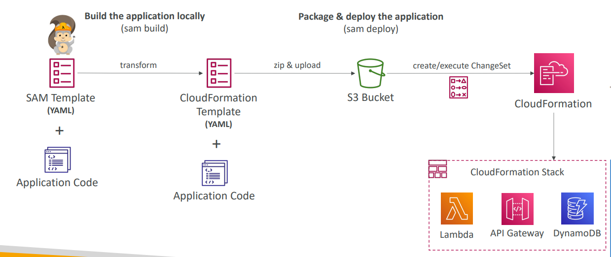
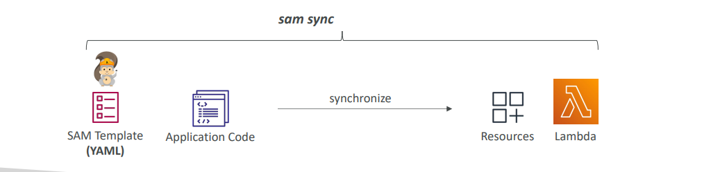

I'll search for information about AWS Serverless Application Model (SAM) lessons to provide you with a comprehensive overview.## AWS Serverless Application Model (SAM) - Overview

AWS SAM lessons will cover the essential framework for developing and deploying serverless applications on AWS. Here's what you'll learn:

### **Core Concepts**

- **SAM Framework**: Understanding SAM as a serverless development framework that transforms simple YAML configurations into complex CloudFormation templates
- **SAM Template Structure**: Learning the Transform header (`AWS::Serverless-2016-10-31`) and key resource types like `AWS::Serverless::Function`, `AWS::Serverless::Api`, and `AWS::Serverless::SimpleTable`

### **Development & Deployment**
- **SAM CLI Commands**: Mastering essential commands like `sam build`, `sam deploy`, `sam sync`, and `sam local` for efficient development workflows
- **SAM Accelerate**: Using `sam sync --watch` for rapid development cycles and bypassing CloudFormation for code-only changes

- **Multi-Environment Configuration**: Managing different environments (dev, prod) using `samconfig.toml` files

### **Local Development & Testing**
- **Local Lambda Execution**: Running Lambda functions locally with `sam local invoke` and `sam local start-lambda`
- **Local API Gateway**: Testing API endpoints locally using `sam local start-api`
- **Event Generation**: Creating sample events for testing with `sam local generate-event`
- **IDE Integration**: Using AWS Toolkits for debugging in VS Code, Cloud9, IntelliJ, and other IDEs

### **Advanced Features**
- **Policy Templates**: Implementing pre-built IAM policies like `S3ReadPolicy`, `SQSPollerPolicy`, and `DynamoDBCrudPolicy`
- **CodeDeploy Integration**: Automated deployment with traffic shifting, canary deployments, and rollback capabilities
- **Deployment Preferences**: Configuring `AutoPublishAlias`, traffic shifting patterns, and CloudWatch alarms for safe deployments

### **SAM vs CDK Comparison**
- **SAM Benefits**: Serverless-focused, declarative YAML/JSON templates, quick Lambda development
- **CDK Integration**: Understanding when to use CDK with SAM and how `cdk synth` works with SAM CLI

### **Real-World Applications**
- Building complete serverless applications with Lambda, API Gateway, and DynamoDB
- CI/CD pipeline integration for automated deployments
- Best practices for serverless architecture patterns

### **Use CloudFormation when:**

- Building complete infrastructure (VPCs, databases, EC2 instances)
- You need fine-grained control over all resource properties
- Working with non-serverless resources
- Creating complex, multi-service architectures

### **Use SAM when:**

- Building serverless applications (Lambda + API Gateway + DynamoDB)
- You want rapid development and local testing
- You prefer simplified, declarative templates
- You need built-in deployment best practices (like CodeDeploy integration)

Bottom Line: SAM is a specialized tool built on top of CloudFormation specifically for serverless applications, making serverless development much faster and easier while CloudFormation remains the comprehensive IaC solution for all AWS resources.