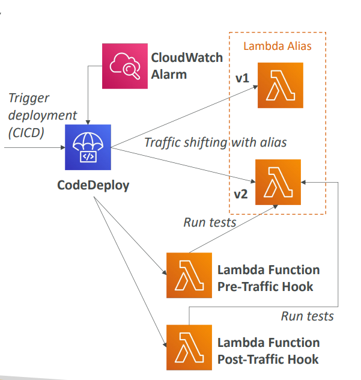

## **SAM and CodeDeploy Integration**

SAM has native integration with AWS CodeDeploy to provide safe, automated deployment strategies for Lambda functions. This integration enables zero-downtime deployments with automated rollback capabilities.

### **How SAM Uses CodeDeploy**

**Built-in Integration**: SAM framework natively uses CodeDeploy to update Lambda functions without requiring separate CodeDeploy configuration. When you deploy through SAM, it automatically leverages CodeDeploy's traffic shifting capabilities.

**Key Components**:
- **Lambda Aliases**: CodeDeploy manages traffic between different versions using Lambda aliases
- **Traffic Shifting**: Gradually moves traffic from old version (v1) to new version (v2)
- **Automated Rollback**: Uses CloudWatch alarms to trigger automatic rollbacks if issues are detected

### **AutoPublishAlias - The Foundation**

This SAM property is crucial for CodeDeploy integration:

```yaml
MyFunction:
  Type: AWS::Serverless::Function
  Properties:
    AutoPublishAlias: live  # Creates and manages alias automatically
    DeploymentPreference:
      Type: Canary10Percent5Minutes
```

**What AutoPublishAlias does**:
- **Detects new deployments** when code changes are pushed
- **Creates new Lambda versions** automatically with the latest code
- **Points the alias** to the updated version of the Lambda function
- **Enables traffic shifting** between versions through the alias

### **Deployment Preference Types**

SAM provides three main deployment strategies:

**1. Linear Deployment**
- **Pattern**: Gradually increase traffic by fixed percentages at regular intervals
- **Examples**:
  - `Linear10PercentEvery3Minutes` - Add 10% traffic every 3 minutes until 100%
  - `Linear10PercentEvery10Minutes` - Add 10% traffic every 10 minutes until 100%

**2. Canary Deployment**
- **Pattern**: Send a small percentage of traffic to new version, then switch all remaining traffic
- **Examples**:
  - `Canary10Percent5Minutes` - 10% traffic to new version for 5 minutes, then 100%
  - `Canary10Percent30Minutes` - 10% traffic to new version for 30 minutes, then 100%

**3. AllAtOnce Deployment**
- **Pattern**: Immediate switch of all traffic to new version
- **Use case**: When you need immediate deployment without gradual shifting

### **Pre and Post Traffic Hooks**

SAM enables you to run validation tests during deployment:

```yaml
DeploymentPreference:
  Type: Canary10Percent5Minutes
  Hooks:
    PreTraffic: !Ref ValidateBeforeTrafficShift
    PostTraffic: !Ref ValidateAfterTrafficShift
```

**Pre-Traffic Hook**: 
- Runs **before** traffic shifting starts
- Validates the new version is working correctly
- Can trigger rollback if validation fails

**Post-Traffic Hook**:
- Runs **after** traffic shifting completes
- Performs final validation checks
- Ensures deployment was successful

### **CloudWatch Alarms Integration**

Automatic rollback based on metrics:

```yaml
DeploymentPreference:
  Type: Canary10Percent5Minutes
  Alarms:
    - !Ref AliasErrorMetricGreaterThanZeroAlarm
    - !Ref LatestVersionErrorMetricGreaterThanZeroAlarm
```

**How it works**:
- **Monitor metrics** like error rates, latency, or custom metrics
- **Trigger rollback** automatically if alarm thresholds are breached
- **Preserve system stability** by reverting to previous working version

### **Real-World Example - E-commerce API**

Imagine you're deploying a new version of an order processing Lambda function:

**Scenario**: Your current version (v1) handles 1000 orders/minute. You want to deploy v2 with new payment processing logic.

**SAM Template**:
```yaml
OrderProcessorFunction:
  Type: AWS::Serverless::Function
  Properties:
    AutoPublishAlias: production
    DeploymentPreference:
      Type: Canary10Percent5Minutes
      Alarms:
        - !Ref ErrorRateAlarm
      Hooks:
        PreTraffic: !Ref ValidateNewPaymentLogic
        PostTraffic: !Ref ValidateAllSystems
```

**Deployment Flow**:
1. **Pre-Traffic Hook** runs validation tests on v2
2. **10% of traffic** (100 orders/minute) routes to v2
3. **CloudWatch monitors** error rates and latency
4. **After 5 minutes**, if all metrics are healthy, **90% remaining traffic** shifts to v2
5. **Post-Traffic Hook** validates complete system functionality


**If problems occur**: CodeDeploy automatically rolls back to v1, ensuring your e-commerce site continues processing orders without disruption.

### **Benefits in Production**

**Risk Mitigation**: Gradual traffic shifting minimizes blast radius if new code has issues
**Zero Downtime**: Customers never experience service interruption
**Automated Recovery**: No manual intervention needed for rollbacks
**Confidence**: Pre/post hooks provide validation checkpoints
**Monitoring**: Built-in integration with CloudWatch for comprehensive observability

This integration makes SAM extremely powerful for production serverless applications, providing enterprise-grade deployment safety with minimal configuration complexity.