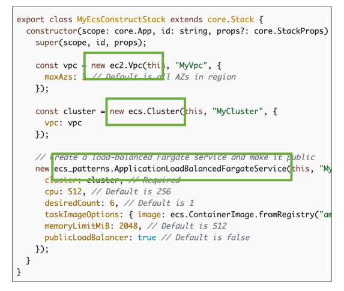
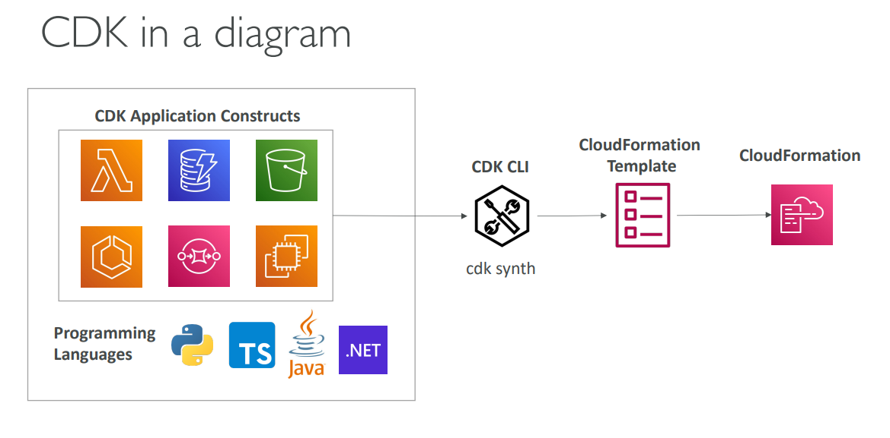

Based on the AWS Cloud Development Kit (CDK) lessons from the course material, here's a comprehensive overview:

## AWS Cloud Development Kit (CDK) Overview

### What is CDK?
AWS CDK is an Infrastructure as Code (IaC) framework that allows you to define cloud infrastructure using familiar programming languages instead of JSON/YAML templates. It's a powerful tool for AWS developers to build, deploy, and manage AWS resources programmatically.

### Key Technologies and Tools You'll Learn:

**Programming Languages Supported:**
- JavaScript/TypeScript
- Python
- Java
- .NET

**Core Components:**
- **CDK Constructs** - High-level components that encapsulate AWS resources
- **CDK CLI** - Command-line interface for managing CDK applications
- **CloudFormation Integration** - CDK compiles to CloudFormation templates
- **CDK Toolkit** - Bootstrap resources for deployment

### Essential CDK Commands:
- `npm install -g aws-cdk-lib` - Install CDK CLI
- `cdk init app` - Create new CDK project
- `cdk bootstrap` - Provision deployment resources
- `cdk synth` - Generate CloudFormation template
- `cdk deploy` - Deploy infrastructure
- `cdk diff` - Compare local vs deployed stacks
- `cdk destroy` - Clean up resources

### CDK Construct Layers:
- **Layer 1 (L1)** - Direct CloudFormation resources (CfnBucket)
- **Layer 2 (L2)** - Higher-level abstractions with sensible defaults
- **Layer 3 (L3)** - Patterns combining multiple resources for common architectures

### Integration Topics:
- **CDK + SAM** - Local testing capabilities
- **CDK Testing** - Using CDK Assertions Module with Jest/Pytest
- **CDK Bootstrapping** - Environment setup and IAM roles
- **Multi-Environment Deployment** - Dev/Prod configurations

### Real-World Applications:
- Lambda function deployment with dependencies
- ECS/EKS container orchestration
- Complete application stacks (API Gateway + Lambda + DynamoDB)
- Multi-service architectures with networking and security

This section prepares you to understand Infrastructure as Code concepts, programmatic AWS resource management, and modern deployment patterns essential for the AWS Developer Associate certification.