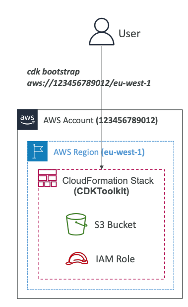

Based on the detailed lesson content from the PDF, here's a comprehensive explanation of the key CDK components:

## CDK Constructs - High-level Components that Encapsulate AWS Resources

### What are CDK Constructs?
CDK Constructs are the fundamental building blocks of CDK applications. They encapsulate everything CDK needs to create the final CloudFormation stack. Each construct can represent either a single AWS resource (like an S3 bucket) or multiple related resources working together (like a worker queue with compute resources).

### Three Layers of Constructs:

**Layer 1 Constructs (L1) - CFN Resources:**
- Directly represent all resources available in CloudFormation
- Construct names start with "Cfn" (e.g., CfnBucket)
- Require explicit configuration of ALL resource properties
- Generated periodically from CloudFormation Resource Specification
- Lowest level, most granular control but requires deep AWS knowledge

**Layer 2 Constructs (L2) - Intent-based API:**
- Higher-level abstractions with convenient defaults and boilerplate
- Provide sensible defaults so you don't need to know all resource details
- Include helpful methods like `bucket.addLifeCycleRule()`
- Most commonly used layer for typical applications
- Balance between control and convenience

**Layer 3 Constructs (L3) - Patterns:**
- Represent multiple related resources for common AWS architectures
- Examples: `aws-apigateway.LambdaRestApi` (API Gateway + Lambda), `aws-ecs-patterns.ApplicationLoadBalancerFargateService` (Fargate + ALB)
- Highest level of abstraction for complete solutions
- Perfect for standard architectural patterns

### AWS Construct Library and Construct Hub:
- **AWS Construct Library**: Collection of constructs included with CDK for every AWS resource
- **Construct Hub**: Additional constructs from AWS, third parties, and open-source community

## CDK CLI - Command-line Interface for Managing CDK Applications

### Essential CDK Commands:

**Installation and Setup:**
- `npm install -g aws-cdk-lib` - Install CDK CLI and libraries globally
- `cdk init app` - Create new CDK project from template

**Development Workflow:**
- `cdk synth` - Synthesize and print the CloudFormation template (crucial for debugging)
- `cdk diff` - View differences between local CDK code and deployed stack
- `cdk deploy` - Deploy the stack(s) to AWS
- `cdk destroy` - Clean up and destroy the stack(s)

**Environment Management:**
- `cdk bootstrap aws://<account>/<region>` - Bootstrap environment before first deployment

### Real-world Example:
In a typical development workflow, you'd write your infrastructure in TypeScript, run `cdk synth` to verify the generated CloudFormation template, use `cdk diff` to see changes, then `cdk deploy` to update your AWS resources.

## CloudFormation Integration - CDK Compiles to CloudFormation Templates

### How the Integration Works:
1. **Code Compilation**: Your CDK code (Python, TypeScript, etc.) gets "compiled" into CloudFormation JSON/YAML templates
2. **Template Generation**: `cdk synth` creates the CloudFormation template
3. **Deployment**: CDK uses CloudFormation service to deploy your infrastructure
4. **State Management**: CloudFormation manages the state and lifecycle of your resources

### Key Benefits:
- **Unified Deployment**: Deploy infrastructure and application runtime code together
- **CloudFormation Features**: Inherit all CloudFormation capabilities (rollback, change sets, etc.)
- **Familiar Deployment**: Uses proven CloudFormation engine under the hood
- **State Tracking**: CloudFormation tracks resource state and dependencies

### CDK + SAM Integration:
You can use SAM CLI to locally test CDK applications:
1. Run `cdk synth` to generate CloudFormation template
2. Use `sam local invoke` with the generated template for local testing

### Real-world Example:
An e-commerce application might define a complete serverless architecture (API Gateway + Lambda + DynamoDB) in TypeScript CDK code, which compiles to a CloudFormation template managing dozens of resources with proper dependencies and configurations.

## CDK Toolkit - Bootstrap Resources for Deployment

### What is CDK Bootstrapping?
Bootstrapping is the process of provisioning essential resources that CDK needs before deploying applications into an AWS environment (account + region combination).

### CDK Toolkit Components:
When you run `cdk bootstrap aws://<account>/<region>`, it creates a CloudFormation stack called **CDKToolkit** containing:

**S3 Bucket:**
- Stores CDK application assets (Lambda code, Docker images)
- Holds CloudFormation templates
- Manages file uploads during deployment

**IAM Roles:**
- Grant CDK permissions to perform deployments
- Enable CloudFormation to create/modify AWS resources
- Provide secure access for deployment operations

### Bootstrap Process:
1. **One-time Setup**: Must be run once per AWS environment (account/region)
2. **Error Prevention**: Without bootstrapping, you'll get "Policy contains a statement with one or more invalid principal" error
3. **Resource Provisioning**: Creates necessary infrastructure for CDK operations

### Real-world Example:
A company deploying to multiple environments (dev: us-east-1, staging: us-west-2, prod: eu-west-1) would run:
- `cdk bootstrap aws://123456789012/us-east-1`
- `cdk bootstrap aws://123456789012/us-west-2`  
- `cdk bootstrap aws://123456789012/eu-west-1`

Each environment gets its own CDKToolkit stack with dedicated S3 bucket and IAM roles, ensuring isolated and secure deployments across different AWS accounts and regions.

### Testing Integration:
CDK includes robust testing capabilities using the CDK Assertions Module with Jest (JavaScript) or Pytest (Python), supporting both fine-grained assertions (testing specific resource properties) and snapshot tests (comparing entire templates against baselines).