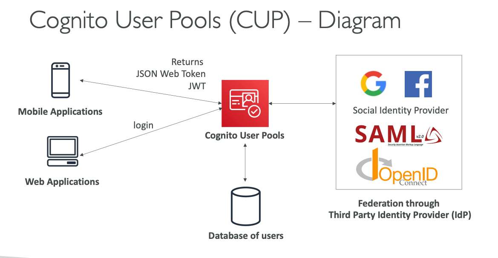
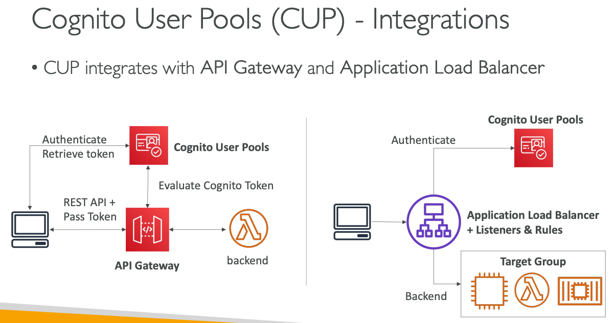

## AWS Cognito User Pools (CUP) - Detailed Explanation

### Core Purpose and Architecture

Cognito User Pools serves as a **serverless user directory** specifically designed for web and mobile applications. It acts as the authentication layer that verifies user identity before granting access to your application. Think of it as your application's dedicated user management system that handles all the complexities of user authentication without requiring you to build or maintain authentication infrastructure.

The service maintains an internal database of users with their credentials, profile information, and authentication preferences. When users successfully authenticate, CUP issues JSON Web Tokens (JWT) that contain verified user information and can be used to access protected resources.

### Authentication Features and Capabilities

**Basic Authentication Methods:**
- Username or email with password combinations
- Automatic password reset functionality through email or SMS
- Email and phone number verification to ensure valid contact information
- Account lockout policies to prevent brute force attacks

**Multi-Factor Authentication (MFA):**
CUP provides robust MFA options including SMS-based codes, time-based one-time passwords (TOTP) through authenticator apps, and adaptive authentication that triggers MFA only when suspicious activity is detected.

**Federated Identity Support:**
The service seamlessly integrates with external identity providers including Facebook, Google, Amazon, Apple, and enterprise systems through SAML and OpenID Connect. This allows users to sign in using their existing social media or corporate accounts while maintaining a unified user experience.

**Compromised Credential Protection:**
CUP includes advanced security features that automatically detect when user credentials have been compromised in external breaches and can block those accounts until passwords are reset.

### Adaptive Authentication and Risk Assessment

CUP employs machine learning algorithms to analyze each sign-in attempt and generate risk scores based on factors like device fingerprinting, geographic location, IP address patterns, and user behavior. When suspicious activity is detected, the system can automatically require additional authentication factors or block access entirely. This creates a dynamic security posture that adapts to threats without impacting legitimate users.

### Lambda Triggers for Custom Authentication Flows

One of CUP's most powerful features is its integration with AWS Lambda through various trigger points in the authentication flow:

**Authentication Event Triggers:**
- **Pre-Authentication:** Validates sign-in requests before processing, allowing custom business logic
- **Post-Authentication:** Logs successful authentications for analytics or triggers welcome workflows
- **Pre-Token Generation:** Modifies JWT token claims to include custom user attributes

**User Management Triggers:**
- **Pre-Sign-up:** Implements custom validation logic for new user registrations
- **Post-Confirmation:** Sends personalized welcome messages or initializes user resources
- **Migrate User:** Enables seamless migration from existing user databases during authentication

### Hosted Authentication UI

CUP provides a fully managed, customizable authentication interface that can be embedded directly into applications. This hosted UI handles the entire authentication flow including sign-up, sign-in, password reset, and MFA challenges. The interface can be customized with your brand colors, logos, and custom CSS to maintain consistent user experience.

For production applications requiring custom domains, you can configure your own domain with SSL certificates (which must be created in the us-east-1 region) to ensure users remain within your branded experience throughout the authentication process.

### JWT Token Management

Upon successful authentication, CUP issues three types of tokens:
- **ID Token:** Contains user identity information and attributes
- **Access Token:** Used for API authorization
- **Refresh Token:** Allows token renewal without re-authentication

These JWT tokens are cryptographically signed and include user information such as unique user ID (sub), email, phone number, and custom attributes. The tokens have configurable expiration times and can be validated by your application or AWS services without additional API calls.

### Integration with AWS Services

**API Gateway Integration:**
CUP tokens can be directly validated by API Gateway, providing seamless authentication for REST APIs. API Gateway automatically verifies token signatures and expiration, rejecting invalid requests before they reach your backend services.

**Application Load Balancer Integration:**
ALB can handle user authentication at the load balancer level, offloading authentication processing from your application servers. Users are redirected to CUP for authentication, and successful authentication results in session cookies that grant access to protected applications.

### Real-World Implementation Example

Consider an e-commerce platform that needs to support both social login and traditional email/password authentication. The company implements CUP with the following architecture:

Users can register using their email or sign in through Google/Facebook federation. Upon registration, a Lambda trigger validates the email domain against a corporate whitelist and initializes user preferences in DynamoDB. The hosted UI is customized with the company's branding and deployed on a custom domain.

When users access the mobile app, they authenticate through CUP and receive JWT tokens. These tokens are automatically validated by API Gateway when users access product catalogs, shopping cart APIs, or order management services. The adaptive authentication system monitors for suspicious login patterns and requires MFA for high-risk transactions like payment processing.

For the web application, an Application Load Balancer handles authentication, redirecting unauthenticated users to the CUP hosted UI and maintaining session state through secure cookies. Lambda triggers log all authentication events to CloudWatch for security monitoring and send personalized welcome emails to new users.

This architecture eliminates the need for custom authentication code while providing enterprise-grade security, scalability, and user experience across multiple platforms and devices.