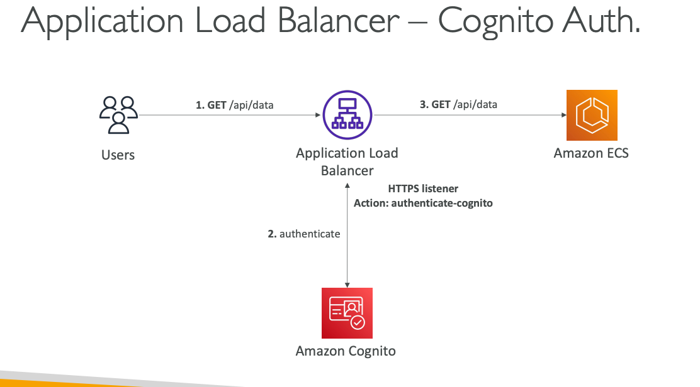
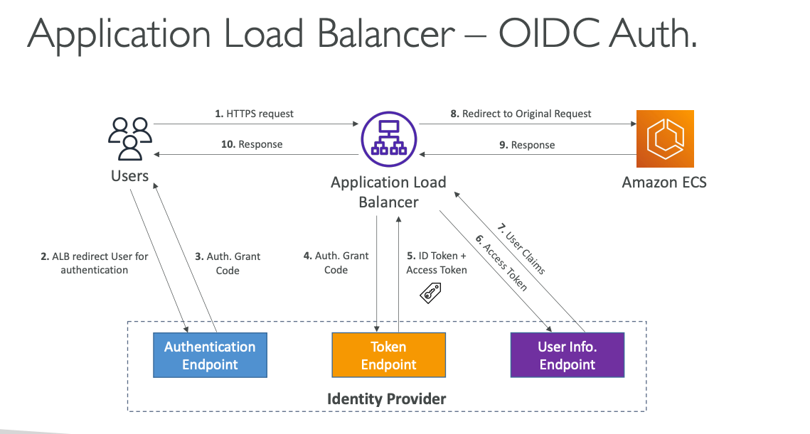

## Application Load Balancer – Authenticate Users

### Core Authentication Architecture

Application Load Balancer (ALB) provides a powerful capability to **offload user authentication** from your application servers directly to the load balancer layer. This means your backend applications can focus entirely on business logic while ALB handles the complete authentication workflow, including redirects, token validation, and session management.

The authentication occurs at the network layer before requests reach your application, creating a security gateway that ensures only authenticated users can access your protected resources. This architecture eliminates the need for authentication code in every application and provides consistent security policies across all services behind the load balancer.

### Authentication Methods and Identity Providers

**Cognito User Pools Integration:**
ALB integrates seamlessly with Cognito User Pools, automatically redirecting unauthenticated users to the CUP hosted authentication interface. Once users authenticate, ALB receives the JWT tokens and validates them before allowing access to backend applications. This integration supports all CUP features including social identity federation (Facebook, Google, Amazon), corporate identity systems (SAML, LDAP, Microsoft AD), and multi-factor authentication.

**OpenID Connect (OIDC) Integration:**
ALB can authenticate against any OIDC-compliant identity provider including corporate identity systems, third-party authentication services, and custom identity solutions. The ALB manages the complete OAuth 2.0 flow including authorization code exchange, token validation, and user information retrieval.

### Technical Requirements and Configuration

**HTTPS Listener Requirement:**
Authentication actions can only be configured on HTTPS listeners for security reasons. This ensures all authentication tokens and user credentials are encrypted in transit. You must configure SSL/TLS certificates on your ALB before enabling authentication features.

**Authentication Actions Configuration:**
ALB uses listener rules with authentication actions that define how to handle incoming requests:
- **authenticate-cognito:** For Cognito User Pool integration
- **authenticate-oidc:** For OpenID Connect provider integration

**OnUnauthenticatedRequest Behavior:**
ALB provides three options for handling unauthenticated requests:
- **authenticate (default):** Redirect users to the identity provider for authentication
- **deny:** Return HTTP 401 Unauthorized for unauthenticated requests
- **allow:** Pass unauthenticated requests to the backend (useful for optional authentication)

### Authentication Flow and Token Management

**Cognito Authentication Flow:**
1. User makes request to protected resource
2. ALB detects absence of authentication session
3. ALB redirects user to Cognito User Pool hosted UI
4. User authenticates with CUP (including MFA if required)
5. CUP redirects back to ALB with authorization code
6. ALB exchanges authorization code for JWT tokens
7. ALB validates tokens and creates session cookie
8. Request is forwarded to backend with user information headers

**OIDC Authentication Flow:**
The OIDC flow follows OAuth 2.0 standards with ALB acting as the OAuth client:
1. User requests protected resource
2. ALB redirects to OIDC provider's authorization endpoint
3. User authenticates with identity provider
4. Provider returns authorization code to ALB
5. ALB exchanges code for ID token and access token at token endpoint
6. ALB validates tokens and retrieves user claims from userinfo endpoint
7. ALB forwards authenticated request to backend applications

### Session Management and Security

**Session Cookies:**
After successful authentication, ALB creates encrypted session cookies that maintain user authentication state. These cookies are cryptographically signed and contain user identity information, eliminating the need for applications to validate tokens on every request.

**Token Validation:**
ALB automatically validates JWT token signatures, expiration times, and issuer information before forwarding requests. Invalid or expired tokens result in automatic reauthentication workflows.

**User Information Headers:**
ALB injects authenticated user information into HTTP headers before forwarding requests to backend applications:
- User identity (sub claim)
- Email address
- Custom attributes from the identity provider
- Authentication timestamp

### Configuration Requirements for Different Identity Providers

**Cognito User Pools Setup:**
- Create User Pool with required authentication settings
- Configure User Pool Client with appropriate OAuth settings
- Set up User Pool Domain for hosted UI
- Configure callback URLs to match ALB endpoints
- Ensure ID tokens are returned (required for ALB integration)

**OIDC Provider Setup:**
- Register ALB as OAuth client with identity provider
- Configure Client ID and Client Secret
- Set redirect URIs to ALB endpoints: `https://ALB-DNS/oauth2/idpresponse`
- Configure appropriate scopes for user information access

### Real-World Implementation Example

Consider a microservices architecture for a SaaS platform where multiple services need user authentication. The company implements ALB authentication with the following setup:

The ALB sits in front of multiple target groups containing different microservices (user management, billing, analytics, reporting). Each target group represents a different business domain but all require user authentication.

ALB is configured with Cognito User Pools integration supporting both social login (Google, Microsoft) and corporate SAML federation for enterprise customers. The hosted UI is customized with company branding and deployed on a custom domain with SSL certificates.

When users access any service (billing.company.com, analytics.company.com), they're automatically redirected to the unified authentication experience. After authentication, ALB maintains session state across all services, providing single sign-on capabilities.

Backend microservices receive authenticated requests with user information in HTTP headers, allowing them to implement user-specific business logic without handling authentication. The billing service uses the user ID for account association, the analytics service applies user-based data filtering, and the reporting service enforces user permissions.

ALB logs all authentication events to CloudWatch, providing centralized security monitoring across the entire platform. Failed authentication attempts, suspicious login patterns, and session management events are tracked for security analysis and compliance reporting.

This architecture provides enterprise-grade authentication with minimal application code changes, consistent security policies, and centralized user management across a complex microservices environment.