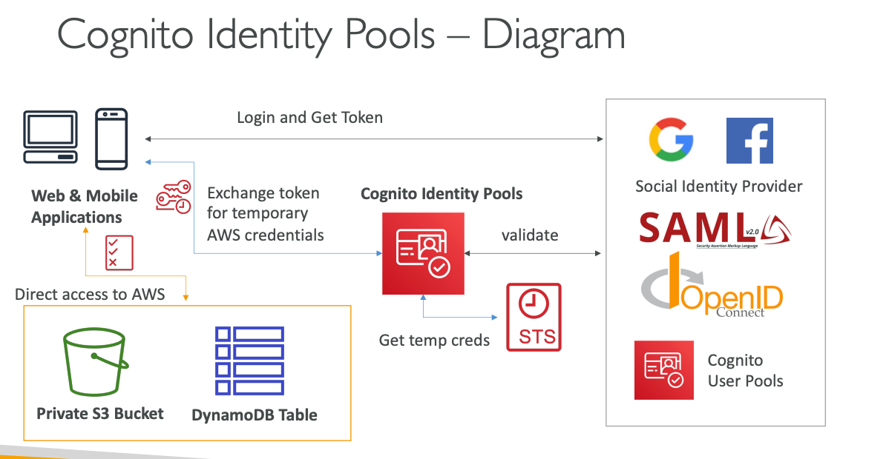

## Cognito Identity Pools (Federated Identities)

### Core Purpose and Authorization Model

Cognito Identity Pools serves as the **authorization layer** that provides temporary AWS credentials to users, enabling direct access to AWS services without requiring backend API calls. Unlike User Pools which handle authentication (who you are), Identity Pools handle authorization (what you can access). The service acts as a bridge between various identity providers and AWS resources, translating external identities into AWS IAM credentials with specific permissions.

The fundamental principle is that users authenticate with their chosen identity provider (social, corporate, or Cognito User Pools), then exchange their authentication tokens for temporary AWS credentials that are scoped to their specific role and permissions. This enables applications to access AWS services directly from client-side code while maintaining fine-grained security controls.

### Identity Sources and Federation Support

**Multiple Identity Provider Integration:**
Identity Pools can accept users from diverse authentication sources including public social providers (Amazon, Facebook, Google, Apple), enterprise systems (SAML, LDAP, Active Directory through federation), OpenID Connect providers, Cognito User Pools, and even custom authentication systems through developer-authenticated identities.

**Unauthenticated (Guest) Access:**
A unique feature of Identity Pools is support for unauthenticated users, allowing applications to provide limited functionality to guests without requiring sign-up. Guest users receive temporary credentials with restricted permissions, enabling features like content browsing or trial access while maintaining security boundaries.

**Cognito User Pools Integration:**
When combined with User Pools, Identity Pools create a complete authentication and authorization solution. Users authenticate through User Pools (receiving JWT tokens) and then exchange these tokens through Identity Pools for AWS credentials, providing seamless access to cloud resources.

### IAM Role Mapping and Credential Management

**Default Role Assignment:**
Identity Pools maintain separate default IAM roles for authenticated and unauthenticated users. These roles define the baseline permissions for each user category, with authenticated users typically receiving broader access than guest users.

**Rule-Based Role Selection:**
Advanced configurations allow dynamic role assignment based on user attributes, identity provider, or custom claims. This enables sophisticated access control scenarios where different user types receive different permission sets based on their characteristics or authentication source.

**STS Integration for Credential Issuance:**
Identity Pools leverage AWS Security Token Service (STS) to issue temporary credentials with configurable expiration times (15 minutes to 1 hour). These credentials include access keys, secret keys, and session tokens that applications use to authenticate with AWS services.

**Trust Policy Requirements:**
IAM roles used by Identity Pools must include trust policies that allow Cognito Identity Pools to assume the roles. This establishes the secure relationship between the identity pool and the IAM roles it can distribute.

### Policy Variables and Fine-Grained Access Control

**Dynamic Permission Scoping:**
Policy variables enable user-specific resource access by injecting identity information into IAM policies. Common variables include `${cognito-identity.amazonaws.com:sub}` (unique user ID) and `${cognito-identity.amazonaws.com:aud}` (identity pool ID), allowing policies to dynamically scope permissions to individual users.

**S3 Bucket Access Patterns:**
Users can be granted access to specific S3 prefixes based on their identity, such as allowing access only to `private/${cognito-identity.amazonaws.com:sub}/*` ensuring each user can only access their own files within shared buckets.

**DynamoDB Row-Level Security:**
Policy variables enable row-level access control in DynamoDB by restricting users to items where partition keys match their user ID. This allows shared tables where users can only access their own data records.

**Leading Key Restrictions:**
Advanced DynamoDB policies can use leading key conditions to limit user access to specific data partitions, enabling multi-tenant applications with user-isolated data access.

### Integration Patterns and Architecture

**Direct AWS Service Access:**
Mobile and web applications can directly interact with AWS services like S3 for file uploads, DynamoDB for data persistence, and Lambda for serverless computing without requiring intermediate API layers. This reduces latency and infrastructure complexity while maintaining security.

**API Gateway Integration:**
Identity Pool credentials can be used with API Gateway through IAM authorization, allowing fine-grained access control to API endpoints based on user identity and permissions.

**Cross-Account Access:**
Identity Pools support cross-account scenarios where users authenticate in one AWS account but access resources in different accounts, enabling complex organizational structures and resource sharing patterns.

### Guest User Implementation Strategies

**Anonymous Analytics:**
Guest users can be provided with credentials to store analytics data or usage metrics in dedicated S3 buckets or DynamoDB tables, enabling product optimization without requiring user registration.

**Trial Access Patterns:**
Applications can offer limited functionality to unauthenticated users through carefully scoped guest credentials, encouraging engagement while protecting sensitive resources.

**Progressive Authentication:**
Guest sessions can be seamlessly upgraded to authenticated sessions when users choose to sign up, transferring any accumulated data or state to their permanent identity.

### Real-World Implementation Example

Consider a photo-sharing mobile application that needs to support both social authentication and direct AWS resource access. The architecture combines User Pools and Identity Pools for comprehensive identity management.

Users authenticate through Cognito User Pools using Facebook, Google, or email/password. Upon authentication, the mobile app exchanges the User Pool JWT token through Identity Pools for temporary AWS credentials. These credentials enable direct S3 uploads for photos, DynamoDB access for metadata storage, and Lambda invocations for image processing.

The IAM roles are configured with policy variables ensuring each user can only access their own S3 prefix (`photos/${cognito-identity.amazonaws.com:sub}/`) and DynamoDB items with matching user IDs. Guest users receive limited credentials allowing them to browse public photos but not upload content.

For enterprise customers, the application supports SAML federation through Identity Pools, allowing corporate users to access the application using their existing Active Directory credentials. Different IAM roles provide enterprise users with additional features like team collaboration and administrative capabilities.

The mobile application uses AWS SDK directly with the temporary credentials, eliminating the need for custom backend APIs for file operations. Image thumbnails are generated automatically through S3 event triggers invoking Lambda functions, with permissions controlled through the same identity-based access patterns.

CloudWatch logs track all AWS API calls made with Identity Pool credentials, providing comprehensive audit trails for security compliance and usage analysis. Failed access attempts and permission denials are monitored for security insights and access pattern optimization.

This architecture enables a scalable, secure photo-sharing platform with minimal backend infrastructure while providing sophisticated user access controls and seamless integration with existing identity systems.