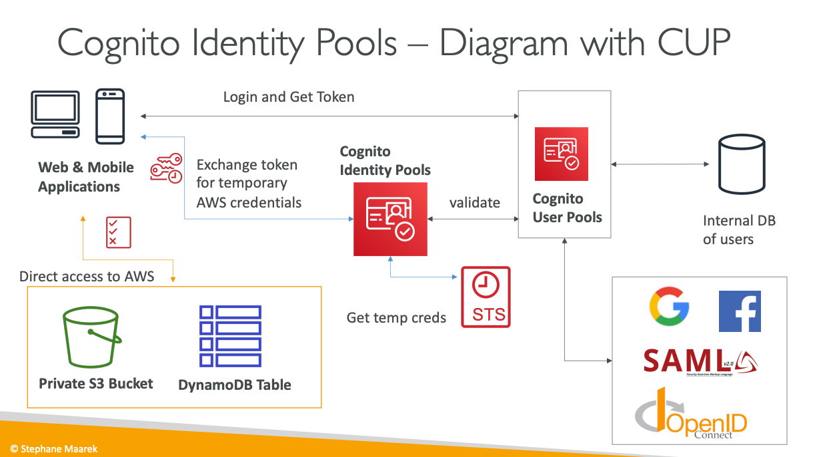

## Cognito User Pools vs Identity Pools - Summary

### Primary Functions and Purpose

**Cognito User Pools (CUP) - Authentication (Identity Verification)**
- Functions as a **serverless user directory** for web and mobile applications
- Handles user registration, sign-in, and account management 
- Verifies **who the user is** through credentials validation
- Issues JWT tokens upon successful authentication
- Manages user lifecycle including password resets and account verification

**Cognito Identity Pools (CIP) - Authorization (Access Control)**
- Provides **temporary AWS credentials** to users for direct AWS service access
- Determines **what the user can access** in AWS resources
- Maps users to IAM roles with specific permissions
- Supports both authenticated and unauthenticated (guest) users
- Enables fine-grained resource access through policy variables

### Key Features Comparison

**User Pools Features:**
- Username/email and password authentication
- Multi-factor authentication (MFA) and adaptive authentication
- Social identity federation (Facebook, Google, SAML)
- Hosted UI with custom branding and domains
- Lambda triggers for custom authentication workflows
- Email and phone number verification
- Compromised credential protection
- Risk-based authentication scoring

**Identity Pools Features:**
- Multiple identity source support (social, SAML, OIDC, User Pools)
- Guest/unauthenticated user access capabilities
- IAM role mapping based on user attributes
- Policy variables for user-specific resource access
- STS integration for temporary credential issuance
- Cross-account access support
- Fine-grained permissions for S3, DynamoDB, and other AWS services

### Integration Patterns

**User Pools Integrations:**
- API Gateway for REST API authentication
- Application Load Balancer for web application authentication
- Returns JWT tokens for application-level authorization
- Works with Lambda authorizers for custom validation

**Identity Pools Integrations:**
- Direct AWS service access (S3, DynamoDB, Lambda)
- API Gateway with IAM authorization
- Mobile and web applications for client-side AWS SDK usage
- Cross-account resource access scenarios

### Authentication vs Authorization Model

**User Pools (Authentication):**
- Validates user credentials and identity
- Issues JWT tokens containing user information
- Manages user sessions and token lifecycle
- Focuses on proving user identity to applications

**Identity Pools (Authorization):**
- Exchanges identity tokens for AWS credentials
- Provides scoped access to AWS resources
- Maps users to appropriate IAM roles
- Focuses on controlling what users can do in AWS

### Use Case Scenarios

**When to Use User Pools:**
- Need user registration and sign-in functionality
- Require social identity federation
- Want hosted authentication UI
- Need custom authentication flows with Lambda
- Building traditional web or mobile applications with user accounts

**When to Use Identity Pools:**
- Need direct AWS service access from client applications
- Want to support guest/anonymous users
- Require fine-grained AWS resource permissions
- Building mobile apps that upload files to S3 or access DynamoDB
- Need temporary AWS credentials for security

### Combined Architecture Benefits

**CUP + CIP = Complete Solution:**
- User Pools handle authentication and user management
- Identity Pools provide AWS resource access authorization
- Seamless integration between both services
- Unified identity management with comprehensive access control
- Supports complex scenarios with both application-level and AWS resource-level security

**Typical Combined Flow:**
1. User authenticates through User Pools (receives JWT)
2. Application exchanges JWT through Identity Pools for AWS credentials
3. User can access both application APIs and AWS services directly
4. Fine-grained permissions control access to specific resources
5. Temporary credentials expire automatically for security

### Decision Framework

**Choose User Pools when:**
- Primary need is user authentication for applications
- Require user registration and profile management
- Need integration with existing identity providers
- Want managed authentication UI and flows

**Choose Identity Pools when:**
- Primary need is AWS resource access from client applications
- Require temporary AWS credentials
- Need to support anonymous/guest access
- Want fine-grained AWS service permissions

**Use Both when:**
- Building comprehensive applications requiring both user management and AWS resource access
- Need complete authentication and authorization solution
- Want to support complex user scenarios with varying permission levels
- Building modern applications with client-side AWS service integration

The combination of User Pools and Identity Pools provides a complete identity and access management solution that handles both application authentication and AWS resource authorization in a unified, secure, and scalable manner.