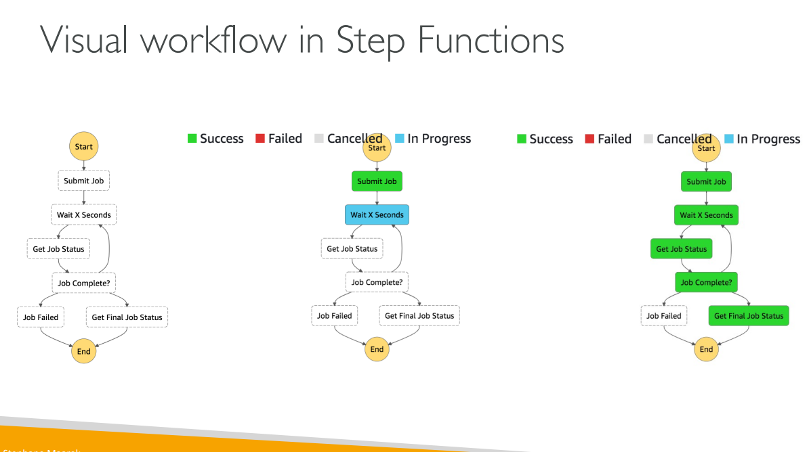

AWS Step Functions is a serverless orchestration service that allows you to coordinate multiple AWS services into scalable workflows. Think of it as a conductor for an orchestra - it tells each AWS service when and how to perform their part.

## What is Step Functions?

AWS Step Functions lets you model your workflows as **state machines** written in JSON. Each workflow represents a business process broken down into individual steps (states) that execute in a specific order.
 

 
## Key Components

### 1. State Machines
A state machine is like a flowchart that defines your workflow. It contains:
- **States**: Individual steps in your workflow
- **Transitions**: How you move from one state to another
- **Input/Output**: Data that flows between states

### 2. State Types

**Task States**: Do actual work by calling AWS services
- Invoke Lambda functions
- Run ECS tasks or Batch jobs
- Put items in DynamoDB
- Send messages to SNS/SQS
- Start other Step Functions

**Choice States**: Make decisions based on input data (like if/else logic)

**Wait States**: Add delays or wait until a specific time

**Parallel States**: Run multiple branches simultaneously

**Pass States**: Transform data without doing work

**Fail/Succeed States**: End the workflow with success or failure

### 3. Workflow Types

**Standard Workflows**:
- Run up to 1 year
- Exactly-once execution
- Perfect for critical processes like payment processing
- Stores execution history for 90 days

**Express Workflows**:
- Run up to 5 minutes
- High throughput (100,000+ executions/second)
- Great for IoT data processing or real-time applications

## Error Handling

Step Functions provides robust error handling at the workflow level:

**Retry**: Automatically retry failed states with configurable backoff
**Catch**: Handle errors and route to alternative paths
**Predefined error codes** like States.TaskFailed, States.Timeout

## Advanced Features

**Wait for Task Token**: Pause workflow until external system responds (human approval, third-party integration)

**Activity Tasks**: Let external workers (EC2, on-premises) poll for work

**ResultPath**: Control how state output is combined with input

## Real-World Example: E-commerce Order Processing

Instead of writing complex code with multiple try-catch blocks, you create a visual workflow:

1. **Validate Order** (Lambda function)
2. **Check Inventory** (DynamoDB query)
3. **Process Payment** (Choice state - approved/declined)
4. **If Approved**: Ship order, send confirmation
5. **If Declined**: Send rejection email
6. **Update Analytics** (Parallel state)

If any step fails, Step Functions automatically retries or routes to error handling paths without you writing error handling code.

## Benefits

- **Visual Workflows**: See your entire process graphically
- **Serverless**: No servers to manage
- **Reliable**: Built-in error handling and retry logic
- **Scalable**: Handles thousands of concurrent executions
- **Cost-effective**: Pay only for state transitions
- **Integration**: Works with 200+ AWS services

Step Functions essentially turns complex, error-prone orchestration code into simple, visual workflows that are easier to understand, maintain, and troubleshoot.