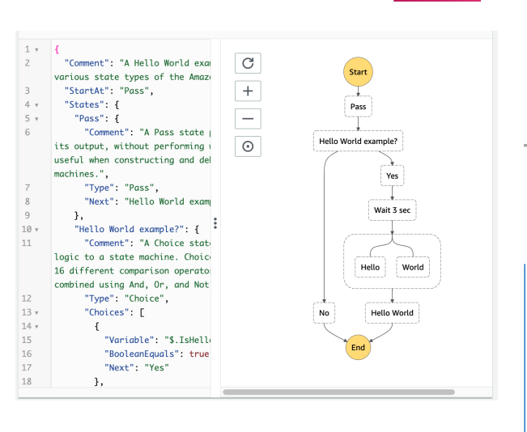

## Core Concepts:
- **State Machines**: Design workflows as state machines written in JSON
- **Serverless Orchestration**: Coordinate multiple AWS services without managing servers
- **Visual Workflows**: See your workflow execution in real-time with graphical representation

## Key Learning Areas:

**State Types**:
- Task States (invoke Lambda, ECS, SQS, SNS, DynamoDB)
- Choice States (conditional branching)
- Wait States (delays and scheduling)
- Parallel States (concurrent execution)
- Pass/Fail/Succeed States

**Workflow Types**:
- Standard Workflows (up to 1 year duration, exactly-once execution)
- Express Workflows (up to 5 minutes, high-throughput processing)

**Advanced Features**:
- Error handling with Retry and Catch
- Activity Tasks for custom workers
- Wait for Task Token pattern
- Integration with API Gateway, EventBridge, and CloudWatch

**Use Cases**:
- Order processing workflows
- Data processing pipelines
- Microservices orchestration
- Human approval workflows
- ETL processes