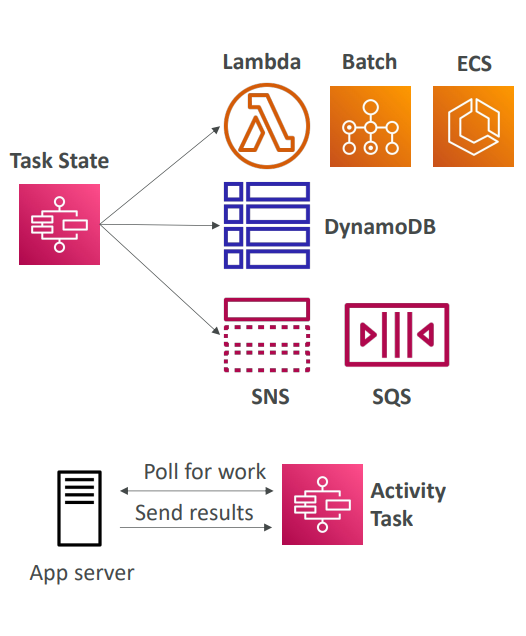

Let me explain both Step Function Task States and the different types of States in detail.

## Step Function – Task States

Task States are the **workhorses** of Step Functions - they do the actual work in your workflow by invoking AWS services or external systems.

### What Task States Do
Task States execute specific operations and can invoke:

**AWS Services:**
- **Lambda functions**: Run custom code
- **AWS Batch**: Run batch computing jobs
- **ECS tasks**: Run containerized applications
- **DynamoDB**: Put/get items from database
- **SNS**: Send notifications
- **SQS**: Send/receive messages
- **Step Functions**: Launch nested workflows

**External Systems:**
- **Activity Tasks**: Custom workers on EC2, on-premises, or mobile devices

### Real-World Example: E-commerce Order Processing

```json
{
  "ProcessPayment": {
    "Type": "Task",
    "Resource": "arn:aws:lambda:region:account:function:ProcessPayment",
    "Next": "UpdateInventory"
  },
  "UpdateInventory": {
    "Type": "Task", 
    "Resource": "arn:aws:states:::dynamodb:putItem",
    "Parameters": {
      "TableName": "Inventory",
      "Item": {"ProductId": {"S": "123"}}
    },
    "End": true
  }
}
```

### Activity Tasks
For systems outside AWS, Activity Tasks let you:
- Poll Step Functions for work using `GetActivityTask` API
- Process the work on your custom worker
- Report results back using `SendTaskSuccess` or `SendTaskFailure`
- Send heartbeats to keep long-running tasks alive (up to 1 year)

**Example**: A mobile app worker polling for image processing tasks.

## Step Function - States

States define the structure and logic of your workflow. Each state type serves a specific purpose:



### 1. Choice State
Makes decisions based on input data (like if/else logic).

**Real-world example**: Customer support routing
```json
{
  "CheckPriority": {
    "Type": "Choice",
    "Choices": [
      {
        "Variable": "$.priority",
        "StringEquals": "HIGH",
        "Next": "EscalateToManager"
      },
      {
        "Variable": "$.priority", 
        "StringEquals": "LOW",
        "Next": "AutoResponse"
      }
    ],
    "Default": "StandardProcess"
  }
}
```

### 2. Wait State
Adds delays or waits until specific time/date.

**Use cases:**
- Wait 5 minutes before retrying
- Wait until business hours to send email
- Delay processing until specific date

**Example**: Newsletter scheduling
```json
{
  "WaitUntilSendTime": {
    "Type": "Wait",
    "TimestampPath": "$.scheduledTime",
    "Next": "SendNewsletter"
  }
}
```

### 3. Parallel State
Executes multiple branches simultaneously.

**Real-world example**: User onboarding
```json
{
  "OnboardUser": {
    "Type": "Parallel",
    "Branches": [
      {
        "StartAt": "SendWelcomeEmail",
        "States": {...}
      },
      {
        "StartAt": "CreateUserProfile", 
        "States": {...}
      },
      {
        "StartAt": "SetupBilling",
        "States": {...}
      }
    ],
    "Next": "CompleteOnboarding"
  }
}
```

### 4. Map State
Dynamically iterates over a list of items.

**Example**: Processing multiple order items
```json
{
  "ProcessOrderItems": {
    "Type": "Map",
    "ItemsPath": "$.orderItems",
    "Iterator": {
      "StartAt": "ValidateItem",
      "States": {
        "ValidateItem": {...},
        "CheckStock": {...}
      }
    },
    "Next": "FinalizeOrder"
  }
}
```

### 5. Pass State
Transforms data without doing work - useful for:
- Adding fixed data to the workflow
- Filtering or transforming input
- Testing workflows

### 6. Fail/Succeed States
Explicitly end workflow execution:
- **Succeed**: Ends successfully
- **Fail**: Ends with failure and custom error message

## Key Benefits

**Visual Logic**: Instead of writing complex nested if-else code, you create visual flowcharts

**Error Handling**: Built-in retry and catch mechanisms at the state level

**Scalability**: Each state can process thousands of items in parallel

**Monitoring**: See exactly where workflows succeed or fail

**Cost Effective**: Pay only for state transitions, not idle time

## Real-World Scenario: Video Processing Pipeline

1. **Task State**: Upload video to S3
2. **Choice State**: Check video format
3. **Parallel State**: Generate thumbnails + extract metadata + transcode video
4. **Wait State**: Wait for all parallel tasks to complete
5. **Task State**: Update database with results
6. **Succeed State**: Mark pipeline complete

This replaces hundreds of lines of orchestration code with a simple, visual workflow that's easy to understand and maintain.