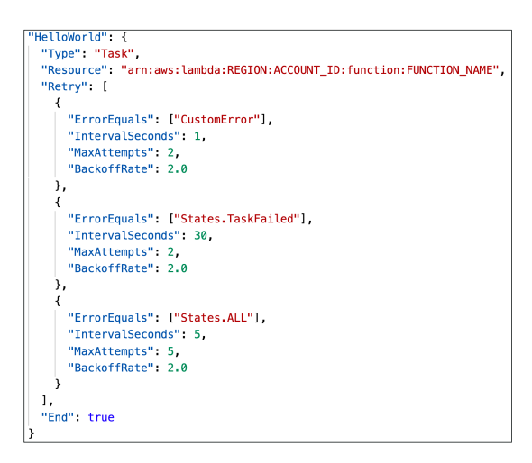
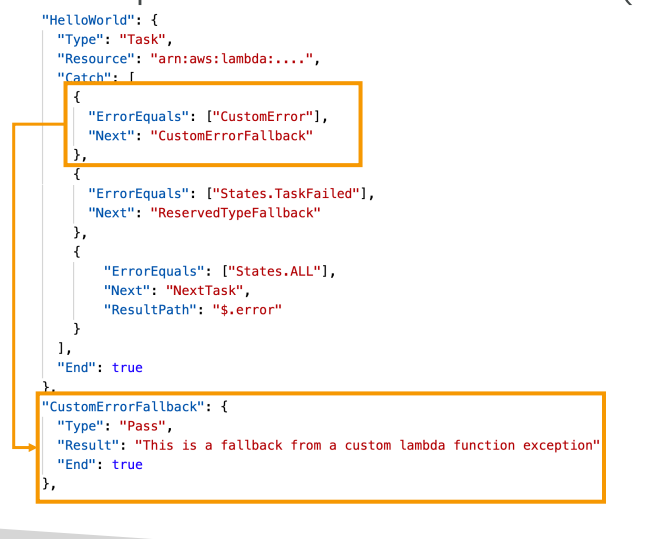
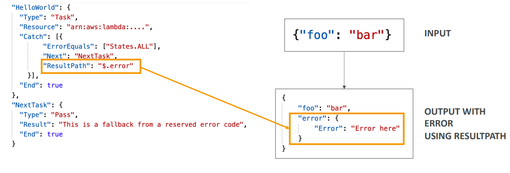
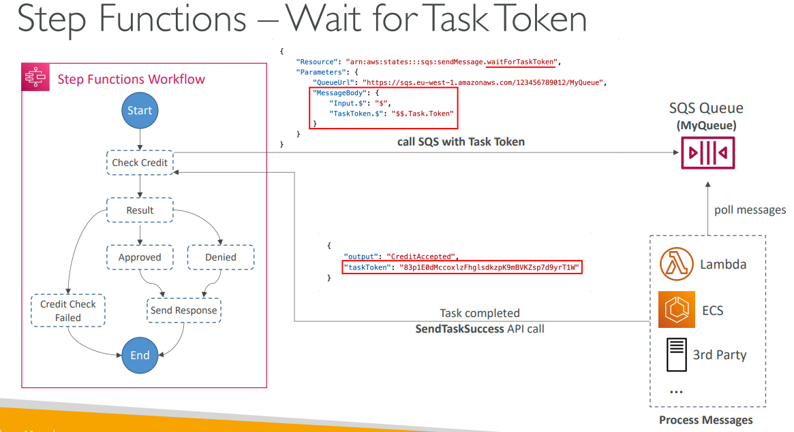

## Error Handling in Step Functions

Error handling in Step Functions is one of its most powerful features. Instead of writing complex try-catch blocks in your application code, you handle errors at the workflow level using **Retry** and **Catch** mechanisms.

## Types of Errors

Step Functions can encounter various runtime errors:

**State Machine Definition Issues**: No matching rule in a Choice state
**Task Failures**: Lambda function exceptions, DynamoDB errors
**Transient Issues**: Network partition events, temporary service outages
**Permission Issues**: Insufficient IAM privileges
**Timeout Issues**: Task takes longer than specified timeout

## Predefined Error Codes

Step Functions provides built-in error codes you can catch:

- **States.ALL**: Matches any error name (catch-all)
- **States.Timeout**: Task ran longer than TimeoutSeconds or no heartbeat received
- **States.TaskFailed**: General execution failure
- **States.Permissions**: Insufficient privileges to execute code
- **Custom Errors**: Your Lambda functions can also report custom error names

## Retry Mechanism

**Retry** automatically retries failed states with configurable backoff strategy.

### Retry Configuration:
- **ErrorEquals**: Specify which errors to retry
- **IntervalSeconds**: Initial delay before first retry (default: 1 second)
- **BackoffRate**: Multiplier for delay after each retry (default: 2.0)
- **MaxAttempts**: Maximum retry attempts (default: 3, set to 0 for no retries)



### Real-World Example: Payment Processing
```json
{
  "ProcessPayment": {
    "Type": "Task",
    "Resource": "arn:aws:lambda:region:account:function:ProcessPayment",
    "Retry": [
      {
        "ErrorEquals": ["States.TaskFailed"],
        "IntervalSeconds": 2,
        "BackoffRate": 2.0,
        "MaxAttempts": 3
      },
      {
        "ErrorEquals": ["States.Timeout"],
        "IntervalSeconds": 1,
        "MaxAttempts": 2
      }
    ],
    "Next": "PaymentSuccess"
  }
}
```

**How it works:**
- First retry after 2 seconds
- Second retry after 4 seconds (2 × 2.0)  
- Third retry after 8 seconds (4 × 2.0)
- If all retries fail, **Catch** mechanism kicks in

## Catch Mechanism

**Catch** handles errors that can't be resolved by retries and transitions to alternative workflow paths.

### Catch Configuration:
- **ErrorEquals**: Specify which errors to catch
- **Next**: State to transition to when error is caught
- **ResultPath**: Controls how error info is included in the output



### Real-World Example: E-commerce Order Processing
```json
{
  "ChargeCustomer": {
    "Type": "Task",
    "Resource": "arn:aws:lambda:region:account:function:ChargeCustomer",
    "Retry": [
      {
        "ErrorEquals": ["States.TaskFailed"],
        "MaxAttempts": 2
      }
    ],
    "Catch": [
      {
        "ErrorEquals": ["PaymentDeclined"],
        "Next": "PaymentDeclinedFlow",
        "ResultPath": "$.error"
      },
      {
        "ErrorEquals": ["States.ALL"],
        "Next": "PaymentErrorFlow",
        "ResultPath": "$.error"
      }
    ],
    "Next": "OrderConfirmation"
  }
}
```

## ResultPath

**ResultPath** controls how error information flows through your workflow:

**Without ResultPath**: Error replaces the entire input
**With ResultPath**: Error is added to input at specified path



### Example: Including Error Details
```json
{
  "Catch": [
    {
      "ErrorEquals": ["States.ALL"],
      "Next": "HandleError",
      "ResultPath": "$.errorInfo"
    }
  ]
}
```

**Input:**
```json
{
  "customerId": "123",
  "amount": 99.99
}
```

**Output with error:**
```json
{
  "customerId": "123",
  "amount": 99.99,
  "errorInfo": {
    "Error": "PaymentDeclined",
    "Cause": "Insufficient funds"
  }
}
```

## Error Evaluation Order

**Important**: Both Retry and Catch are evaluated **from top to bottom**:

1. **Retry** attempts are exhausted first
2. **Catch** blocks are then evaluated in order
3. More specific errors should be listed before general ones

```json
{
  "Catch": [
    {
      "ErrorEquals": ["PaymentDeclined"],
      "Next": "PaymentDeclinedHandler"
    },
    {
      "ErrorEquals": ["States.TaskFailed"],
      "Next": "GenericErrorHandler"
    },
    {
      "ErrorEquals": ["States.ALL"],
      "Next": "CatchAllHandler"
    }
  ]
}
```

## Complete Real-World Example: Customer Onboarding

```json
{
  "StartAt": "ValidateCustomer",
  "States": {
    "ValidateCustomer": {
      "Type": "Task",
      "Resource": "arn:aws:lambda:region:account:function:ValidateCustomer",
      "Retry": [
        {
          "ErrorEquals": ["States.Timeout"],
          "IntervalSeconds": 1,
          "MaxAttempts": 2
        }
      ],
      "Catch": [
        {
          "ErrorEquals": ["ValidationFailed"],
          "Next": "SendRejectionEmail",
          "ResultPath": "$.validationError"
        },
        {
          "ErrorEquals": ["States.ALL"],
          "Next": "LogError",
          "ResultPath": "$.systemError"
        }
      ],
      "Next": "CreateAccount"
    },
    "CreateAccount": {
      "Type": "Task",
      "Resource": "arn:aws:lambda:region:account:function:CreateAccount",
      "Retry": [
        {
          "ErrorEquals": ["States.TaskFailed"],
          "IntervalSeconds": 2,
          "BackoffRate": 2.0,
          "MaxAttempts": 3
        }
      ],
      "End": true
    },
    "SendRejectionEmail": {
      "Type": "Task",
      "Resource": "arn:aws:lambda:region:account:function:SendEmail",
      "End": true
    },
    "LogError": {
      "Type": "Task",
      "Resource": "arn:aws:lambda:region:account:function:LogError",
      "End": true
    }
  }
}
```
## Wait for Task Token

**Purpose**: Pause Step Functions workflow until external system responds

**How it works**:
1. Add `.waitForTaskToken` to Resource field
2. Step Functions pauses and sends task token to external system
3. External system processes work
4. External system calls `SendTaskSuccess` or `SendTaskFailure` with token
5. Workflow resumes



**Example**:
```json
{
  "Resource": "arn:aws:states:::sqs:sendMessage.waitForTaskToken",
  "Parameters": {
    "QueueUrl": "approval-queue",
    "MessageBody": {
      "taskToken.$": "$$.Task.Token",
      "data.$": "$.inputData"
    }
  }
}
```

**Use Cases**: Human approval, third-party APIs, legacy systems

---

## Activity Tasks 

**Purpose**: Let custom workers outside AWS poll Step Functions for work

**How it works**:
1. Worker polls using `GetActivityTask` API
2. Step Functions sends task with data and token
3. Worker processes locally
4. Worker responds with `SendTaskSuccess`/`SendTaskFailure`
5. Workflow continues

**Example**:
```json
{
  "Type": "Task",
  "Resource": "arn:aws:states:region:account:activity:MyActivity",
  "TimeoutSeconds": 300,
  "HeartbeatSeconds": 60
}
```

**Worker polls**: 
```python
response = stepfunctions.get_activity_task(activityArn=activity_arn)
# Process work
stepfunctions.send_task_success(taskToken=token, output=result)
```

**Use Cases**: On-premises systems, mobile apps, specialized hardware

**Key Difference**: 
- **Wait for Task Token**: Push-based (send to external system)
- **Activity Tasks**: Pull-based (external worker polls)
