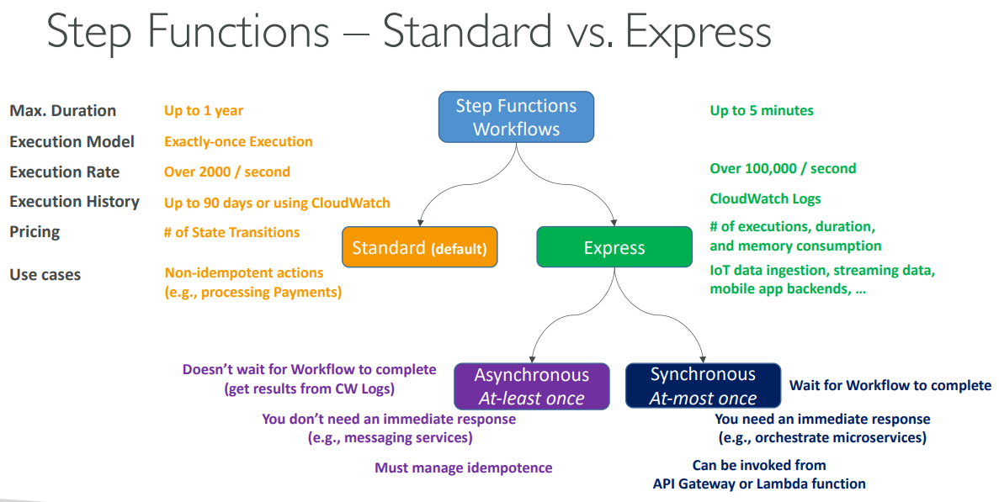

## Step Functions – Standard vs. Express - Summary

| Feature | Standard (Default) | Express |
|---------|-------------------|---------|
| **Max Duration** | Up to 1 year | Up to 5 minutes |
| **Execution Model** | Exactly-once execution | At-least once execution |
| **Execution Rate** | Over 2,000/second | Over 100,000/second |
| **Invocation Type** | Asynchronous | Synchronous & Asynchronous |

### Key Differences

**Duration & Scale:**
- **Standard**: Long-running workflows (minutes to year)
- **Express**: Short, high-volume workflows (seconds to 5 minutes)

**Execution Guarantees:**
- **Standard**: Exactly-once (each step runs once)
- **Express**: At-least once (steps may run multiple times)

**Performance:**
- **Standard**: Lower throughput, higher reliability
- **Express**: Ultra-high throughput, eventual consistency

**History & Monitoring:**
- **Standard**: Full execution history for 90 days
- **Express**: No built-in history (use CloudWatch Logs)

**Pricing:**
- **Standard**: Pay per state transition
- **Express**: Pay per execution, duration, and memory

### When to Use Each

**Standard Workflows - Use For:**
- **Non-idempotent actions** (payment processing, order fulfillment)
- **Long-running processes** (data migration, ETL pipelines)
- **Critical workflows** where exactly-once execution is required
- **Complex orchestration** with human approval steps
- **Audit requirements** (need execution history)

**Express Workflows - Use For:**
- **IoT data ingestion** (sensor data processing)
- **Streaming data processing** (real-time analytics)
- **Mobile app backends** (user action processing)
- **High-volume microservices orchestration**
- **Event-driven architectures** (reactive workflows)

### Response Behavior

**Standard:**
- **Doesn't wait** for workflow completion
- Get results from CloudWatch Logs or polling
- Use when you **don't need immediate response**

**Express:**
- **Waits for workflow** to complete (synchronous mode)
- **Immediate response** with results
- Can be invoked from **API Gateway or Lambda**

### Idempotence Requirement

**Standard:** Built-in idempotence (exactly-once execution)
**Express:** **Must manage idempotence** yourself (steps may retry)

### Real-World Examples

**Standard Workflow:** E-commerce order processing
- Validate order → Process payment → Update inventory → Ship order
- Takes minutes/hours, must run exactly once per order

**Express Workflow:** Real-time user analytics
- User clicks → Log event → Update counters → Send notification
- Takes seconds, processes thousands of events per second

**Choose Standard for reliability and complexity, Express for speed and volume.**