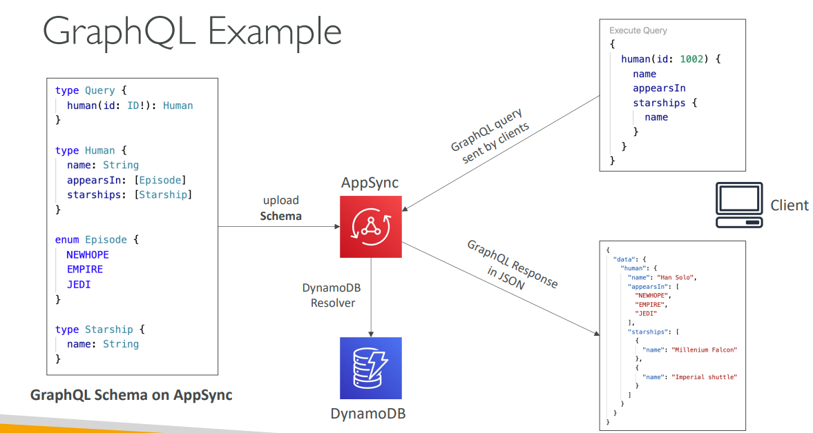
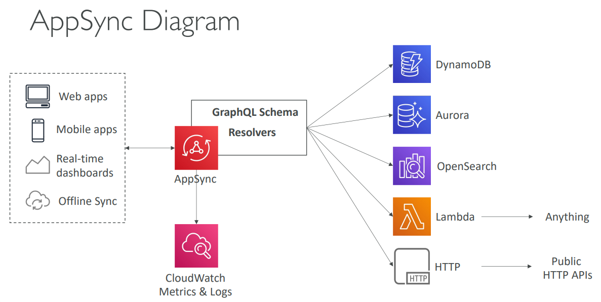

## AWS AppSync

AWS AppSync is a fully managed service that makes it easy to develop GraphQL APIs by handling the heavy lifting of securely connecting to data sources like DynamoDB, Lambda, and more.

### What is AppSync?

**Managed GraphQL Service**: AppSync provides a managed GraphQL endpoint that automatically handles GraphQL query execution, real-time subscriptions, and offline synchronization.

**GraphQL Benefits**: Unlike REST APIs where you get fixed data structures, GraphQL lets clients request exactly the data they need in a single request.

### Key Components

**1. GraphQL Schema**
The foundation of your API - defines what data clients can request and how it's structured.



**2. Resolvers**
Functions that connect your GraphQL schema fields to data sources. They define how to fetch data when a field is requested.

**3. Data Sources**
Backend systems that store your data:
- DynamoDB tables
- Aurora/RDS databases
- OpenSearch clusters
- Lambda functions
- HTTP APIs

### How AppSync Works

1. **Upload GraphQL Schema** to AppSync
2. **Configure Resolvers** to connect schema fields to data sources
3. **Clients send GraphQL queries** to AppSync endpoint
4. **AppSync executes resolvers** to fetch data
5. **Returns JSON response** with exactly the requested data


### Real-Time Features

**Subscriptions**: Clients can subscribe to real-time updates
```graphql
subscription OnNewMessage {
  onMessageAdded(channelId: "channel-123") {
    id
    content
    author
    timestamp
  }
}
```

**WebSocket/MQTT**: AppSync automatically handles real-time connections using WebSocket or MQTT over WebSocket for mobile apps.

### Offline Capabilities

**Local Data Access**: Mobile apps can work offline and sync when connectivity returns
**Conflict Resolution**: AppSync handles data conflicts when multiple users modify the same data offline
**Optimistic Updates**: UI updates immediately while syncing in background

### Security Options

**API_KEY**: Simple API key for development/testing
**AWS_IAM**: IAM users/roles for internal applications
**AMAZON_COGNITO_USER_POOLS**: User authentication via Cognito
**OPENID_CONNECT**: Integration with external identity providers

### AppSync Architecture


```
Mobile Apps ──┐
              ├── AppSync GraphQL API ──┬── DynamoDB
Web Apps   ───┤                        ├── Lambda
              │                        ├── Aurora
Real-time  ───┘                        └── HTTP APIs
Dashboards
```

### Use Cases

**Mobile Applications**:
- Real-time chat apps
- Social media feeds
- Collaborative editing tools
- IoT device monitoring

**Web Applications**:
- Content management systems
- E-commerce platforms
- Dashboard applications
- Real-time analytics

**Benefits vs Traditional REST**:
- **Single Request**: Get all needed data in one query
- **No Over-fetching**: Request only required fields
- **Real-time Updates**: Built-in subscription support
- **Offline Support**: Automatic sync when online
- **Type Safety**: Strong schema validation
- **Rapid Development**: Generated client SDKs

### Integration with AWS Amplify

AppSync works seamlessly with AWS Amplify for full-stack development:
- **Auto-generated GraphQL APIs** from data models
- **Real-time synchronization** across devices
- **Offline-first** mobile applications
- **Built-in authentication** with Cognito integration