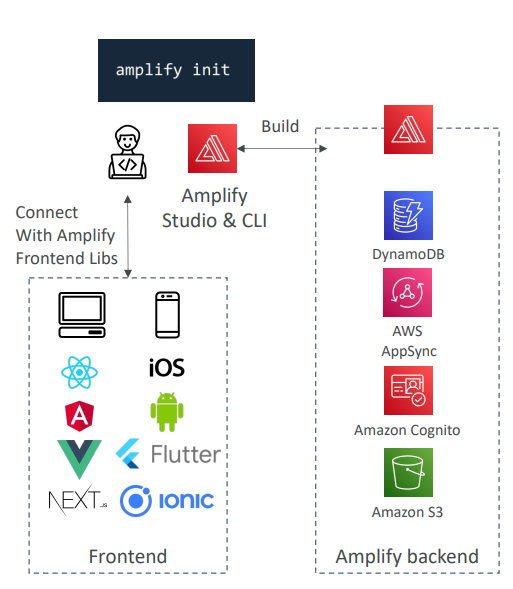

## AWS Amplify

AWS Amplify is a complete platform for building and deploying full-stack web and mobile applications. Think of it as "Elastic Beanstalk for mobile and web applications" - it provides everything you need to go from idea to production quickly.

### What is AWS Amplify?

**Full-Stack Development Platform**: Amplify provides tools, services, and libraries to build complete applications with frontend and backend components.



**AWS Services Integration**: Seamlessly connects your app to AWS services like Cognito, AppSync, DynamoDB, S3, and Lambda.

### Core Components

**1. Amplify CLI**
Command-line tool to configure and manage your backend infrastructure

**2. Amplify Studio**
Visual interface to build full-stack apps with drag-and-drop components

**3. Amplify Libraries**
Frontend libraries with pre-built components for React, Vue, Angular, iOS, Android, Flutter

**4. Amplify Hosting**
Managed hosting service with CI/CD pipeline


### Key Features

### Authentication
**Powered by Amazon Cognito**:
- User registration and sign-in
- Password reset and account recovery
- Multi-factor authentication (MFA)
- Social sign-in (Google, Facebook, Amazon)
- Pre-built UI components for login/signup
- Fine-grained authorization

**Example Implementation**:
```javascript
import { Auth } from 'aws-amplify';

// Sign up user
await Auth.signUp({
  username: 'user@example.com',
  password: 'TempPassword123!',
  attributes: {
    email: 'user@example.com',
    name: 'John Doe'
  }
});

// Sign in user
await Auth.signIn('user@example.com', 'TempPassword123!');
```

### DataStore
**Powered by AppSync + DynamoDB**:
- Local data storage with cloud synchronization
- Offline-first architecture
- Real-time data updates
- Conflict resolution
- GraphQL powered
- Visual data modeling with Amplify Studio

**Example Data Model**:
```javascript
// Create a blog post
import { DataStore } from 'aws-amplify';
import { Post } from './models';

await DataStore.save(
  new Post({
    title: "My First Post",
    content: "Hello World!",
    status: "published"
  })
);

// Query posts
const posts = await DataStore.query(Post, p => p.status("eq", "published"));
```

**Real-time Subscriptions**:
```javascript
// Subscribe to real-time updates
DataStore.observe(Post).subscribe(msg => {
  console.log(msg.model, msg.opType, msg.element);
});
```

### Amplify Hosting

**Complete CI/CD Pipeline**:
- **Source Integration**: GitHub, GitLab, Bitbucket, CodeCommit
- **Build Process**: Automatic builds on code commits
- **Testing**: End-to-end testing with Cypress
- **Deployment**: Deploy to global CDN (CloudFront)
- **Pull Request Previews**: Preview changes before merging

**Build Configuration (amplify.yml)**:
```yaml
version: 1
frontend:
  phases:
    preBuild:
      commands:
        - npm ci
    build:
      commands:
        - npm run build
  artifacts:
    baseDirectory: build
    files:
      - '**/*'
  cache:
    paths:
      - node_modules/**/*
test:
  phases:
    preTest:
      commands:
        - npm install cypress
    test:
      commands:
        - npx cypress run
```

### Advanced Features

**Custom Domains**: Use your own domain with SSL certificates
**Password Protection**: Protect staging environments
**Redirects & Rewrites**: Handle single-page application routing
**Custom Headers**: Add security headers
**Monitoring**: Built-in performance and error monitoring

### End-to-End Testing

**Integrated Cypress Testing**:
- Run E2E tests during build phase
- Catch regressions before production
- Generate visual test reports
- Test staging environment before deployment

```javascript
// cypress/integration/app.spec.js
describe('App E2E', () => {
  it('should display welcome message', () => {
    cy.visit('/');
    cy.contains('Welcome to my app');
    cy.get('[data-testid="login-button"]').click();
  });
});
```

### Real-World Application Example

**Social Media App Architecture**:

```
Frontend (React) ──┐
                   ├── Amplify ──┬── Authentication (Cognito)
Mobile (React Native) ──┘        ├── API (AppSync + GraphQL)
                                 ├── Database (DynamoDB)
                                 ├── Storage (S3)
                                 ├── Analytics (Pinpoint)
                                 └── Hosting (CloudFront)
```

**Quick Setup with Amplify CLI**:
```bash
# Initialize project
amplify init

# Add authentication
amplify add auth

# Add API with GraphQL
amplify add api

# Add file storage
amplify add storage

# Deploy everything
amplify push

# Add hosting
amplify add hosting
```

### Amplify Studio - Visual Development

**Visual Data Modeling**: Create data models using drag-and-drop interface
**UI Component Library**: Pre-built components for common patterns
**Theme Management**: Consistent styling across your app
**Content Management**: Non-technical users can manage app content

### Integration with AWS Services

**Backend Services**:
- **Authentication**: Cognito User Pools
- **APIs**: AppSync (GraphQL) or API Gateway (REST)
- **Database**: DynamoDB
- **Storage**: S3 for files and media
- **Analytics**: Pinpoint for user analytics
- **Push Notifications**: Pinpoint
- **Functions**: Lambda for custom logic

### Development Workflow

**1. Local Development**:
```bash
amplify mock api    # Test GraphQL locally
amplify mock storage # Test file uploads locally
```

**2. Multiple Environments**:
```bash
amplify env add production
amplify env checkout production
amplify push
```

**3. Team Collaboration**:
- Share backend environments
- Pull backend configuration
- Branch-based deployments

### Benefits

**Rapid Development**: Go from idea to production in hours/days instead of weeks
**AWS Best Practices**: Built-in security, scalability, and reliability
**Offline-First**: Apps work offline and sync when online
**Real-time Features**: Built-in real-time data synchronization
**Scalable**: Automatically scales with your user base
**Cost-Effective**: Pay only for what you use
**Full-Stack**: Handle both frontend and backend from one platform

### Use Cases

**Mobile Applications**:
- Social media apps
- E-commerce apps
- Real-time chat applications
- IoT device management

**Web Applications**:
- Content management systems
- Dashboard applications
- Collaborative tools
- E-learning platforms

**Enterprise Applications**:
- Internal tools
- Customer portals
- Analytics dashboards
- Workflow management systems

Amplify essentially removes the complexity of building full-stack applications by providing a unified platform that handles infrastructure, authentication, data management, and deployment, allowing developers to focus on building great user experiences.