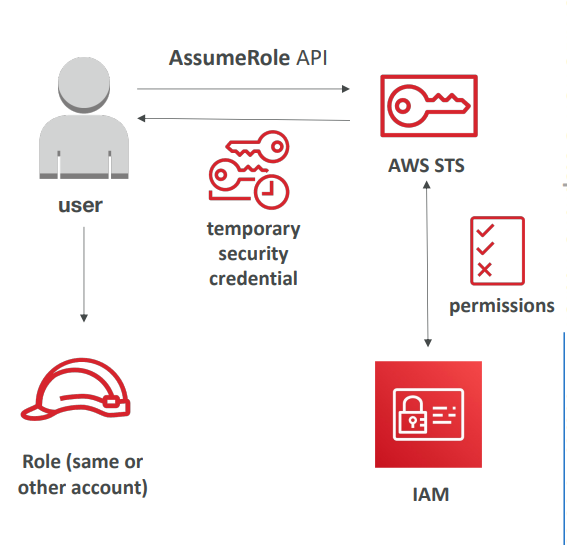
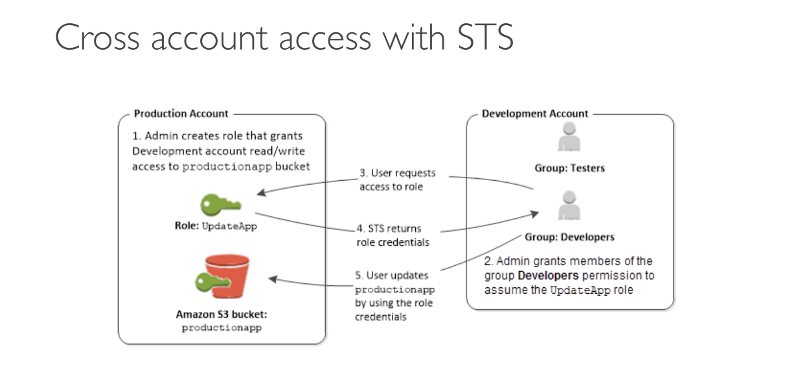
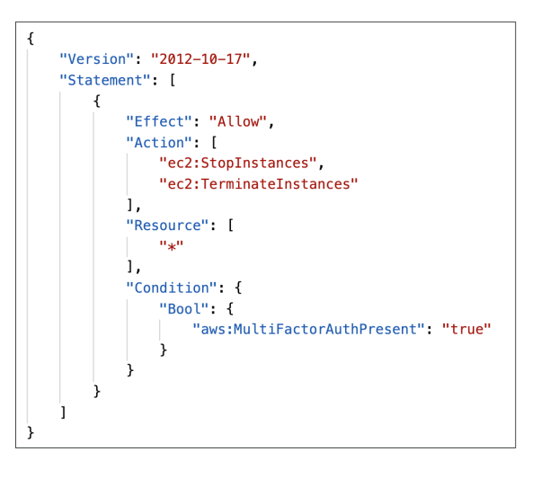

## AWS STS – Security Token Service

### 1. What is AWS STS?

AWS STS provides **temporary, limited-privilege credentials** for accessing AWS resources. Instead of using permanent IAM user credentials, STS generates short-lived tokens that automatically expire (15 minutes to 1 hour).

**Key STS APIs:**
- **AssumeRole** - Switch to different roles (same or cross-account)
- **GetSessionToken** - Get temporary credentials with MFA enforcement
- **AssumeRoleWithSAML** - For enterprise single sign-on users
- **AssumeRoleWithWebIdentity** - For social login (Google, Facebook)
- **GetCallerIdentity** - Check current authentication identity

### 2. Using STS to Assume a Role

**Process Flow:**
1. Create an IAM Role with specific permissions
2. Define which principals (users/accounts) can assume this role
3. Use STS AssumeRole API to get temporary credentials
4. Use temporary credentials to access AWS resources



**Real-World Example:**
A developer needs elevated permissions to deploy to production:
- Normal user account has limited permissions
- Production deployment role has broader S3 and Lambda permissions
- Developer calls `aws sts assume-role` to temporarily become the deployment role
- Gets temporary credentials for 1 hour to perform deployment
- Credentials automatically expire after deployment

### 3. Cross Account Access with STS

**Scenario:** Company A needs to access Company B's AWS resources

**Setup Process:**
1. **Company B** creates an IAM role called "PartnerAccess"
2. **Company B** configures the role's trust policy to allow Company A's account
3. **Company A's user** calls STS AssumeRole API
4. **STS** returns temporary credentials for the PartnerAccess role
5. **Company A** can now access Company B's specific resources



**Real-World Example:**
A consulting firm accessing client's AWS environment:
- Client creates "ConsultantRole" with read-only access to specific S3 buckets
- Client trusts consultant's AWS account in the role's trust policy
- Consultant assumes the role to access client data for analysis
- Access automatically expires, no permanent credentials shared

### 4. STS with MFA

**Purpose:** Enforce multi-factor authentication for sensitive operations

**How it works:**
1. User calls `GetSessionToken` with MFA device info
2. Provides MFA code from their authenticator device
3. STS returns temporary credentials with MFA condition satisfied
4. These credentials can be used for operations requiring MFA



**Real-World Example:**
Deleting production resources requires MFA:
- IAM policy requires `aws:MultiFactorAuthPresent:true` for deletion operations
- Administrator runs: `aws sts get-session-token --serial-number arn:aws:iam::123456789012:mfa/admin --token-code 123456`
- STS returns temporary credentials that satisfy MFA requirement
- Admin can now delete production resources using these credentials

**CLI Command Example:**
```bash
aws sts get-session-token \
  --serial-number arn-of-the-mfa-device \
  --token-code code-from-token \
  --duration-seconds 3600
```

**Security Benefits:**
- **Time-limited access** - Credentials automatically expire
- **Least privilege** - Only specific permissions granted
- **Audit trail** - All role assumptions logged in CloudTrail
- **No permanent credentials** - Reduces risk of credential theft
- **MFA enforcement** - Ensures human verification for sensitive operations