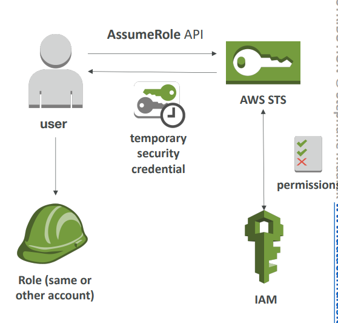
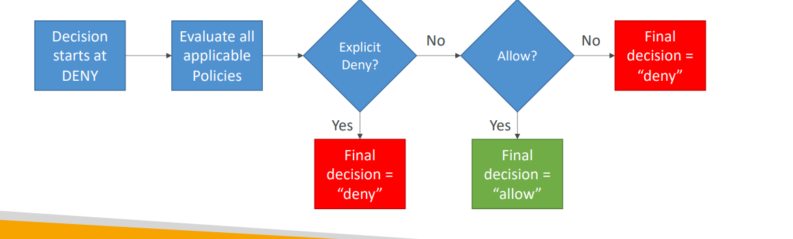
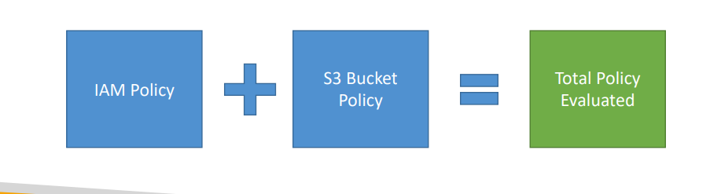

## IAM Best Practices

### 1. Core IAM Best Practices

**General Principles:**
- Never use Root Account except for initial setup
- Apply **Least Privilege** - minimum permissions needed
- One physical user = One AWS user
- Use **Multi-Factor Authentication (MFA)** for all accounts
- Create strong password policies
- Assign users to groups, assign permissions to groups
- Use IAM Roles for AWS services
- Regular audit using IAM Credentials Report & Access Advisor

**Role-Specific Best Practices:**
- Each EC2 instance should have its own role
- Each Lambda function should have its own role
- Each ECS task should have its own role
- Create least-privileged roles per service
- Don't reuse roles across applications

**IAM Best Practices – Cross Account Access**
- Cross account access allows users from one AWS account to access resources in a - different AWS account securely using IAM roles and STS.
- Account B (resource owner) creates an IAM Role
- Account B defines which external accounts can access this role (trust policy)
- Account A (accessing account) uses AWS STS to assume the role
- STS returns temporary credentials (15 minutes to 1 hour)
- Account A uses temporary credentials to access Account B's resources



## 2. Advanced IAM - Authorization Model

**Policy Evaluation Logic (Simplified):**
1. **Start with DENY** (default)
2. **Check for explicit DENY** → If found, final decision = DENY
3. **Check for ALLOW** → If found, final decision = ALLOW  
4. **Otherwise** → Final decision = DENY



**Real-World Example:**
A user has multiple policies attached:
- Policy A: Allows S3 read access
- Policy B: Denies S3 access to production bucket
- Result: User can read from all S3 buckets EXCEPT production bucket (explicit deny wins)

## 3. IAM Policies & S3 Bucket Policies

**Key Concept:** AWS evaluates the **UNION** of IAM policies and S3 bucket policies



**Examples:**

**Example 1:** IAM allows S3 access + No bucket policy = **ACCESS GRANTED**

**Example 2:** IAM allows S3 access + Bucket policy denies = **ACCESS DENIED** (explicit deny wins)

**Example 3:** IAM has no S3 permissions + Bucket policy allows = **ACCESS GRANTED**

**Example 4:** IAM explicitly denies + Bucket policy allows = **ACCESS DENIED** (explicit deny wins)

**Real-World Use Case:**
Cross-account access to S3:
- Company A's user has no S3 permissions in their IAM policy
- Company B's S3 bucket policy explicitly allows Company A's account
- Result: Company A can access Company B's bucket through bucket policy

## 4. Dynamic Policies with IAM

**Problem:** How to give each user access to their own folder in S3?

**Bad Solution (Option 1):**
- Create separate policy for each user
- Policy for Georges: allows access to `/home/georges`
- Policy for Sarah: allows access to `/home/sarah`
- **Problem:** Doesn't scale with many users

**Good Solution (Option 2):**
Use **policy variables** like `${aws:username}`

**Dynamic Policy Example:**
```json
{
  "Version": "2012-10-17",
  "Statement": [
    {
      "Effect": "Allow",
      "Action": "s3:GetObject",
      "Resource": "arn:aws:s3:::company-bucket/home/${aws:username}/*"
    }
  ]
}
```

**Real-World Example:**
Employee file storage system:
- One policy for all employees
- Each employee automatically gets access to `/home/their-username/`
- When "john.doe" logs in, policy resolves to `/home/john.doe/`
- Scales to thousands of employees with one policy

## 5. Inline vs Managed Policies

### AWS Managed Policies
- **Maintained by AWS**
- Good for power users and administrators
- Automatically updated for new services/APIs
- Examples: `AmazonS3FullAccess`, `PowerUserAccess`

### Customer Managed Policies  
- **Best Practice for organizations**
- Reusable across multiple principals
- Version controlled with rollback capability
- Central change management
- Can be shared across accounts

### Inline Policies
- **Strict one-to-one relationship** with principal
- Policy deleted when principal is deleted
- Use for unique, one-off permissions
- Not reusable

**Real-World Example:**
A company needs S3 access for developers:
- **AWS Managed:** Use `AmazonS3ReadOnlyAccess` for basic needs
- **Customer Managed:** Create `CompanyS3DeveloperAccess` with specific bucket permissions
- **Inline:** Give one developer temporary access to a specific bucket for a project

**Best Practice:** Use Customer Managed policies for most scenarios, Inline only for unique one-off cases, AWS Managed for standard permissions.

**PassRole Permission:**
When configuring AWS services (EC2, Lambda, CodePipeline), you need `iam:PassRole` permission to assign roles to these services. The service then assumes the role to perform actions on your behalf.