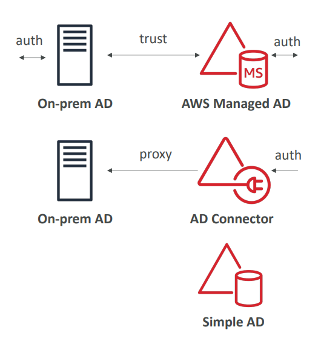

## 1. Granting a User Permissions to Pass a Role to an AWS Service

### What is PassRole Permission?

**PassRole** (`iam:PassRole`) allows a user to assign an IAM role to an AWS service during configuration. This is a one-time setup action where the service later assumes the role to perform its work.

### Why Use PassRole?

Instead of giving users direct permissions for all service actions, PassRole enables:
- **Security separation**: User configures, service executes
- **Least privilege**: User only needs setup permissions, not execution permissions
- **Role reuse**: Same role can be used across multiple services

### Common PassRole Scenarios

**EC2 Instance Role:**
- User launches EC2 with PassRole permission
- User assigns role to EC2 instance
- EC2 assumes role to access S3, DynamoDB automatically

**Lambda Function Role:**
- Developer creates Lambda function
- Developer passes execution role to Lambda
- Lambda assumes role to read Kinesis streams, write CloudWatch logs

**ECS Task Role:**
- DevOps creates ECS task definition
- DevOps passes task role to ECS
- ECS task assumes role to access required AWS services

**Required Permissions:**
- `iam:PassRole` - To pass the role to service
- `iam:GetRole` - Often needed to view role details

### Real-World Example

A developer needs to create Lambda function accessing DynamoDB:

**Developer's Permissions:**
```json
{
  "Effect": "Allow",
  "Action": [
    "lambda:CreateFunction",
    "iam:PassRole"
  ],
  "Resource": [
    "arn:aws:lambda:*:*:function:*",
    "arn:aws:iam::*:role/LambdaExecutionRole"
  ]
}
```

**Process:**
1. Developer creates Lambda function
2. Developer passes LambdaExecutionRole to Lambda
3. Lambda service assumes the role
4. Lambda can now access DynamoDB using role's permissions

## 2. Can a Role be Passed to Any Service?

### Answer: NO

Roles can **only be passed to services that their trust policy explicitly allows**. The trust policy acts as a security gate.

### Trust Policy Control

Each IAM role has a **trust policy** that defines which services can assume it.

**Example - Lambda Trust Policy:**
```json
{
  "Version": "2012-10-17",
  "Statement": [
    {
      "Effect": "Allow",
      "Principal": {
        "Service": "lambda.amazonaws.com"
      },
      "Action": "sts:AssumeRole"
    }
  ]
}
```

**Security Implication:** Even if a user has `iam:PassRole` permission, they cannot pass a Lambda role to EC2 because the trust policy only allows Lambda service.

### Real-World Security Example

**Problem:** Developer tries to pass Lambda execution role to EC2 instance
**Result:** Operation fails because Lambda role's trust policy doesn't allow EC2

**Solution:** Create separate EC2 role with appropriate trust policy:
```json
{
  "Principal": {
    "Service": "ec2.amazonaws.com"
  }
}
```

### Trust Policy Examples

**EC2 Trust Policy:**
```json
{
  "Principal": {
    "Service": "ec2.amazonaws.com"
  }
}
```

**CodePipeline Trust Policy:**
```json
{
  "Principal": {
    "Service": "codepipeline.amazonaws.com"
  }
}
```

**Cross-Account Trust Policy:**
```json
{
  "Principal": {
    "AWS": "arn:aws:iam::123456789012:root"
  }
}
```

## 3. What is Microsoft Active Directory (AD)?

### Core Concept

Microsoft Active Directory is a **centralized identity and access management system** commonly used in enterprise environments, particularly with Windows-based infrastructure.

### Key Components

**Active Directory Structure:**
- **Domain Controller**: Central server managing authentication
- **Objects Database**: Stores user accounts, computers, printers, file shares, security groups
- **Trees**: Hierarchical organization of objects
- **Forest**: Collection of trees


### How AD Works

**Authentication Process:**
1. User "John" enters username/password
2. Domain Controller verifies credentials
3. User gains access to network resources
4. Single sign-on to authorized applications/services

### Real-World Example

**Corporate Network Setup:**
- **Domain**: company.com
- **Users**: john.doe@company.com, jane.smith@company.com
- **Resources**: File servers, printers, applications
- **Process**: John logs in once, accesses all authorized resources automatically

### AWS Directory Services Integration

AWS provides three options to integrate with Active Directory:

### 1. AWS Managed Microsoft AD



- **Full AD implementation** in AWS cloud
- Manage users locally in AWS
- Supports MFA
- Can establish trust relationships with on-premises AD
- **Use case**: Migrate AD to cloud or create cloud-native AD

### 2. AD Connector
- **Proxy/gateway** to on-premises AD
- Redirects authentication requests to on-premises
- Users remain managed on-premises
- Supports MFA
- **Use case**: Keep existing AD, extend to AWS

### 3. Simple AD
- **AD-compatible** managed directory in AWS
- Cannot connect to on-premises AD
- Basic directory functionality
- **Use case**: Small businesses needing simple directory services

### Enterprise Integration Example

**Hybrid Environment:**
- **On-premises**: Main corporate AD with 10,000 employees
- **AWS**: Cloud applications needing AD authentication
- **Solution**: AD Connector routes AWS authentication to corporate AD
- **Result**: Employees use same corporate credentials for AWS applications

### Benefits for AWS

- **Single Sign-On**: Use corporate credentials for AWS services
- **Centralized Management**: Manage users in one place
- **Security**: Leverage existing security policies and MFA
- **Compliance**: Meet enterprise identity management requirements