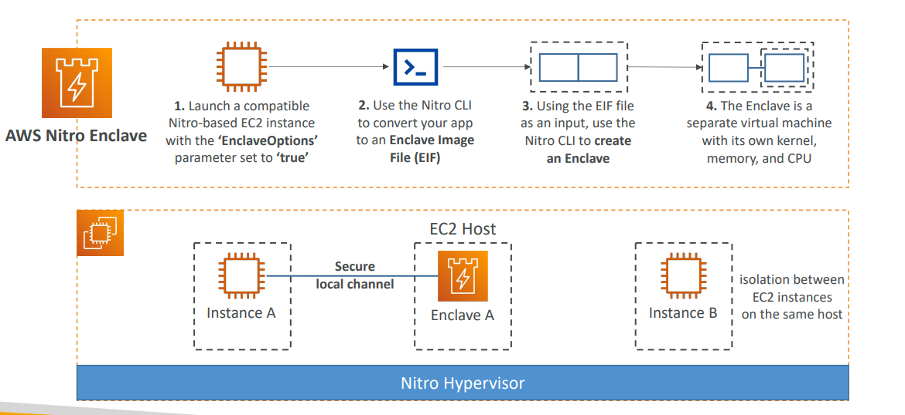

# AWS Nitro Enclaves Lecture

## What are AWS Nitro Enclaves?

AWS Nitro Enclaves are designed to **process highly sensitive data in an isolated compute environment**. They provide the highest level of isolation for sensitive workloads by creating a separate, hardened virtual machine.

### Core Purpose
- **Highly Sensitive Data Processing**: Personally Identifiable Information (PII), healthcare data, financial information
- **Complete Isolation**: Fully isolated virtual machines that are hardened and highly constrained
- **Reduced Attack Surface**: Minimizes potential security vulnerabilities for sensitive data processing applications

## Enclave Characteristics

### What Enclaves Are NOT
- **Not a container**: Unlike Docker containers, enclaves are separate VMs
- **No persistent storage**: Enclaves don't maintain data between sessions
- **No interactive access**: You cannot SSH or directly access the enclave
- **No external networking**: Enclaves cannot connect to the internet

### What Enclaves ARE
- **Fully isolated virtual machines**: Separate from the parent EC2 instance
- **Hardened environment**: Stripped-down, security-focused runtime
- **Highly constrained**: Limited functionality by design for security
- **Temporary execution environment**: Designed for specific processing tasks

## Cryptographic Attestation

### Security Validation
**Cryptographic Attestation** ensures that **only authorized code can be running in your Enclave**. This provides:
- **Code Integrity**: Verification that the running code matches expected signatures
- **Environment Validation**: Confirmation that the enclave environment is secure and unmodified
- **Trust Establishment**: Cryptographic proof of the enclave's authenticity

### How Attestation Works
1. **Code Signing**: Your application code is cryptographically signed
2. **Enclave Creation**: Enclave boots with signed code
3. **Attestation Document**: Enclave generates cryptographic proof of its state
4. **Verification**: External services can verify the enclave's authenticity

## KMS Integration

### Exclusive Access Model
**Only Enclaves can access sensitive data** through special KMS integration:
- **Enclave-only KMS Keys**: Certain KMS operations restricted to attested enclaves
- **Condition-based Access**: KMS policies can require attestation documents
- **Zero Trust**: Even the EC2 host cannot access enclave-protected data

### Security Benefits
- **Hardware-level Protection**: Keys protected by Nitro hardware
- **Attestation-based Access**: Cryptographic proof required for key access
- **Isolation Guarantee**: Sensitive operations isolated from host OS



## Implementation Process

### Step 1: Launch Compatible EC2 Instance
```bash
# Launch Nitro-based EC2 instance with enclave support
aws ec2 run-instances \
  --image-id ami-12345678 \
  --instance-type m5.large \
  --enclave-options Enabled=true
```

**Requirements**:
- **Nitro-based Instance**: Must use Nitro system instances
- **EnclaveOptions**: Set to 'true' during instance launch
- **Supported Instance Types**: M5, M5d, M5n, C5, C5n, R5, R5d

### Step 2: Create Enclave Image File (EIF)
```bash
# Use Nitro CLI to convert application to EIF
nitro-cli build-enclave \
  --docker-uri my-secure-app:latest \
  --output-file my-app.eif
```

**Process**:
- **Docker Container**: Start with a containerized application
- **Nitro CLI**: Tool converts Docker image to Enclave Image File
- **EIF Output**: Specialized format for enclave execution

### Step 3: Create and Run Enclave
```bash
# Create enclave from EIF
nitro-cli run-enclave \
  --eif-path my-app.eif \
  --memory 512 \
  --cpu-count 2
```

### Step 4: Enclave Architecture
```
EC2 Host Instance
├── Nitro Hypervisor
├── Parent Instance (your application)
└── Enclave (isolated VM)
    ├── Separate kernel
    ├── Dedicated memory
    ├── Dedicated CPU cores
    └── Secure local channel to parent
```

## Use Cases

### Primary Applications
- **Securing Private Keys**: Cryptographic key operations in isolation
- **Processing Credit Cards**: PCI DSS compliant payment processing
- **Secure Multi-party Computation**: Privacy-preserving data analysis
- **Healthcare Data Processing**: HIPAA-compliant medical data analysis
- **Financial Transactions**: Secure trading and financial calculations

### Example Architecture
```
Banking Application:
┌─────────────────┐    ┌─────────────────┐
│   Web Frontend  │────│  Application    │
│   (EC2)         │    │  Server (EC2)   │
└─────────────────┘    └─────────────────┘
                              │
                    ┌─────────────────┐
                    │ Nitro Enclave   │
                    │ - Card Processing│
                    │ - PII Encryption │
                    │ - KMS Operations │
                    └─────────────────┘
```

## Real-World Example

### Secure Payment Processing
**Problem**: Process credit card payments while maintaining PCI DSS compliance

**Solution**:
1. **Web Application**: Runs on standard EC2 instance
2. **Payment Data**: Passed to Nitro Enclave for processing
3. **Enclave Processing**: 
   - Validates card numbers
   - Encrypts sensitive data
   - Communicates with payment gateways
4. **KMS Integration**: Encryption keys accessible only to attested enclave
5. **Audit Trail**: All operations logged and attestation documents preserved

### Benefits Achieved
- **Compliance**: Meets PCI DSS Level 1 requirements
- **Isolation**: Card data never accessible to main application
- **Attestation**: Cryptographic proof of secure processing
- **Reduced Scope**: Minimizes PCI compliance audit scope

## Key Advantages

### Security Benefits
- **Hardware-level Isolation**: Nitro system provides hardware-enforced boundaries
- **Minimized Attack Surface**: Stripped-down environment reduces vulnerabilities
- **Cryptographic Assurance**: Attestation provides mathematical proof of security
- **Compliance Ready**: Designed for strict regulatory requirements

### Operational Benefits
- **AWS Integration**: Works seamlessly with existing AWS services
- **Familiar Development**: Build with standard containerization tools
- **Flexible Deployment**: Deploy alongside existing EC2 workloads
- **Cost Effective**: Pay only for enclave compute resources used

**Key Takeaway**: Nitro Enclaves provide the highest level of data protection for sensitive workloads by combining hardware-level isolation, cryptographic attestation, and exclusive access to encryption keys, making them ideal for compliance-heavy industries like finance and healthcare.