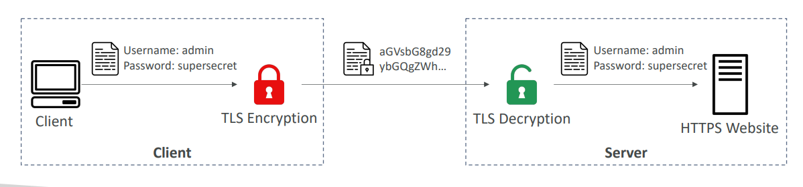
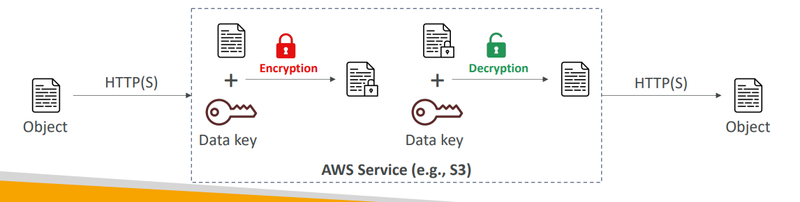
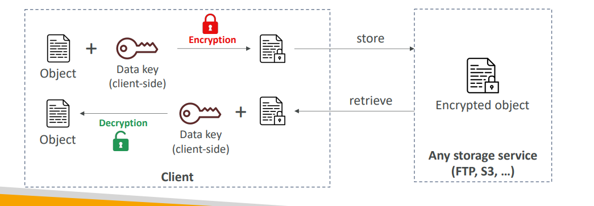

# Encryption Types in AWS

## Encryption in Flight (TLS/SSL)

**What it is:**
Data is encrypted while being transmitted over the network between client and server.

**How it works:**
- Data is encrypted before sending and decrypted after receiving
- Uses TLS certificates to establish secure connections
- Prevents Man-in-the-Middle (MITM) attacks

**Real-world example:**
When you visit a banking website (HTTPS), your login credentials are encrypted during transmission. Even if someone intercepts the network traffic, they only see scrambled data like "aGVsbG8gd29ybGQgZWh..." instead of your actual username and password.

**AWS Implementation:**
- HTTPS endpoints for services like S3, API Gateway
- Load balancers with SSL/TLS certificates
- AWS Certificate Manager (ACM) for managing certificates

## Server-Side Encryption at Rest

**What it is:**
Data is encrypted after the server receives it and stored in encrypted form on disk.

**How it works:**
- Server receives unencrypted data over HTTPS
- Server encrypts data using encryption keys before storing
- Data is decrypted when retrieved for sending back to client
- The AWS service manages the encryption/decryption process

**Real-world example:**
When you upload a document to S3, the file travels encrypted over HTTPS. Once S3 receives it, S3 encrypts the file using AWS-managed keys and stores the encrypted version. When you download it later, S3 decrypts it automatically before sending it back to you.

**AWS Implementation:**
- S3 with SSE-S3 (AWS-managed keys) or SSE-KMS (customer-managed keys)
- RDS database encryption
- EBS volume encryption

## Client-Side Encryption

**What it is:**
Data is encrypted by the client before sending to the server, and the server never sees the unencrypted data.

**How it works:**
- Client encrypts data using their own keys before transmission
- Server stores the encrypted data without being able to decrypt it
- Only the client (or authorized recipients) can decrypt the data
- Provides maximum security as the cloud provider never has access to plaintext

**Real-world example:**
A healthcare application encrypts patient records on the user's device before uploading to S3. AWS only stores encrypted data and cannot read the medical information. Only the healthcare app with the proper decryption keys can access the actual patient data.

**AWS Implementation:**
- S3 Client-Side Encryption Library
- Application-level encryption before sending to any AWS service
- AWS Encryption SDK for implementing envelope encryption

## Key Differences

- **In-flight:** Protects data during transmission
- **Server-side:** AWS handles encryption/decryption automatically
- **Client-side:** You control encryption and AWS never sees plaintext data