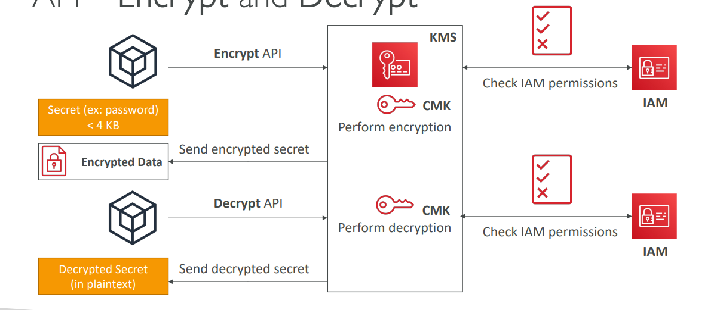
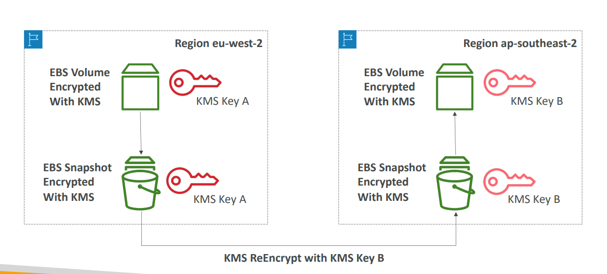
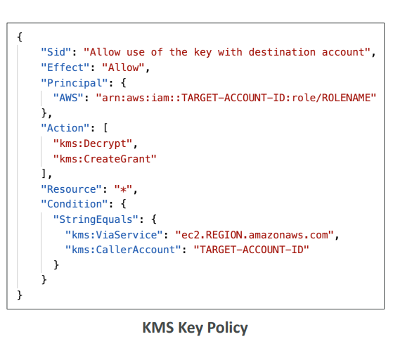
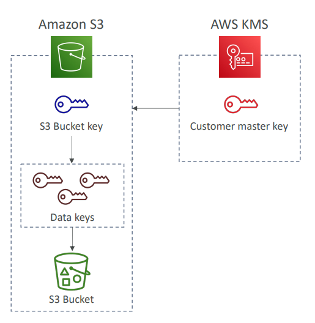

# KMS Deep Dive Lecture (Continued)

## How Does KMS Work?

### Direct Encrypt/Decrypt API (≤4KB)
For small data (under 4KB), you can use KMS directly:
- **Encrypt API**: Send your secret to KMS, it returns encrypted data
- **Decrypt API**: Send encrypted data to KMS, it returns plaintext
- IAM permissions are checked for both operations
- Perfect for passwords, API keys, small configuration files

### Envelope Encryption (>4KB) 
For larger data, KMS uses envelope encryption:
- **GenerateDataKey API**: KMS creates a data encryption key (DEK)
- Returns both plaintext DEK and encrypted DEK
- You encrypt your large file locally with plaintext DEK
- Store encrypted file + encrypted DEK together
- Delete plaintext DEK from memory

**Decryption Process**: Send encrypted DEK to KMS Decrypt API → get plaintext DEK → decrypt your file locally

## Copying Snapshots Across Regions
When moving encrypted EBS snapshots between regions:
1. Snapshot is encrypted with KMS Key A in source region
2. Copy operation automatically re-encrypts with KMS Key B in destination region
3. Must have permissions for both keys
4. Cannot directly copy - KMS keys are region-specific

**Example**: Copy snapshot from eu-west-2 to ap-southeast-2 requires re-encryption step

## Copying Snapshots Across Accounts
Cross-account snapshot sharing requires specific steps:
1. Create snapshot with your Customer Managed Key (not AWS managed)
2. Modify KMS key policy to allow target account access
3. Share the encrypted snapshot with target account
4. Target account copies snapshot and re-encrypts with their own KMS key
5. Target account creates volume from their copy

**Key Point**: AWS managed keys cannot be shared across accounts

## S3 Bucket Key for SSE-KMS Encryption
Traditional SSE-KMS makes one KMS call per object operation, causing:
- High KMS API costs
- Potential quota limit issues
- Many CloudTrail events

**S3 Bucket Key Solution**:
- S3 generates one bucket-level data key from your KMS key
- Uses this bucket key to generate object-level data keys
- Reduces KMS API calls by 99%
- Reduces costs by 99%
- Fewer CloudTrail events

**Trade-off**: Less granular CloudTrail logging per object

## Principal Options in IAM Policies
When writing KMS key policies, you can specify these principals:

### Account Level
- **AWS Account**: `"AWS": "123456789012"`
- **Root User**: `"AWS": "arn:aws:iam::123456789012:root"`

### User Level  
- **IAM Users**: `"AWS": "arn:aws:iam::123456789012:user/username"`
- **Federated Users**: `"AWS": "arn:aws:sts::123456789012:federated-user/username"`

### Role Level
- **IAM Roles**: `"AWS": "arn:aws:iam::123456789012:role/rolename"`
- **Role Sessions**: For assumed roles with session names

### Service Level
- **AWS Services**: `"Service": "s3.amazonaws.com"`
- **All Principals**: `"AWS": "*"` (use carefully)

**Real Example**: A key policy allowing EC2 instances to decrypt could specify the EC2 instance role ARN as principal, ensuring only those instances can use the key.