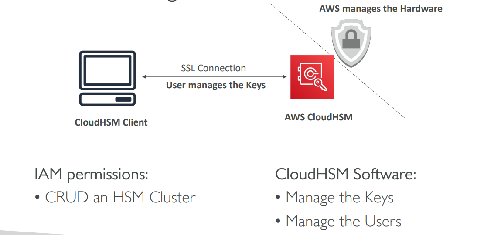
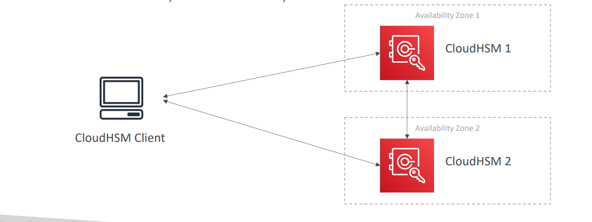
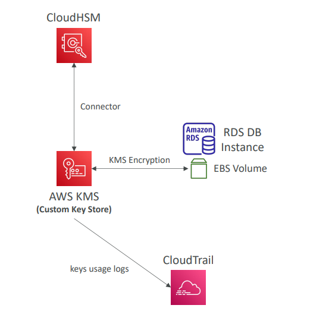

# CloudHSM Lecture

## What is CloudHSM?

CloudHSM is AWS's hardware-based key management solution. While KMS manages encryption software, CloudHSM provides dedicated hardware for encryption operations.

**Key Difference**: 
- **KMS**: AWS manages the software for encryption
- **CloudHSM**: AWS provisions encryption hardware, you manage keys entirely

## CloudHSM Core Features

### Hardware Security Module (HSM)
- **Dedicated Hardware**: Single-tenant hardware device exclusively for you
- **Tamper Resistant**: Physical security - device destroys keys if tampered with
- **FIPS 140-2 Level 3 Compliance**: Highest security certification
- **No Free Tier**: Premium service with costs

### Encryption Capabilities
- **Symmetric Encryption**: Traditional AES encryption
- **Asymmetric Encryption**: RSA and ECC key pairs
- **Digital Signing & Hashing**: More advanced cryptographic operations
- **SSL/TLS Keys**: Perfect for web server certificates

## CloudHSM Architecture Diagram

### The Setup
- **AWS Manages**: The physical HSM hardware infrastructure
- **You Manage**: All encryption keys and user access
- **Connection**: SSL connection between your applications and CloudHSM
- **Client Software**: Required CloudHSM Client for key operations

### Access Control Split
**IAM Permissions** (AWS Level):
- Create, read, update, delete HSM clusters
- Basic infrastructure management

**CloudHSM Software** (Application Level):
- Manage the actual encryption keys
- Manage HSM users and permissions
- Perform cryptographic operations

## CloudHSM High Availability

### Multi-AZ Deployment
- **CloudHSM clusters** automatically spread across multiple Availability Zones
- **Automatic Replication**: Keys synchronized between HSM devices
- **Failover**: If one AZ fails, other HSMs continue operating
- **Durability**: Great for availability and data durability

## CloudHSM Integration with AWS Services

### Integration Method
CloudHSM integrates with AWS services **through KMS Custom Key Store**:
- Configure KMS to use CloudHSM as the key store backend
- AWS services (EBS, S3, RDS) use KMS API as usual
- KMS forwards cryptographic operations to CloudHSM
- **Best of Both Worlds**: Familiar KMS API + CloudHSM security

### Service Examples
- **EBS Volumes**: Encrypt with keys stored in CloudHSM
- **S3 Objects**: SSE-KMS encryption using CloudHSM keys
- **RDS Databases**: Database encryption with CloudHSM
- **Redshift**: Native CloudHSM support for data warehouse encryption

### Audit Trail
- **CloudTrail**: Logs key usage events
- **CloudWatch**: Performance and operational metrics
- **KMS Integration**: Maintains familiar logging patterns

## CloudHSM vs KMS Comparison

### Infrastructure & Tenancy
| Feature | AWS KMS | AWS CloudHSM |
|---------|---------|--------------|
| **Tenancy** | Multi-Tenant (shared) | Single-Tenant (dedicated) |
| **Hardware** | AWS managed software | Dedicated HSM hardware |
| **Control** | AWS controls infrastructure | You control keys entirely |

### Key Management
| Feature | AWS KMS | AWS CloudHSM |
|---------|---------|--------------|
| **Key Types** | AWS Owned, AWS Managed, Customer Managed | Customer Managed Only |
| **Encryption Types** | Symmetric, Asymmetric, Digital Signing | Symmetric, Asymmetric, Digital Signing + Hashing |
| **Accessibility** | Regional (multi-region available) | VPC-based (can share via VPC Peering) |

### Performance & Features
| Feature | AWS KMS | AWS CloudHSM |
|---------|---------|--------------|
| **Cryptographic Acceleration** | None | SSL/TLS + Oracle TDE Acceleration |
| **High Availability** | AWS Managed Service | Manual setup across AZs |
| **Free Tier** | Yes | No |

### Authentication & Audit
| Feature | AWS KMS | AWS CloudHSM |
|---------|---------|--------------|
| **Access Control** | AWS IAM | You create users and manage permissions |
| **Audit** | CloudTrail + CloudWatch | CloudTrail + CloudWatch + MFA support |

## When to Choose CloudHSM

### Use CloudHSM When:
- **Regulatory Compliance**: Need dedicated hardware for compliance (banking, healthcare)
- **Key Control**: Must have exclusive control over encryption keys
- **Performance**: Need cryptographic acceleration for SSL/TLS or Oracle TDE
- **SSE-C**: Good option for S3 customer-provided key encryption

### Use KMS When:
- **Simplicity**: Want AWS to manage the complexity
- **Cost**: Need free tier or lower costs
- **Integration**: Want seamless AWS service integration
- **Shared Infrastructure**: Multi-tenant is acceptable

**Real Example**: A bank might use CloudHSM for their core banking encryption to meet regulatory requirements that mandate dedicated hardware and exclusive key control, while using KMS for general application encryption needs.