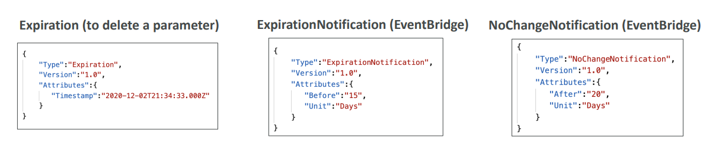

# SSM Parameter Store Lecture

## What is SSM Parameter Store?

SSM Parameter Store is a serverless, scalable service for secure storage of configuration data and secrets. It's fully integrated with AWS services and provides a simple API for managing configuration across your applications.

### Core Features
- **Secure Storage**: For configuration and secrets
- **Optional KMS Encryption**: Seamless encryption for sensitive data
- **Serverless & Scalable**: No infrastructure to manage
- **Version Tracking**: Track changes to configurations and secrets
- **IAM Security**: Fine-grained access control
- **EventBridge Integration**: Notifications for parameter changes
- **CloudFormation Support**: Infrastructure as code integration

## SSM Parameter Store Hierarchy

### Hierarchical Structure
Parameter Store uses a path-based hierarchy similar to a file system:

```
/my-department/
  ├── my-app/
  │   ├── dev/
  │   │   ├── db-url
  │   │   └── db-password
  │   ├── prod/
  │   │   ├── db-url
  │   │   └── db-password
  │   └── other-app/
  └── /other-department/
```

### Special AWS Paths
- **/aws/reference/secretsmanager/**: Reference Secrets Manager secrets
- **/aws/service/**: Public parameters (like latest AMI IDs)
  - Example: `/aws/service/ami-amazon-linux-latest/amzn2-ami-hvm-x86_64-gp2`

### API Usage
**Applications can retrieve parameters using:**
- **GetParameter**: Get single parameter
- **GetParameters**: Get multiple specific parameters  
- **GetParametersByPath**: Get all parameters under a path

**Example**: Dev Lambda function gets `/my-department/my-app/dev/*` parameters, while Prod Lambda function gets `/my-department/my-app/prod/*` parameters.

## Standard vs Advanced Parameter Tiers

### Parameter Tier Comparison

| Feature | Standard | Advanced |
|---------|----------|----------|
| **Total Parameters** | 10,000 per account/region | 100,000 per account/region |
| **Parameter Value Size** | 4 KB maximum | 8 KB maximum |
| **Parameter Policies** | Not available | Available |
| **Cost** | Free | $0.05 per parameter per month |

### When to Use Each Tier
**Standard Tier**:
- Basic configuration needs
- Cost-sensitive environments
- Small parameter values
- Simple use cases

**Advanced Tier**:
- Large-scale applications
- Need parameter policies
- Larger parameter values
- Requires advanced features like TTL

## Parameter Policies (Advanced Parameters Only)

Parameter policies provide advanced lifecycle management for your parameters. You can assign multiple policies to a single parameter.

### Available Policy Types

#### 1. Expiration Policy
- **Purpose**: Automatically delete parameters after a specified time
- **Use Case**: Force updating or deleting sensitive data like passwords
- **Benefit**: Ensures secrets don't stay valid indefinitely

#### 2. ExpirationNotification Policy  
- **Purpose**: Send EventBridge notification before parameter expires
- **Use Case**: Alert teams before passwords expire
- **Integration**: Works with EventBridge for automated workflows

#### 3. NoChangeNotification Policy
- **Purpose**: Send EventBridge notification if parameter hasn't been updated
- **Use Case**: Remind teams to rotate stale secrets
- **Compliance**: Helps meet security requirements for regular rotation

### Policy Example Workflow
1. **Create Parameter**: Database password with 90-day expiration
2. **Set Policies**: 
   - ExpirationNotification at 80 days
   - NoChangeNotification if unchanged for 60 days
3. **Automation**: EventBridge triggers Lambda to rotate password
4. **Cleanup**: Parameter auto-deletes after expiration



## Real-World Example

**E-commerce Application Setup**:
```
/ecommerce/
├── web-app/
│   ├── dev/
│   │   ├── db-connection-string (Standard, plaintext)
│   │   ├── api-key (Advanced, encrypted, 30-day expiration)
│   │   └── feature-flags (Standard, plaintext)
│   └── prod/
│       ├── db-connection-string (Standard, encrypted)
│       ├── api-key (Advanced, encrypted, 90-day expiration)
│       └── feature-flags (Standard, plaintext)
```

**Benefits**:
- **Environment Separation**: Dev and prod configurations isolated
- **Security**: Sensitive data encrypted with KMS
- **Automation**: API keys rotate automatically via policies
- **Cost Optimization**: Only critical parameters use Advanced tier
- **Scalability**: Serverless service grows with application needs

This hierarchy allows different environments to pull their specific configurations while maintaining security and compliance through encryption and automated rotation policies.