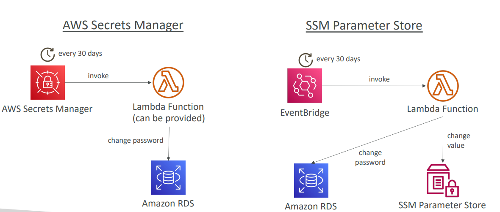

# AWS Secrets Manager Lecture

## What is AWS Secrets Manager?

AWS Secrets Manager is a newer service specifically designed for storing secrets with advanced features. It's primarily meant for database credentials and other sensitive information that requires automatic rotation.

### Core Features
- **Secret Storage**: Specifically designed for secrets (not general configuration)
- **Automatic Rotation**: Built-in capability to rotate secrets every X days
- **Lambda Integration**: Uses AWS Lambda for automated secret generation during rotation
- **Database Integration**: Native integration with Amazon RDS, Redshift, and DocumentDB
- **Mandatory KMS Encryption**: All secrets are encrypted using KMS
- **CloudFormation Support**: Full integration with infrastructure as code

## Secret Rotation Capabilities

### Automatic Rotation Process
Secrets Manager provides automatic rotation functionality:
1. **Schedule**: Set rotation every X days (e.g., every 30 days)
2. **Lambda Function**: AWS provides pre-built Lambda functions for common services
3. **Seamless Rotation**: Changes password without downtime
4. **Version Management**: Maintains multiple versions during rotation process

### Supported Services with Pre-built Rotation
- **Amazon RDS**: MySQL, PostgreSQL, Aurora
- **Amazon Redshift**: Data warehouse credentials
- **Amazon DocumentDB**: NoSQL database credentials

### Rotation Workflow Example
```
Day 1: Create secret with initial password
Day 30: Secrets Manager triggers Lambda
        Lambda generates new password
        Lambda updates database with new password
        Lambda updates secret with new password
Day 60: Process repeats automatically
```

## AWS Secrets Manager Multi-Region Secrets

### Replication Architecture
Multi-region secrets allow you to replicate secrets across multiple AWS regions for high availability and disaster recovery.

**Primary-Replica Model**:
- **Primary Secret** in us-east-1
- **Read Replica** in us-west-2
- **Automatic Sync**: Secrets Manager keeps replicas synchronized with primary

### Key Features
- **Automatic Replication**: Changes in primary region automatically sync to replicas
- **Promotion Capability**: Can promote read replica to standalone secret
- **Regional Failover**: Applications can fail over to replica regions

### Use Cases
- **Multi-Region Applications**: Apps deployed across multiple regions
- **Disaster Recovery**: Ensure secrets available if primary region fails
- **Multi-Region Databases**: Cross-region database setups
- **Global Applications**: Reduce latency by accessing local replica

### Example Architecture
```
Primary Region (us-east-1)     Secondary Region (us-west-2)
┌─────────────────────┐       ┌─────────────────────┐
│   Secrets Manager   │────→  │   Secrets Manager   │
│   MySecret-A        │       │   MySecret-A        │
│   (primary)         │       │   (replica)         │
└─────────────────────┘       └─────────────────────┘
```

## SSM Parameter Store vs Secrets Manager

### Cost Comparison
| Feature | SSM Parameter Store | Secrets Manager |
|---------|-------------------|-----------------|
| **Cost Level** | $ (Low cost) | $$$ (Higher cost) |
| **Standard Parameters** | Free | N/A |
| **Advanced Parameters** | $0.05/month | N/A |
| **Secret Storage** | N/A | ~$0.40/month per secret |

### Functionality Comparison
| Feature | SSM Parameter Store | Secrets Manager |
|---------|-------------------|-----------------|
| **API** | Simple API | Rich API for secrets |
| **Rotation** | Manual (Lambda + EventBridge) | Automatic with AWS Lambda |
| **KMS Encryption** | Optional | Mandatory |
| **Pre-built Rotation** | None | RDS, Redshift, DocumentDB |
| **CloudFormation** | Full support | Full support |
| **Cross-Service Access** | Can pull Secrets Manager secrets | Native secret management |

### Rotation Capabilities Comparison

**Secrets Manager Rotation**:
- **Built-in**: Automatic rotation every X days
- **AWS Lambda**: Pre-provided Lambda functions
- **Zero Downtime**: Seamless credential updates
- **Service Integration**: Direct integration with AWS databases

**SSM Parameter Store Rotation**:
- **Manual Setup**: Requires custom Lambda function
- **EventBridge Trigger**: Uses scheduled events
- **Custom Logic**: You write the rotation logic
- **More Flexible**: Can rotate any type of parameter



### When to Choose Each Service

**Choose Secrets Manager When**:
- Storing database passwords or API keys
- Need automatic rotation
- Using RDS, Redshift, or DocumentDB
- Multi-region secret replication required
- Budget allows for premium features

**Choose SSM Parameter Store When**:
- Storing general configuration data
- Cost is a primary concern
- Need hierarchical parameter structure
- Simple secrets without rotation
- Mixed configuration and secrets storage

## Real-World Example

**E-commerce Application Secret Management**:

**Using Secrets Manager**:
```
Production Database:
- Secret: prod-db-credentials
- Rotation: Every 90 days
- Regions: us-east-1 (primary), us-west-2 (replica)
- Cost: ~$0.40/month per secret
```

**Using SSM Parameter Store**:
```
Application Configuration:
- /ecommerce/prod/api-endpoint (free)
- /ecommerce/prod/cache-timeout (free)
- /ecommerce/prod/feature-flags (free)
- /ecommerce/prod/api-key (advanced, $0.05/month)
```

**Best Practice**: Use Secrets Manager for database credentials with automatic rotation, and SSM Parameter Store for general configuration data to optimize costs while maintaining security.s