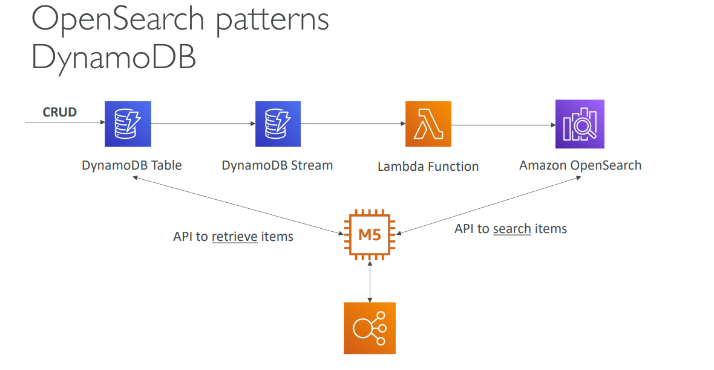
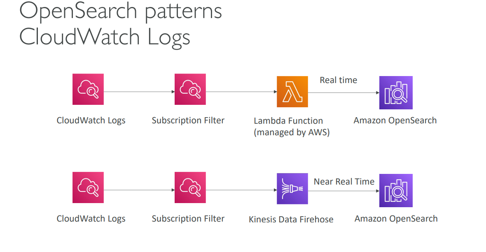
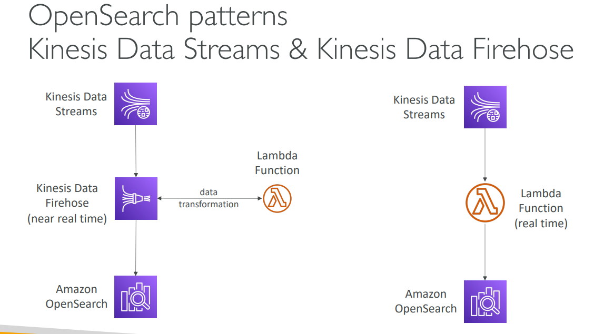

# Lecture: Amazon SES and OpenSearch Service

## Amazon Simple Email Service (SES)

### What is Amazon SES?
Amazon SES is a fully managed email service that allows you to send and receive emails securely, globally, and at scale. Think of it as AWS's email delivery platform for applications.

### Core Features
**Email Capabilities:**
- Supports both inbound and outbound emails
- Send emails via AWS Console, APIs, or standard SMTP
- Flexible IP deployment options: shared, dedicated, or customer-owned IPs

**Monitoring & Security:**
- Reputation dashboard to track your sending reputation
- Performance insights and anti-spam feedback
- Email delivery statistics (deliveries, bounces, opens)
- Supports DKIM (DomainKeys Identified Mail) and SPF (Sender Policy Framework) for authentication

### Use Cases
- **Transactional emails**: Order confirmations, password resets
- **Marketing campaigns**: Newsletters, promotional emails  
- **Bulk communications**: System notifications, alerts

**Simple Example:** An e-commerce app uses SES to automatically send order confirmation emails to customers when they make a purchase.

---

## Amazon OpenSearch Service

### What is OpenSearch?
OpenSearch is the successor to Amazon ElasticSearch. It's a search and analytics service that allows you to search any field in your data, even with partial matches.

### Key Concepts
**Search Capabilities:**
- Unlike DynamoDB (which only queries by primary key or indexes), OpenSearch can search any field
- Supports partial text matching and complex search queries
- Commonly used as a complement to other databases

**Deployment Options:**
- Managed cluster mode
- Serverless cluster mode
- Includes OpenSearch Dashboards for visualization

**Security & Integration:**
- Security through Cognito & IAM, KMS encryption, TLS
- Data ingestion from Kinesis Data Firehose, AWS IoT, and CloudWatch Logs
- Does not natively support SQL (but can be enabled via plugin)

---

## OpenSearch Integration Patterns

### 1. DynamoDB + OpenSearch Pattern
**Architecture:** DynamoDB Table → DynamoDB Stream → Lambda Function → OpenSearch

**Use Case:** You have a product catalog in DynamoDB but need advanced search capabilities. DynamoDB handles CRUD operations, while OpenSearch provides the search functionality.

### 2. CloudWatch Logs + OpenSearch Pattern
**Two approaches:**

**Real-time:** CloudWatch Logs → Subscription Filter → Lambda Function → OpenSearch

**Near Real-time:** CloudWatch Logs → Subscription Filter → Kinesis Data Firehose → OpenSearch

**Use Case:** Analyzing application logs for troubleshooting and monitoring. CloudWatch Logs captures the logs, and OpenSearch makes them searchable.

### 3. Kinesis + OpenSearch Pattern
**Real-time:** Kinesis Data Streams → Lambda Function → OpenSearch

**Near Real-time:** Kinesis Data Streams → Kinesis Data Firehose → OpenSearch (with optional Lambda for data transformation)

**Use Case:** Processing streaming data like user activity logs or IoT sensor data. Kinesis handles the streaming, and OpenSearch provides analytics and search capabilities.

### Integration Benefits
- **Real-time insights**: Search and analyze data as it arrives
- **Scalability**: Handle large volumes of data efficiently
- **Flexibility**: Combine structured data storage with powerful search capabilities
- **Visualization**: Use OpenSearch Dashboards for monitoring and analytics

**Real-world Example:** A social media platform uses DynamoDB to store user posts, but implements OpenSearch to provide instant search functionality across all posts, hashtags, and user mentions.