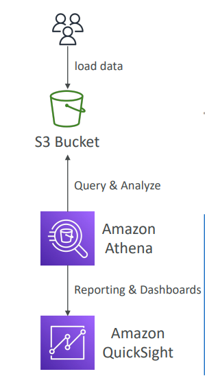
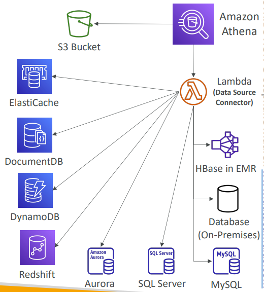

## Amazon Athena Overview (Recap)
Amazon Athena is a serverless query service that lets you analyze data stored in Amazon S3 using standard SQL. Built on Presto engine, it supports various file formats and charges $5.00 per TB of data scanned.

---

## Amazon Athena - Performance Improvement

### Key Performance Optimization Strategies

#### 1. Use Columnar Data Formats
**Why Columnar?**
- Traditional row-based formats scan entire rows even when you only need specific columns
- Columnar formats only scan the columns you need, dramatically reducing data scanned

**Recommended Formats:**
- **Apache Parquet** (most popular)
- **ORC (Optimized Row Columnar)**
- Use AWS Glue to convert CSV/JSON to Parquet or ORC

**Performance Impact:** Huge performance improvement and cost savings since you pay per TB scanned.

#### 2. Data Compression
**Compression Benefits:**
- Smaller file sizes = less data to scan = lower costs
- Faster query performance

**Supported Compression:**
- bzip2, gzip, lz4, snappy, zlib, zstd

#### 3. Partitioning Strategy
**Partition Structure:**
```
s3://your-bucket/pathToTable/
  /<PARTITION_COLUMN_NAME>=<VALUE>/
  /<PARTITION_COLUMN_NAME>=<VALUE>/
  /etc...
```

**Example:**
```
s3://athena-examples/flight/parquet/
  /year=1991/month=1/day=1/
  /year=1991/month=1/day=2/
  /year=1991/month=2/day=1/
```

**Benefits:**
- Query only relevant partitions
- Athena skips entire partitions that don't match your WHERE clause
- Massive performance gains for time-series data

#### 4. File Size Optimization
**Recommendation:** Use larger files (> 128 MB)
- Reduces overhead from processing many small files
- Better parallelization
- More efficient resource utilization

---

## Amazon Athena - Federated Query

### What is Federated Query?
Federated Query allows you to run SQL queries across data stored in different sources - not just S3. It breaks down data silos and enables unified analytics.



### Architecture
**Components:**
- **Amazon Athena** - Query engine
- **AWS Lambda** - Data Source Connectors
- **Various Data Sources** - AWS and on-premises

### Supported Data Sources
**AWS Services:**
- DynamoDB
- RDS (MySQL, PostgreSQL, etc.)
- Redshift
- ElastiCache
- DocumentDB
- CloudWatch Logs

**External Sources:**
- On-premises databases
- MySQL
- SQL Server
- HBase in EMR

### How It Works
1. **Query Submission:** You write SQL in Athena
2. **Connector Execution:** Lambda functions (Data Source Connectors) execute against each data source
3. **Data Federation:** Results are combined and processed
4. **Result Storage:** Final results stored back in S3

### Use Cases
**Cross-Database Analytics:**
```sql
SELECT 
  orders.order_id,
  customers.customer_name,
  products.product_name
FROM s3_orders_table orders
JOIN rds_customers_table customers ON orders.customer_id = customers.id
JOIN dynamodb_products_table products ON orders.product_id = products.id
```

**Hybrid Cloud Reporting:**
- Combine on-premises sales data with AWS analytics data
- Join historical data in Redshift with real-time data in DynamoDB

### Benefits
- **No Data Movement:** Query data where it lives
- **Unified View:** Single SQL interface for multiple data sources
- **Cost Effective:** No need to migrate or duplicate data
- **Real-time:** Query live data across different systems

**Real-world Example:** A retail company uses Federated Query to create daily reports by joining:
- Customer data from RDS
- Order history from S3 (partitioned by date)
- Product catalog from DynamoDB
- Real-time inventory from on-premises systems

All in a single SQL query without moving any data!