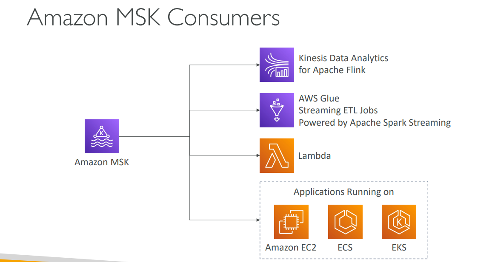

# Lecture: Amazon MSK & AWS Macie

## Amazon Managed Streaming for Apache Kafka (MSK)

### What is Amazon MSK?
Amazon MSK is AWS's fully managed Apache Kafka service - it's an alternative to Amazon Kinesis for streaming data. Think of it as "Apache Kafka without the operational overhead."

### Core Features
**Fully Managed Service:**
- AWS creates and manages Kafka broker nodes and Zookeeper nodes
- Automatic recovery from common Apache Kafka failures
- Deploy in your VPC with multi-AZ support (up to 3 AZs for high availability)
- Data stored on EBS volumes for as long as you want

**MSK Serverless:**
- Run Apache Kafka without managing capacity
- Automatic provisioning and scaling of compute & storage

---

## Apache Kafka at a High Level

### Architecture Components
**MSK Cluster:**
- **Broker 1, 2, 3...** - Handle message storage and processing
- **Topics with Partitions** - Organize data streams
- **Replication** - Data copied across brokers for fault tolerance

**Producers & Consumers:**
- **Producers** - Applications that write data to topics
- **Consumers** - Applications that read data from topics
- **Your Code** - Custom applications using Kafka APIs

### Data Flow
1. **Producers write to topics** - Send messages to specific Kafka topics
2. **Brokers store data** - Messages distributed across partitions
3. **Consumers poll from topics** - Read messages for processing
4. **Replication ensures durability** - Data copied across multiple brokers


---

## Kinesis Data Streams vs Amazon MSK

### Message Size & Structure
**Kinesis Data Streams:**
- 1 MB message size limit
- Data organized in **Shards**
- Supports shard splitting & merging
- Sequence numbers for ordering

**Amazon MSK:**
- 1MB default, configurable up to 10MB+
- Data organized in **Kafka Topics with Partitions**
- Can only add partitions (no splitting/merging)
- Kafka offset-based ordering

### Encryption & Security
**Kinesis:**
- TLS in-flight encryption
- KMS at-rest encryption

**MSK:**
- PLAINTEXT or TLS in-flight encryption
- KMS at-rest encryption

### Scaling Characteristics
**Kinesis:** More flexible scaling with shard operations
**MSK:** Simpler partition-based scaling (add partitions only)

---

## Amazon MSK Consumers

### Integration Options
**Analytics & Processing:**
- **Kinesis Data Analytics for Apache Flink** - Real-time stream processing
- **AWS Glue Streaming ETL Jobs** - Powered by Apache Spark Streaming

**Compute Services:**
- **AWS Lambda** - Serverless event processing
- **Amazon EC2** - Custom applications
- **ECS/EKS** - Containerized applications

### Consumer Patterns
**Real-time Analytics:** MSK → Kinesis Data Analytics → Real-time dashboards
**ETL Processing:** MSK → AWS Glue → Data warehouse
**Microservices:** MSK → Lambda → Business logic processing




---

## AWS Macie

### What is AWS Macie?
Macie is a fully managed data security and data privacy service that uses **machine learning and pattern matching** to discover and protect sensitive data in AWS.


### Core Capabilities
**Sensitive Data Discovery:**
- Automatically scans S3 buckets
- Identifies Personally Identifiable Information (PII)
- Detects financial data, healthcare records, credentials

**Machine Learning Detection:**
- Learns normal access patterns
- Identifies unusual data access behavior
- Continuously monitors for anomalies

### How Macie Works
1. **Data Analysis** - Scans S3 buckets for sensitive content
2. **Classification** - Uses ML to identify data types and sensitivity levels
3. **Alerting** - Sends notifications when sensitive data is discovered
4. **Integration** - Works with Amazon EventBridge for automated responses

### Architecture Flow
```
S3 Buckets → Macie → Discover Sensitive Data (PII) → Amazon EventBridge → Notifications/Integrations
```

### Use Cases
**Compliance & Governance:**
- GDPR compliance monitoring
- PCI DSS data discovery
- HIPAA sensitive data identification

**Security Monitoring:**
- Detect accidental exposure of sensitive data
- Monitor for unusual access patterns
- Automated incident response

**Data Discovery:**
- Inventory sensitive data across organization
- Classify data for proper handling
- Support for data governance initiatives

**Real-world Example:** A healthcare company uses Macie to automatically scan all S3 buckets, identify any files containing patient information (PII/PHI), and trigger alerts through EventBridge to ensure HIPAA compliance and proper data handling procedures.

### Integration Benefits
- **Automated Discovery:** No manual scanning required
- **Continuous Monitoring:** Ongoing protection of sensitive data
- **Event-Driven Response:** Automatic actions via EventBridge
- **Comprehensive Coverage:** Works across all S3 buckets in account