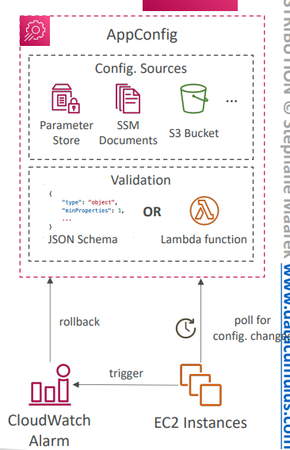
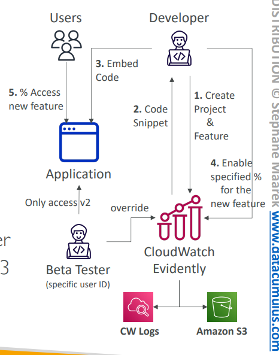

# Lecture: AWS AppConfig & CloudWatch Evidently

## AWS AppConfig

### What is AWS AppConfig?
AWS AppConfig is a service that allows you to configure, validate, and deploy dynamic configurations to your applications independently of code deployments. Think of it as "configuration management as a service."


### Core Capabilities
**Dynamic Configuration Management:**
- Deploy configuration changes without restarting applications
- No code deployments required for configuration updates
- Works with apps on EC2, Lambda, ECS, EKS, and on-premises

**Configuration Types:**
- **Feature flags** - Enable/disable features dynamically
- **Application tuning** - Adjust performance parameters
- **Allow/block listing** - Control access and permissions
- **Environment-specific settings** - Different configs per environment

### Configuration Sources
**Multiple Source Options:**
- **SSM Parameter Store** - Centralized parameter management
- **SSM Documents** - Structured configuration documents
- **S3 Buckets** - Configuration files stored in S3
- **Other sources** - Custom configuration stores

### Validation Mechanisms
**Pre-deployment Validation:**
- **JSON Schema validation** - Syntactic checks for structure
- **Lambda Function validation** - Custom semantic validation logic

**Example validation flow:**
1. Configuration change proposed
2. JSON Schema validates structure
3. Lambda function performs business logic validation
4. If valid, deployment proceeds; if not, rollback occurs

### Gradual Deployment & Rollback
**Safe Deployment Strategy:**
- Gradually deploy configuration changes
- Monitor application health during rollout
- Automatic rollback if CloudWatch Alarms trigger
- Minimize risk of configuration-related outages

### Architecture Flow
```
Configuration Sources → AppConfig → Validation → EC2/Lambda/ECS → CloudWatch Alarm → Rollback
```

Applications poll AppConfig for configuration changes, ensuring they always have the latest valid configuration.



---

## CloudWatch Evidently

### What is CloudWatch Evidently?
CloudWatch Evidently is a service for safely validating new features by serving them to a specified percentage of your users. It's AWS's managed feature flagging and A/B testing platform.

### Core Concepts

#### 1. Launches (Feature Flags)
**Purpose:** Enable and disable features for a subset of users
- Control feature rollouts
- Safely test new functionality
- Instant feature enable/disable capability

#### 2. Experiments (A/B Testing)
**Purpose:** Compare multiple versions of the same feature
- Statistical analysis of feature performance
- Data-driven decision making
- Performance monitoring and comparison

#### 3. Overrides
**Purpose:** Pre-define specific variations for particular users
- Beta tester access to new features
- VIP user experiences
- Developer testing scenarios

### Implementation Workflow
**Step-by-step Process:**
1. **Create Project & Feature** - Set up in CloudWatch Evidently
2. **Generate Code Snippet** - Evidently provides integration code
3. **Embed Code in Application** - Add feature flag logic
4. **Enable Percentage** - Specify what % of users get new feature
5. **Users Access New Feature** - Controlled rollout begins

### Data Collection & Analysis
**Evaluation Events Storage:**
- **CloudWatch Logs** - Real-time event monitoring
- **Amazon S3** - Long-term storage and analysis
- Statistical analysis of experiment results
- Performance monitoring and metrics collection

### Use Cases
**Risk Mitigation:**
- Reduce risk of deploying broken features
- Identify unintended consequences early
- Safe feature rollouts with instant rollback

**Performance Optimization:**
- A/B test different implementations
- Measure user engagement and conversion
- Data-driven feature development decisions

### Architecture Example
```
Developer → Evidently (Create Project) → Application (Embed Code) → Users → % Access New Feature
                                                    ↓
                            CloudWatch Logs/S3 ← Evaluation Events
```



### Benefits
**Development Velocity:**
- Deploy features independently of releases
- Instant feature control without code changes
- Reduced deployment risk

**Data-Driven Decisions:**
- Statistical validation of feature impact
- User behavior analysis
- Performance comparison between variants

**Operational Safety:**
- Gradual rollouts minimize blast radius
- Instant rollback capabilities
- Real-time monitoring and alerting

**Real-world Example:** An e-commerce company uses Evidently to test a new checkout flow. They serve the new design to 10% of users, monitor conversion rates, and gradually increase the percentage based on positive results. Beta testers get override access to always see the new version for feedback.

### Integration Benefits
- **Seamless AWS Integration** - Works with existing CloudWatch and S3
- **No Infrastructure Management** - Fully managed service
- **Built-in Analytics** - Statistical analysis included
- **Enterprise Scale** - Handles millions of evaluations