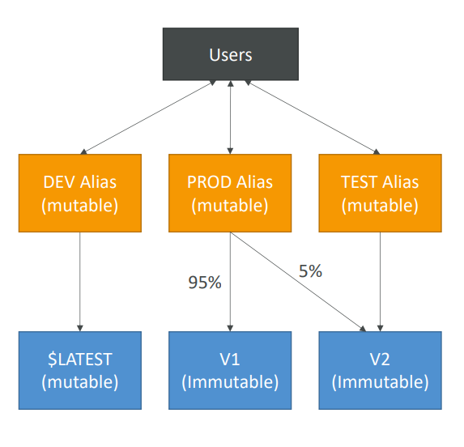

# AWS Lambda: Versions & Aliases

In AWS Lambda, **Versions** and **Aliases** help you manage your function's deployment and invocation. They enable better control over which code/configuration is run, facilitate testing, and support safer deployment strategies like canary releases.

---

## Lambda Versions

When developing a Lambda function, you work on the **`$LATEST`** version. This version is **mutable**—any code or configuration changes apply here.

When you want a stable, deployable snapshot, you **publish a version**.

**Key characteristics:**

- **Immutability:** Once published, code and most configuration (runtime, handler, memory, timeout, layers, execution role, environment variables) are immutable for that version.
- **Sequential Numbering:** Each version gets an auto-incremented number (e.g., 1, 2, 3, ...).
- **Unique ARN:** Every version (including `$LATEST`) has a unique ARN, e.g.  
  `arn:aws:lambda:region:account-id:function:FunctionName:1`
- **Snapshot:** A version is a snapshot of your function's code and configuration at publish time.

> **Typical use:** Publish a new version when you have a stable release for a specific environment (testing, production, etc).

---

## Lambda Aliases

**Aliases** are friendly names (pointers) for Lambda function versions. Instead of referencing a version number, you use an alias.

**Key characteristics:**

- **Pointers to Versions:** An alias points to a specific version (e.g., `PROD` → v3, `TEST` → v5, `DEV` → `$LATEST`).
- **Mutability:** Aliases are mutable; you can update them to point to different versions without changing the alias ARN.
- **Weighted Routing (Canary Deployments):**  
  Aliases can split traffic between two versions (e.g., 90% to v5, 10% to v6) for canary releases.
- **Stable Endpoint:** Event sources (API Gateway, S3, etc.) can invoke Lambda using an alias ARN, providing a stable endpoint even as the underlying version changes.
- **Unique ARN:**  
  `arn:aws:lambda:region:account-id:function:FunctionName:AliasName`
- **No Chaining:** Aliases cannot point to other aliases.

---

## Real-World Example: Managing a Web API Backend

Imagine an e-commerce app with a Lambda function for processing new orders.

### 1. Initial Development (`$LATEST`)
- Develop order processing logic on `$LATEST`.

### 2. First Deployment (Version 1 & `TEST` Alias)
- Publish Version 1.
- Create `TEST` alias → Version 1.
- Testing environment's API Gateway uses the `TEST` alias ARN.

### 3. Promoting to Production (Version 1 & `PROD` Alias)
- After testing, create `PROD` alias → Version 1.
- Production API Gateway uses the `PROD` alias.

### 4. Developing New Features (`$LATEST` → Version 2)
- Develop V2.0 (e.g., add SMS confirmation) on `$LATEST`.
- Publish Version 2.

### 5. Testing New Features (`TEST` Alias → Version 2)
- Update `TEST` alias → Version 2.
- Testing uses V2.0; production (`PROD`) still uses Version 1.

### 6. Canary Deployment to Production (`PROD` Alias with Weights)
- Update `PROD` alias: 90% traffic → Version 1, 10% → Version 2.
- Monitor for errors/issues with Version 2.

### 7. Full Rollout to Production (`PROD` Alias → Version 2)
- If canary is successful, update `PROD` alias → 100% Version 2.
- Use CodeDeploy with SAM to automate traffic shifting.

---

**Summary:**  
- **Versions** = immutable snapshots of code/config.
- **Aliases** = flexible pointers for environments and safe deployments.

