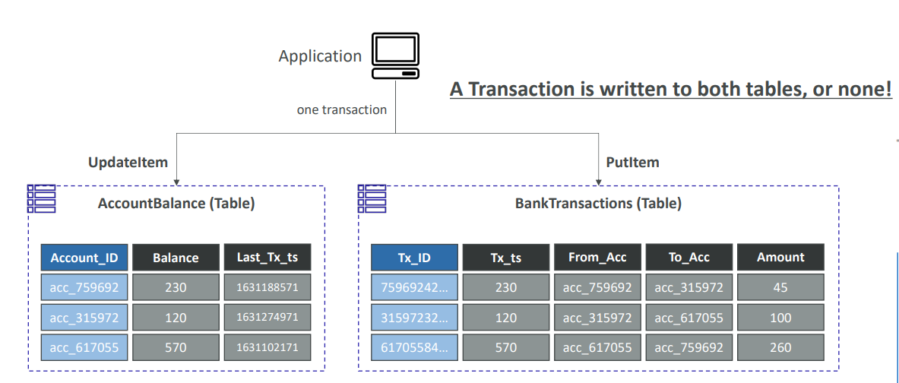

## **DynamoDB Transactions**

### **What are DynamoDB Transactions?**

* **Transactions** allow you to perform **coordinated, all-or-nothing operations** (PutItem, UpdateItem, DeleteItem, GetItem) **across multiple items and even multiple tables**.
* **ACID-compliant**:

  * **Atomicity:** All operations succeed or none do.
  * **Consistency:** Ensures data integrity.
  * **Isolation:** Intermediate states are invisible to other operations.
  * **Durability:** Once committed, changes are permanent.

### **Main APIs for Transactions**

* **TransactWriteItems:**
  Allows you to group up to 25 write actions (PutItem, UpdateItem, DeleteItem, ConditionCheck) in a single atomic request.
* **TransactGetItems:**
  Groups up to 25 GetItem actions in a single atomic read request.

### **Read & Write Modes in Transactions**

* **Write Modes:** Standard (default) and Transactional (ACID).
* **Read Modes:** Eventual consistency, Strong consistency, and Transactional (for transaction reads).

### **How it works (under the hood):**

* **Two-phase commit:**
  For each transactional write, DynamoDB performs a “prepare” phase and a “commit” phase—doubling the required capacity.
* **All or nothing:**
  If any item in a transaction fails a condition, the entire transaction fails and nothing is committed.

### **Use Cases**

* **Financial transactions:**
  Transfer money between accounts (debit and credit must both succeed).
* **Order processing:**
  Reserve inventory and create order records together.
* **Gaming:**
  Update scores, achievements, and logs in a single atomic operation.

**Example from slides:**
You update a bank account balance and write a transaction log to another table in one atomic transaction—both succeed or both fail.

---

## **Transaction Capacity Computations**

**Key Point:**
**Transactional operations cost 2x the normal WCU/RCU**—because of the two-phase process (prepare + commit).

### **Calculating Write Capacity for Transactions**

* **Each transactional write operation:**

  * Consumes **2 WCUs** per 1 KB (not 1 WCU as in standard mode).
  * **Larger items:**

    * Still round up to the nearest KB (e.g., a 5 KB item = 5 WCUs × 2 = 10 WCUs per operation).

* **Example from slides:**

  * 3 transactional writes/second, item size 5 KB:

    * 5 KB rounds up to 5 WCUs per write.
    * Multiply by 2 for transactional: **3 × 5 × 2 = 30 WCUs** needed.

### **Calculating Read Capacity for Transactions**

* **Each transactional read operation:**

  * Consumes **2 RCUs** per 4 KB (not 1 RCU as in standard strongly consistent read).
  * **Larger items:**

    * Still round up to nearest 4 KB.

* **Example from slides:**

  * 5 transactional reads/second, item size 5 KB:

    * 5 KB rounds up to 2 RCUs per read (since 4 KB per RCU, 5 KB = 2 RCUs).
    * Multiply by 2 for transactional: **5 × 2 × 2 = 20 RCUs** needed.

---

## **Quick Reference Table**

| Operation         | Standard Cost | Transactional Cost |
| ----------------- | ------------- | ------------------ |
| Write (1 KB item) | 1 WCU         | 2 WCUs             |
| Read (4 KB item)  | 1 RCU         | 2 RCUs             |
| Write (5 KB item) | 5 WCUs        | 10 WCUs            |
| Read (5 KB item)  | 2 RCUs        | 4 RCUs             |

---

## **Summary**

* **DynamoDB Transactions** provide true ACID guarantees across multiple items/tables, enabling complex business logic and preventing data anomalies.
* **Capacity computations for transactions** require you to **double the normal WCU/RCU** calculations for each transactional read/write.
* **Real-world tip:** Always plan for higher throughput when using transactions to avoid throttling.

