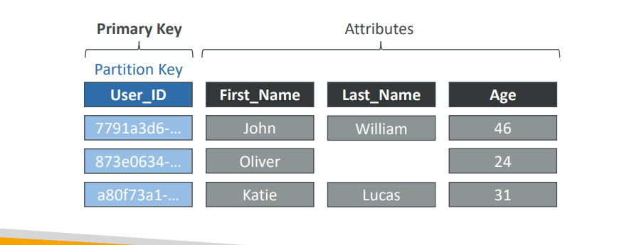
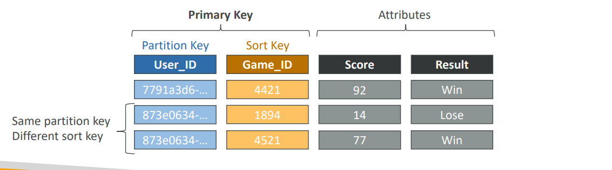

**Amazon DynamoDB** is a **fully managed NoSQL database service** offered by AWS. It is designed for applications that require **single-digit millisecond performance at any scale**. DynamoDB is serverless—you don’t need to provision or manage servers.

---

### **Key Features:**

* **Fully Managed:**
  AWS handles all the infrastructure, scaling, backups, and replication. No servers for you to patch or manage.

* **NoSQL:**
  DynamoDB is a key-value and document database. It doesn’t require a fixed schema and can handle semi-structured or unstructured data.

* **Performance:**
  Consistent, fast performance with single-digit millisecond latency, regardless of scale.

* **Scalable:**
  DynamoDB automatically scales up and down to adjust for capacity and maintain performance as your application grows.

* **High Availability & Durability:**
  Data is automatically replicated across multiple Availability Zones within an AWS Region.

* **Integrated Security:**
  Supports encryption at rest (using AWS KMS), in-transit encryption (TLS), and fine-grained access control using IAM.

* **Event-driven & Streams:**
  DynamoDB Streams capture changes (insert, update, delete) in your table for real-time processing—integrates easily with Lambda.

* **Flexible Data Model:**

  * **Tables** store items (like rows in RDBMS).
  * **Items** are sets of attributes (like columns).
  * **Primary key**: 
  - **simple** (partition key)
  
  - **composite** (partition key + sort key).
  
---

### **Pricing Model:**

* **On-demand mode:** Pay per request, no need to set throughput.
* **Provisioned mode:** You set the read/write capacity units, and AWS bills accordingly.
* **Other charges:** You pay for storage, data transfer, and optional features (DAX cache, Streams, backups).

---

### **Real Work Example:**

Suppose you’re building a **shopping cart service** for an e-commerce platform:

* Each user’s cart is stored as an item in a DynamoDB table.
* The partition key is the `user_id`.
* The cart contains attributes like `cart_items`, `last_updated`, etc.
* When users add items, the cart is updated in milliseconds, supporting thousands of users in parallel without performance drops.
* You use DynamoDB Streams to trigger an AWS Lambda function whenever a cart is updated (e.g., to send recommendations).

---

### **Summary Table:**

| Feature        | DynamoDB                                   |
| -------------- | ------------------------------------------ |
| Type           | NoSQL (key-value, document)                |
| Managed by AWS | Yes                                        |
| Scaling        | Auto, massive, serverless                  |
| Performance    | Single-digit millisecond latency           |
| Data Model     | Tables, items, attributes; flexible schema |
| Partition Key  | Yes                                        |
| Sort Key       | Optional (for composite primary keys)      |
| Streams        | Yes (for event-driven processing)          |
| Security       | KMS encryption, IAM, VPC endpoints         |
| Pricing        | On-demand or provisioned, pay per use      |

---

