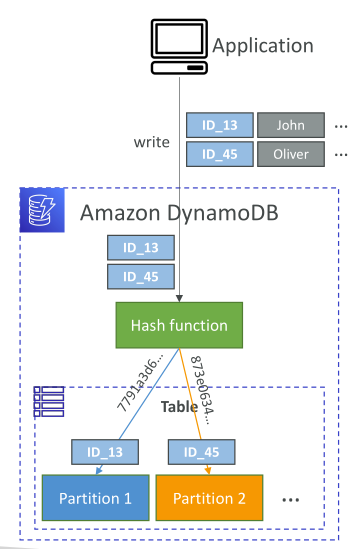

### **DynamoDB R/W Capacity Modes**

DynamoDB offers two main capacity modes:

1. **Provisioned Capacity Mode**
2. **On-Demand Capacity Mode**

Your question is specifically about **Provisioned Capacity Mode**.

---

## 1 **Provisioned Capacity Mode**

With Provisioned Capacity, you **specify the number of reads and writes per second** that you expect your application to require. You pay for the capacity you provision, regardless of actual usage. This is suitable for applications with predictable traffic.

* **You set:**

  * Read Capacity Units (RCUs): Number of strongly consistent reads per second for items up to 4 KB.
  * Write Capacity Units (WCUs): Number of writes per second for items up to 1 KB.

---

### **Strongly Consistent Read vs. Eventually Consistent Read**

* **Strongly Consistent Read:**

  * Returns the most up-to-date data, reflecting all writes.
  * Uses **1 RCU** per 4KB item per read.

* **Eventually Consistent Read:**

  * May not reflect the results of a recently completed write.
  * Uses **0.5 RCUs** per 4KB item per read (twice as efficient).
  * Eventually, all copies of data will be consistent.

**Use case in real world:**
If you need absolute up-to-date results, like banking or inventory management, use strongly consistent reads. For analytics or most web apps where minor delay is OK, use eventually consistent reads to save cost.

---

### **Partitions Internal (How DynamoDB Scales Internally)**

* DynamoDB **automatically partitions your data** based on the amount of data and throughput.
* Each partition can handle a certain amount of RCUs, WCUs, and storage.
* **When your usage increases, DynamoDB splits partitions** to spread load and data.

  
  
**Real-world example:**
If your application’s traffic grows, DynamoDB will add more partitions in the background to keep up with your read/write capacity settings.

---

### **Throttling**

* **Throttling occurs when your requests exceed the provisioned RCU or WCU for your table or its partitions.**
* When throttled, DynamoDB returns a `ProvisionedThroughputExceededException`.
* This protects the database and maintains performance for all users.
* You can handle throttling by **increasing capacity**, **optimizing access patterns**, or using **exponential backoff** in your client code.

**Real-world scenario:**
If your provisioned WCU is 100, but suddenly 500 write requests hit at once, DynamoDB will throttle 400 of them. This is common during unexpected traffic spikes or unoptimized batch jobs.

---

### **Summary Table**

| Feature               | Strongly Consistent | Eventually Consistent          |
| --------------------- | ------------------- | ------------------------------ |
| Read Capacity Usage   | 1 RCU per 4 KB      | 0.5 RCUs per 4 KB              |
| Consistency Guarantee | Always up-to-date   | May lag, eventually up-to-date |
| Cost                  | Higher              | Lower                          |

---

### **Real-World Example**

Imagine an e-commerce app:

* You expect \~1000 read requests and 500 write requests per second.
* You provision 1000 RCUs and 500 WCUs.
* If a big sale happens and 5000 users hit "checkout" at the same time, you might hit throttling unless you raise your provisioned capacity.
* If your inventory read operation can tolerate slight delays, you can use eventually consistent reads and save 50% on read costs.

---
## **2. On-Demand Capacity Mode**
No capacity planning needed.

DynamoDB automatically scales to handle your workload.

You only pay for what you use (measured as RRUs—Read Request Units, and WRUs—Write Request Units, equivalent to RCUs/WCUs).

No practical throttle limits (within AWS service limits)—good for unpredictable or spiky workloads.

Typically 2.5x more expensive per request than provisioned mode for the same throughput, so use with care for high, stable workloads.