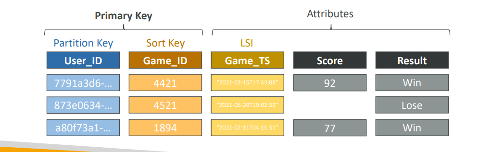
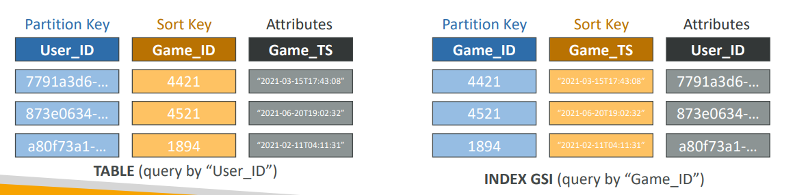

## **1. Local Secondary Index (LSI)**

* **Purpose:** Provides an **alternative sort key** for your table (while using the same partition key as the base table).

* **How it works:**

  * LSI allows you to query items in a partition using a different sort key than the main table’s sort key.
  * Each table can have **up to 5 LSIs**.
  * **Must be defined at table creation time.**

* **Projections:** Decide which attributes from the main table to copy into the index:

  * `KEYS_ONLY` (just the keys)
  * `INCLUDE` (keys + some attributes)
  * `ALL` (all attributes)

* **Example:**
  Suppose you have a `UserGames` table with partition key `User_ID` and sort key `Game_TS` (timestamp).
  You could create an LSI on `Score`, so you can efficiently query all games played by a user, sorted by `Score`, instead of by time.

* **Real world:**

  * Query all orders for a customer, sorted by price instead of date.

* **Note:**

  * **LSIs share the RCUs and WCUs of the main table.**
  * No special throttling concerns—main table’s throughput applies.

---

## **2. Global Secondary Index (GSI)**

* **Purpose:** Enables queries using **alternative primary keys** (partition key or partition + sort key) that can be completely different from the main table’s primary key.

* **How it works:**

  * Can be **added or modified anytime** (not limited to table creation).
  * Each GSI can have its own provisioned throughput (RCUs/WCUs).
  * **Partition and sort keys can be any scalar attributes**.
  * Attribute projections just like LSI: `KEYS_ONLY`, `INCLUDE`, `ALL`.

* **Example:**
  In the same `UserGames` table, if you want to quickly look up all games by `Game_ID` (across users), create a GSI with `Game_ID` as partition key and optionally another attribute as sort key.

* **Real world:**

  * E-commerce: query all orders by product ID, not just by user ID.

* **Note:**

  * **You must provision RCUs and WCUs for the GSI itself.**
  * **Writes to the main table will propagate to the GSI.**

---

## **3. Indexes and Throttling**

* **GSI Throttling:**

  * If writes to the GSI are throttled (because you exceeded its WCU), **writes to the main table are also throttled**, even if you have enough WCU on the main table.
  * This means your application can be blocked by GSI capacity limits.
  * **Best practice:** Carefully choose your GSI partition key to avoid hot partitions, and provision enough capacity for your GSI.
* **LSI Throttling:**

  * LSIs use the main table’s RCUs/WCUs, so **no separate throttling**; everything is governed by the table’s own capacity.
* **General throttling issues (for all indexes):**

  * Hot keys or unevenly distributed data can create hot partitions and throttle both tables and indexes.
  * Distribute access patterns and partition keys to avoid these hotspots.

---

## **Summary Table**

| Feature             | LSI                                           | GSI                                   |
| ------------------- | --------------------------------------------- | ------------------------------------- |
| Partition Key       | Same as main table                            | Different from main table             |
| Sort Key            | Alternative attribute (must pick at creation) | Optional, can pick at any time        |
| Define at creation? | Yes                                           | No, can add anytime                   |
| Own RCUs/WCUs?      | No, shares with main table                    | Yes, must provision separately        |
| Max per table       | 5                                             | 20 (soft limit, can increase)         |
| Throttling          | Only by main table’s capacity                 | GSI WCU limit can throttle base table |

---

## **Practical Example**

**E-commerce Orders Table**

* Main Table:

  * Partition Key: `CustomerID`
  * Sort Key: `OrderTimestamp`
* LSI:

  * Sort Key: `OrderTotal` (allows you to get orders by value per customer)
* GSI:

  * Partition Key: `ProductID` (enables you to find all orders for a product across all customers)

---

## **Slide Reference**

* LSI: Alternative sort key, same partition key, up to 5 per table, defined at creation, shares throughput
* GSI: Alternative partition/sort keys, can add anytime, needs its own capacity, must provision carefully to avoid throttling the table
* Throttling: GSI throttle = table throttle; LSI uses main table’s RCUs/WCUs

---
