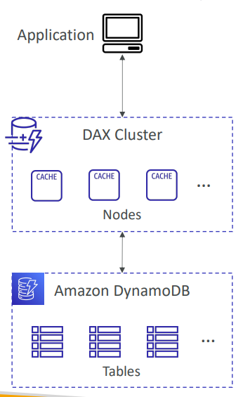

## DynamoDB Accelerator (DAX) – Overview

**DAX** is a **fully managed, in-memory cache** for DynamoDB, designed to **dramatically speed up read operations** by delivering microsecond response times (compared to DynamoDB’s typical millisecond latency). DAX acts as a caching layer in front of your DynamoDB tables, reducing both read latency and cost for repeated access.

---

## How DAX Works

- **DAX clusters** run inside your VPC, spanning one or more Availability Zones for high availability.
- Applications use a **DAX-aware SDK/Client** (not the standard DynamoDB client).
- **Read flow:**
  - If the item is in the DAX cache: returned instantly (microseconds).
  - If not: DAX fetches from DynamoDB, caches it, and returns to the app.
- **Write flow:** All writes go directly to DynamoDB; DAX updates or invalidates the cache as needed (**write-through**).



---

## Key Features

- **In-Memory Caching:** Uses RAM to cache frequently accessed items.
- **Microsecond Latency:** 10x–100x faster reads for cached data.
- **Fully Managed:** AWS handles patching, scaling, failover, and maintenance.
- **Highly Available:** Multi-AZ clusters with automatic failover.
- **API-Compatible:** No changes to your data model or tables—just swap the client.

---

## When Should You Use DAX?


**Best for:**
- **Read-heavy workloads:** Social feeds, dashboards, product catalogs.
- **Latency-sensitive apps:** Leaderboards, real-time analytics.
- **Hot keys:** High contention on certain items.

**Not ideal for:**
- Write-heavy or write-only workloads.
- Applications requiring strongly consistent reads (DAX is eventually consistent for cached reads).

---

### DAX vs. ElastiCache (Redis)

Use **ElastiCache (Redis)** if you need:
- Caching for services beyond DynamoDB (e.g., RDS, API responses).
- Complex data structures (sorted sets, pub/sub, session management).
- Custom cache keys, eviction policies, or advanced caching logic.

**Examples:**
- Caching user sessions for a website.
- Storing precomputed leaderboard rankings.
- Building chat/messaging systems.
- Speeding up SQL queries for RDS/MySQL/PostgreSQL.

---

## How to Use DAX (Step-by-Step)

1. **Create a DAX cluster** in the AWS Console.
2. **Update your application** to use the DAX client SDK (Java, Python, Node.js, .NET, Go, etc.).
3. **Change the endpoint** from DynamoDB to your DAX cluster endpoint.

**Architecture:**
```
App (DAX client) → DAX Cluster → DynamoDB Table
```

---

## Real-World Scenario

**E-commerce Flash Sale:**  
During a flash sale, your product catalog receives thousands of reads per second.  
DAX caches popular products, so most requests are served instantly from memory—reducing DynamoDB costs and avoiding throttling.

---

## Summary Table

| Feature     | DAX (with DynamoDB)                  |
| ----------- | ------------------------------------ |
| Purpose     | In-memory caching for DynamoDB reads |
| Performance | Microseconds (cached)                |
| Consistency | Eventually consistent                |
| Integration | Requires DAX client SDK              |
| Cost        | Pay for cluster size/hours           |
| Use Case    | Read-heavy, low-latency, hot keys    |