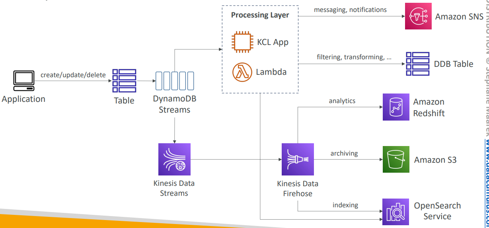
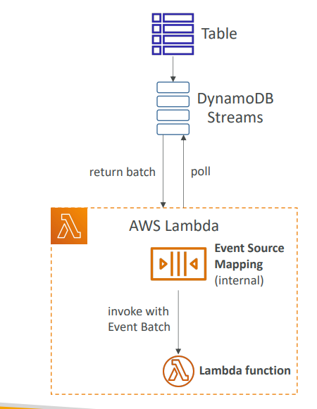

Certainly! Here’s a **detailed, step-by-step breakdown** of **DynamoDB Streams** and **DynamoDB Streams with AWS Lambda**, including concepts, architecture, event format, scaling, and practical scenarios.

---

## **DynamoDB Streams – Deep Dive**

### **1. What is a DynamoDB Stream?**

* **DynamoDB Stream** is a time-ordered log of changes to items in a DynamoDB table, captured as *stream records*.
* You **enable it per table** and choose how much of the item you want in the stream.
* **Retention period:** 24 hours. After that, records are automatically removed.


---

### **2. Stream View Types**

When you enable Streams, you select a *StreamViewType*:

| Stream View Type      | What You Get in Each Record             | Use Case Example                     |
| --------------------- | --------------------------------------- | ------------------------------------ |
| KEYS\_ONLY            | Only the primary key(s) of changed item | Audit or lightweight change tracking |
| NEW\_IMAGE            | The entire new version (after change)   | Syncing new state elsewhere          |
| OLD\_IMAGE            | The entire old version (before change)  | Tracking what was removed/changed    |
| NEW\_AND\_OLD\_IMAGES | Both before and after images            | Auditing, change detection           |

---

### **3. What Triggers a Stream Record?**

* Any write operation: **PutItem**, **UpdateItem**, **DeleteItem**, **BatchWriteItem**.
* For **UpdateItem**, stream can show which attributes changed and their values *before* and *after*.

---

### **4. Stream Record Structure (Example)**

A stream event sent to Lambda looks like:

```json
{
  "Records": [
    {
      "eventID": "1",
      "eventName": "INSERT" | "MODIFY" | "REMOVE",
      "eventVersion": "1.1",
      "eventSource": "aws:dynamodb",
      "awsRegion": "us-west-2",
      "dynamodb": {
        "Keys": { "OrderID": {"S": "12345"} },
        "NewImage": { "OrderID": {"S": "12345"}, "Status": {"S": "NEW"} },
        "OldImage": { ... }, // For MODIFY or REMOVE
        "StreamViewType": "NEW_AND_OLD_IMAGES",
        ...
      },
      "eventSourceARN": "arn:aws:dynamodb:..."
    }
  ]
}
```

* **eventName** tells if it’s an INSERT, MODIFY, or REMOVE.
* **NewImage** and **OldImage** contain item state after and before the operation.

---

### **5. DynamoDB Streams Architecture**

```
DynamoDB Table
    |
    |  [write/modify/delete]
    v
DynamoDB Stream (24h buffer, ordered, per table)
    |
    |  [poll or trigger]
    v
AWS Lambda (or Kinesis, custom consumer, etc.)
    |
    |  [process/forward/notify]
    v
Other AWS services, notifications, analytics, ETL, etc.
```

* Streams **do not slow down writes**—they are asynchronous.



---

## **DynamoDB Streams & AWS Lambda – How It Works**



### **1. Lambda Integration Overview**

* AWS Lambda can be directly connected to a DynamoDB Stream as an **event source**.
* Lambda is automatically invoked when new stream records appear.

### **2. Processing Flow**

1. **Writes to table** → generate stream records (within a few seconds).
2. **DynamoDB Streams service** buffers and delivers records to the Lambda service.
3. **Lambda** receives batches of records as event input and executes your handler function.
4. **Lambda function** can process, transform, forward, or trigger any workflow.

### **3. Lambda Batch Processing and Scaling**

* Lambda receives **batches** (default 100, max 10,000 records per batch).
* **Parallelization:** You can configure how many shards (streams are sharded) Lambda will process concurrently.
* **Error handling:**

  * If a batch fails, Lambda retries until successful or records expire (24h).
  * Use *dead letter queues (DLQ)* or *on-failure destinations* for error records.

### **4. Permissions**

* Lambda needs the `AWSLambdaDynamoDBExecutionRole` to read from streams and execute functions.
* DynamoDB table must allow Streams to be enabled.

---

## **Common Use Cases & Real-World Examples**

### **1. Real-time Analytics**

* Every update to a sales table triggers a Lambda function.
* Lambda aggregates totals, updates a summary table, or sends data to Amazon Redshift/Kinesis for BI dashboards.

### **2. Event-Driven Automation**

* New user signup (insert in table) triggers welcome email (via SNS/Ses) using Lambda.
* Order status updates trigger SMS/email notifications.

### **3. Materialized Views/Projections**

* As user activity is recorded in a main table, Lambda uses streams to maintain a running tally or denormalized summary table for reporting.

### **4. Cross-Region Replication**

* Streams capture all changes in one region.
* Lambda (or Kinesis Data Streams + custom app) replicates changes to a DynamoDB table in another AWS region (used in Global Tables, too).

### **5. Auditing & Compliance**

* Streams with NEW\_AND\_OLD\_IMAGES feed Lambda.
* Lambda writes “before and after” records to S3 for a tamper-proof audit log.

---

## **Advanced Tips**

* **Streams can have multiple consumers:** Lambda, Kinesis Data Streams, or custom consumers using the DynamoDB Streams API.
* **Ordering guarantee:** Stream records from the same partition key are delivered in order.
* **Scaling:** Streams are sharded for high-throughput tables; Lambda can process shards in parallel.
* **No impact on table’s RCU/WCU usage.** Stream processing costs (Lambda invocation, network, etc.) are separate.

---

## **Summary Table**

| Feature/Scenario        | DynamoDB Streams                    | With AWS Lambda                       |
| ----------------------- | ----------------------------------- | ------------------------------------- |
| Event-driven automation | Yes                                 | Yes                                   |
| Real-time analytics     | Yes (with custom consumers)         | Yes (easy, serverless)                |
| Data replication        | Yes (with Kinesis/Custom app)       | Yes (simpler, serverless)             |
| Auditing/Logging        | Yes                                 | Yes (Lambda → S3)                     |
| Scaling                 | Automatic (sharding)                | Lambda concurrency config, shards     |
| Error handling          | N/A                                 | Retries, DLQ, on-failure destinations |
| Cost                    | Streams free, pay for read from API | Pay for Lambda invocations/time       |

---